# Module 3 Final Project Submission

* Student name:  Gina Durante
* Student pace: self paced
* Scheduled project review date/time: 7/16/20, 12:30pm
* Instructor name:  Jeff Herman
* Blog post URL:  https://github.com/gdurante2019/dsc-mod-3-project-v2-1-online-ds-sp-000


# The Project: Predicting Water Well Status in Tanzania using Machine Learning

## Executive Summary

The government of Tanzania struggles to provide clean water to all of its citizens, but over 40% of the population still lacks access to clean water.  The government has collaborated with Taarifa, a non-profit organization, to create a database of all of the water supply projects in the country. Data for each water supply project includes information about the project’s geographic location, local water abundance and quality, technical information (e.g., type of well), funder, installer, project administration, and more.

DrivenData, a social enterprise that works with mission-driven organizations, is hosting a competition to predict water well status using machine learning algorithms. The dataset provided by DrivenData contains data for 59,400 water supply projects. There are 39 features in this dataset and three target classes (well status = ‘functional’, ‘non-functional’, or ‘functional; needs repair’).  Thus, this is a **multi-class classification problem.**

For this project, I used data visualization extensively during the exploration phase and evaluated several different supervised machine learning models to predict water well status. I also employed a few different approaches to address class imbalances, significantly improving performance around costly ‘false-negative’ errors (predicting wells to be ‘functional’, when in fact they were ‘non-functional’ or ‘functional needing repair’).  

In this project, I found that there is a significant trade-off between 1) better overall test accuracy scores when using the original imbalanced class data, and 2) better performance in minimizing false negative errors by addressing class imbalances.  In fact, the problem with false negatives resulting from the use of imbalanced class data is so great that, for a model to be useful, the class imbalance issue _must_ be addressed.  To do this, I employed either SMOTE resampling or the class_weight='balanced' parameter (where available).

## Background

Tanzania is a developing country that is home to approximately 57,000,000 people. The government seeks to provide clean water to its citizens, but a significant percentage of people (~43%, or 25,000,000) do not yet have access to clean water (1). Over 75,000 water supply projects have been constructed, ranging from large wells for hundreds or thousands of people to shallow wells or hand pumps serving only a few people. Only about 54% of all water supply projects in the country are functional, while 38% are non-functional (needing replacement) and the remaining ~8% are functional, but in need of repair. 

The government of Tanzania has collaborated with Taarifa, a non-profit organization, to create a database of all of the water supply projects in the country (3). Data for each water supply project includes information about the project’s geographic location, local water abundance and quality, technical information (e.g., type of well), funder, installer, project administration, and more.

More information about water infrastructure in Tanzania can be found at the Ministry of Water website (2).

### Machine learning competition to predict functional status of wells
DrivenData, a social enterprise that works with mission-driven organizations, is hosting a competition to predict water well status using machine learning algorithms (4). DrivenData provides data to participants in the competition in the form of a .csv file and very brief descriptors for each field. The dataset provided by DrivenData contains data for 59,400 water supply projects. In total, there are 39 features in this dataset; most are categorical. With three target classes (well status = ‘functional’, ‘non-functional’, or ‘functional; needs repair’), **this is a multi-class classification problem.** 

Participants develop machine learning models and submit their predictions (‘functional’, ‘non-functional’, or ‘functional—needing repair’) for 14850 wells in the test dataset. DrivenData compares each participant’s predictions against the actual status of the wells and returns an accuracy score for the participant’s prediction dataset.


## Methodology

### OSEMiN Framework
* Using tools learned in Flatiron’s Data Science Boot Camp, I developed several machine learning models to evaluate and predict water well status, evaluating various features within those selected
  * To approach the question and structure the project, I used the OSEMiN (Obtain, Scrub, Explore, Model, and iNterpret) methodology 
  * After obtaining the data from the DrivenData website, I performed data cleaning, explored the data using visualizations and tables, and viewed the Tanzanian water well website 
  * After evaluating the quality of the data in various categories and considering issues such as collinearity and value of the information contained, I selected a subset of features to use in modeling 
  * Finally, I evaluated performance of the models—especially regarding how well they did in terms of predicting whether the well was ‘non-functional’ or ‘functional, needing repair’

###  Classification of Categorical Variables
* The model classifies a given well as ‘functional’, ‘non-functional’ (needs replacement), or ‘functional--needing repair’; the target is not a numerical value
* Since a model is a representation of a process, not the process itself, it will never be 100% correct; thus, there will be errors in prediction
* Because there will be prediction errors, results should be interpreted in the context of which errors are more important; for example:
  * A functional well predicted to be non-functional may result in costs for a technician to travel to the well and evaluate its status
  * A non-functional well predicted to be functional may result in delays in repair or replacement, causing possible health consequences and other hardships to those who depend on the well

### Types of Data Available¶
* Location
  * Geographic—e.g., basin, latitude/longitude, altitude, water quality, water quantity
  * Political/social—e.g., region, district, LGA, ward, subvillage, population around well
* Project technical specifics
  * Extraction method/type of well—e.g., gravity, hand-pump, submersible, motorized, wind-powered) 
  * Water source—e.g., lake, river, spring, rainwater harvesting, shallow well
  * Waterpoint type—e.g., hand pump, communal standpipe, cattle trough, improved spring
* Project management specifics
  * Project initiation and construction:  funder, installer, public meeting held, permit issued, construction year
  * Project management—e.g., name and type of managing organization, payment types
  
#### Limitations of the data
  * Significant percentage of values missing ('construction_year' and 'scheme_name', for example)
  * Data quality issues for features with large numbers of values, such as 'funder', 'installer', and 'scheme_name'
    * Different spellings of the same organization's name
    * Shorthand entry--e.g., 'q' 'dw', and no master list is available to decipher this information
    * Organization name vs. organization type (e.g., 'school' or 'church')--primarily for 'scheme_name'

### Observations on results of different modeling approaches
* _**'n' values:**_ 
  * "'n' values" represents the top 'n' number of dummy variables for a feature to be included in the model, sorted in descending order by greatest number of projects attributed to that parameter to the least
  * Created a function that takes top 'n' values of a feature and assign 'other' to the remaining values in that feature (e.g., installer, funder, ward, subvillage); benefits include:
    * Reducing the total number of dummy variables, thereby potentially reducing overfitting and increasing performance along certain measures
    * Easily testing the effects of different numbers of dummy variables on model results
  * 'n' values between 50 and 125 seemed to represent a sweet spot in many models for both test accuracy scores and minimization of false negatives
* _**Decision trees:**_ the hyperparameter '**max_depth**' (the maximum number of decision points that a tree can have) must be carefully considered
  * The default setting, **max_depth=None**, results in higher accuracy scores with training data but a wider spread between training and test scores
  * Larger max_depth values are likely to result in overfitting
* _**Addressing imbalanced classes:**_ 
  * Minimizing costly 'false negative' errors (predicting a well to be 'functional' when it was not) requires addressing imbalanced classes   
    * 'functional needs repair' wells erroneously predicted to be 'functional' between 54% to 77% of the time (depending on the model)  
    * 'non-functional' wells erroneously predicted to be 'functional' around 25-30% of the time (depending on the model)
    * The usefulness of these models is very limited if these false negatives cannot be reduced 
  * Modeling using the class_weight='balanced' or SMOTE resampling had lower overall accuracy but much better performance on minimizing the most costly false negatives 
    * SMOTE often provided slightly higher accuracy scores in the decision tree classifier
    * However, class_weight='balanced' resulting in better performance reducing false negatives
    * Choice of balanced class weights vs. SMOTE resampling will depend on the importance of overall accuracy vs. reduction of certain kinds of errors    


## Findings

### Model Performance: Accuracy and Reduction of False Negatives 
* Imbalanced dataset (original)
  * Training accuracies ranged 77% to 85%
  * Test accuracies ranged from 74% to 80%
  * False negatives were unacceptably high  (up to 77% and 40% for mis-classification of 'functional needs repair' and 'non functional' wells as 'functional', respectively)
* SMOTE resampled data
  * Training accuracies ranged 73% to 80%
  * Test accuracies ranged from 69% to 78%
  * False negatives were noticeably better than for imbalanced dataset, but still higher than for models run with class_weight='balanced' (~30-35% and ~23-30% for mis-classification of 'functional needs repair' and 'non functional' wells as 'functional', respectively)
* class_weight='balanced' (in models where this parameter is available)
  * Training accuracies ranged 65% to 78%
  * Test accuracies ranged from 62% to 74%
  * Best performance of the three options for false negatives (as low as 17% and 17% for mis-classification of 'functional needs repair' and 'non functional' wells as 'functional', respectively)
*   **Conclusion--Class imbalances:**  There is a significant trade-off between overall accuracy and minimizing costly false negatives by addressing class imbalances that contribute to the errors in the smaller classes ('non-functional' and 'functional needs repair'). 
  
### Feature Importances 
* I found that the top features importances will vary depending on the modeling objectives
  * Some specific feature values appear towards the top of the feature importance list for virtually all of the models employed, and for imbalanced or rebalanced data, hyperparameter tuning, etc.
  * Other feature importances as a whole (such as LGA) are greater in models are optimized for accuracy scores with rebalanced data (and they do fairly well with false negatives)
* I recommend looking more closely at these values, since they are likely to contain those specific values that have more wells needing replacement or repair


## Future Work

* Additional modeling with subsets of dummy variables: 
  * Most models have many of the same dummy variables at the top of their feature importance lists
  * May want to explore whether a smaller subset of dummy variables, such as the top 50, would improve model performance
* Improving data completeness--could additional information could be obtained for features with significant missing values or data entry inconsistencies?  For example:
  * ‘Other’ in the category ‘extraction_type’; almost 85% of wells in this category are non-functional
  * Year constructed--no date recorded for significant percentage of wells; do these wells have something in common, such as:
    * Clustered in certain locations where data was/is not collected?
    * Constructed before a certain date?
    * Constructed by certain installers or funded by certain funders?
    * Of a certain type, e.g., handpump?  
* Evaluating whether funder or installer country of origin influences well functionality
  * For example, at least a couple of funders are obviously from Germany, as indicated by their names (there is no other funder/installer location information in the dataset itself, and I couldn't find a comprehensive source anywhere else) 
  * Wells associated with these funders have a very high 'functional' status, with very few projects in need of maintenance or equipment replacement
  * If the government of Tanzania or Taarifa had a complete and accurate list of the location for each funder/installer, the locations of the funders or installers could be another feature on which to model 
* Latitude / longitude—Looking at functional status of wells at various geographic locations to identify possible patterns due to geological differences


# Data Exploration

## Visualizations

Visualizations during data exploration were a very important tool for getting a better handle on the data available.  I used stacked bar charts and tables extensively to get a better handle on the potential influence of features on well function.  Examples are provided below.

### Funders


```python
top_n_funders = dataset_eda_subset(df_train, col1='funder', col2='status_group', 
                                   rotation = 45, m=0, n=40, figsize=(16,5), fontsize=16)
top_n_funders.head(10)
```


<div>
<style scoped>
    .dataframe tbody tr th:only-of-type {
        vertical-align: middle;
    }

    .dataframe tbody tr th {
        vertical-align: top;
    }

    .dataframe thead th {
        text-align: right;
    }
</style>
<table border="1" class="dataframe">
  <thead>
    <tr style="text-align: right;">
      <th>status_group</th>
      <th>functional</th>
      <th>functional needs repair</th>
      <th>non functional</th>
    </tr>
    <tr>
      <th>funder</th>
      <th></th>
      <th></th>
      <th></th>
    </tr>
  </thead>
  <tbody>
    <tr>
      <th>government_of_tanzania</th>
      <td>3720</td>
      <td>701</td>
      <td>4663</td>
    </tr>
    <tr>
      <th>missing</th>
      <td>1981</td>
      <td>437</td>
      <td>1217</td>
    </tr>
    <tr>
      <th>danida</th>
      <td>1713</td>
      <td>159</td>
      <td>1242</td>
    </tr>
    <tr>
      <th>hesawa</th>
      <td>936</td>
      <td>232</td>
      <td>1034</td>
    </tr>
    <tr>
      <th>rwssp</th>
      <td>805</td>
      <td>109</td>
      <td>460</td>
    </tr>
    <tr>
      <th>world_bank</th>
      <td>545</td>
      <td>97</td>
      <td>707</td>
    </tr>
    <tr>
      <th>kkkt</th>
      <td>723</td>
      <td>66</td>
      <td>498</td>
    </tr>
    <tr>
      <th>world_vision</th>
      <td>743</td>
      <td>131</td>
      <td>372</td>
    </tr>
    <tr>
      <th>unicef</th>
      <td>600</td>
      <td>99</td>
      <td>358</td>
    </tr>
    <tr>
      <th>tasaf</th>
      <td>493</td>
      <td>64</td>
      <td>320</td>
    </tr>
  </tbody>
</table>
</div>


```python
top_n_funders_pct = dataset_eda_subset_pct(df_train, col1='funder', col2='status_group', 
                                           m=0, n=40, figsize=(16, 5.5), legend_cols=3)
```


### Installers


```python
top_n_installers = dataset_eda_subset(df_train, col1='installer', figsize=(16,6),
                                      col2='status_group', m=0, n=40)
top_n_installers.head(10)
```


<div>
<style scoped>
    .dataframe tbody tr th:only-of-type {
        vertical-align: middle;
    }

    .dataframe tbody tr th {
        vertical-align: top;
    }

    .dataframe thead th {
        text-align: right;
    }
</style>
<table border="1" class="dataframe">
  <thead>
    <tr style="text-align: right;">
      <th>status_group</th>
      <th>functional</th>
      <th>functional needs repair</th>
      <th>non functional</th>
    </tr>
    <tr>
      <th>installer</th>
      <th></th>
      <th></th>
      <th></th>
    </tr>
  </thead>
  <tbody>
    <tr>
      <th>dwe</th>
      <td>9450</td>
      <td>1622</td>
      <td>6354</td>
    </tr>
    <tr>
      <th>missing</th>
      <td>2000</td>
      <td>440</td>
      <td>1215</td>
    </tr>
    <tr>
      <th>government</th>
      <td>552</td>
      <td>258</td>
      <td>1081</td>
    </tr>
    <tr>
      <th>hesawa</th>
      <td>786</td>
      <td>54</td>
      <td>555</td>
    </tr>
    <tr>
      <th>rwe</th>
      <td>304</td>
      <td>137</td>
      <td>765</td>
    </tr>
    <tr>
      <th>commu</th>
      <td>726</td>
      <td>32</td>
      <td>307</td>
    </tr>
    <tr>
      <th>danida</th>
      <td>542</td>
      <td>83</td>
      <td>425</td>
    </tr>
    <tr>
      <th>district_council</th>
      <td>385</td>
      <td>61</td>
      <td>515</td>
    </tr>
    <tr>
      <th>kkkt</th>
      <td>425</td>
      <td>62</td>
      <td>423</td>
    </tr>
    <tr>
      <th>0</th>
      <td>445</td>
      <td>3</td>
      <td>329</td>
    </tr>
  </tbody>
</table>
</div>


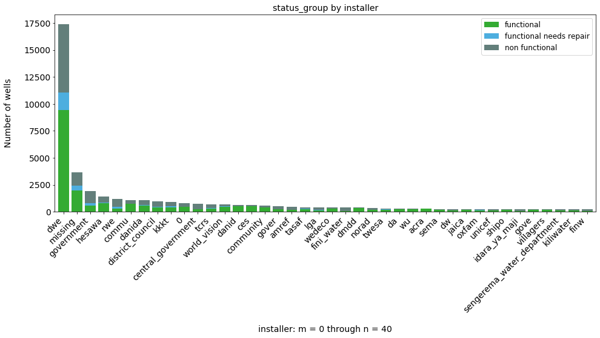


```python
top_n_installers_pct = dataset_eda_subset_pct(df_train, col1='installer', col2='status_group', 
                                           figsize=(16, 5), m=0, n=40, fontsize=14)
```


### Payment type


```python
status_by_payment_type = dataset_eda_subset(df_train, col1='payment_type', figsize=(8,5),
                                            col2='status_group', n=20, rotation=45, fontsize=14)
status_by_payment_type
```


<div>
<style scoped>
    .dataframe tbody tr th:only-of-type {
        vertical-align: middle;
    }

    .dataframe tbody tr th {
        vertical-align: top;
    }

    .dataframe thead th {
        text-align: right;
    }
</style>
<table border="1" class="dataframe">
  <thead>
    <tr style="text-align: right;">
      <th>status_group</th>
      <th>functional</th>
      <th>functional needs repair</th>
      <th>non functional</th>
    </tr>
    <tr>
      <th>payment_type</th>
      <th></th>
      <th></th>
      <th></th>
    </tr>
  </thead>
  <tbody>
    <tr>
      <th>never pay</th>
      <td>11379</td>
      <td>1907</td>
      <td>12062</td>
    </tr>
    <tr>
      <th>per bucket</th>
      <td>6090</td>
      <td>409</td>
      <td>2486</td>
    </tr>
    <tr>
      <th>monthly</th>
      <td>5482</td>
      <td>927</td>
      <td>1891</td>
    </tr>
    <tr>
      <th>unknown</th>
      <td>3528</td>
      <td>432</td>
      <td>4197</td>
    </tr>
    <tr>
      <th>on failure</th>
      <td>2429</td>
      <td>277</td>
      <td>1208</td>
    </tr>
    <tr>
      <th>annually</th>
      <td>2740</td>
      <td>247</td>
      <td>655</td>
    </tr>
    <tr>
      <th>other</th>
      <td>611</td>
      <td>118</td>
      <td>325</td>
    </tr>
  </tbody>
</table>
</div>


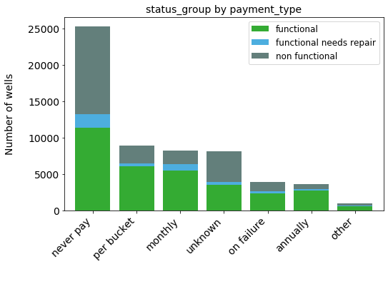


```python
payment_type_pct = dataset_eda_subset_pct(df_train, col1='payment_type', col2='status_group', 
                                           figsize=(10, 5), m=0, n=7)
```


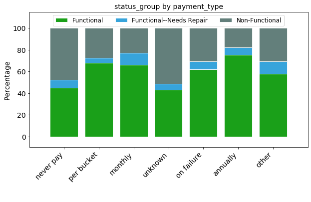


### Region


```python
status_by_region = dataset_eda_subset(df_train, col1='region', col2='status_group', n=40)
status_by_region
```


<div>
<style scoped>
    .dataframe tbody tr th:only-of-type {
        vertical-align: middle;
    }

    .dataframe tbody tr th {
        vertical-align: top;
    }

    .dataframe thead th {
        text-align: right;
    }
</style>
<table border="1" class="dataframe">
  <thead>
    <tr style="text-align: right;">
      <th>status_group</th>
      <th>functional</th>
      <th>functional needs repair</th>
      <th>non functional</th>
    </tr>
    <tr>
      <th>region</th>
      <th></th>
      <th></th>
      <th></th>
    </tr>
  </thead>
  <tbody>
    <tr>
      <th>Iringa</th>
      <td>4141</td>
      <td>123</td>
      <td>1030</td>
    </tr>
    <tr>
      <th>Shinyanga</th>
      <td>2789</td>
      <td>635</td>
      <td>1558</td>
    </tr>
    <tr>
      <th>Mbeya</th>
      <td>2319</td>
      <td>504</td>
      <td>1816</td>
    </tr>
    <tr>
      <th>Kilimanjaro</th>
      <td>2640</td>
      <td>322</td>
      <td>1417</td>
    </tr>
    <tr>
      <th>Morogoro</th>
      <td>2119</td>
      <td>300</td>
      <td>1587</td>
    </tr>
    <tr>
      <th>Arusha</th>
      <td>2294</td>
      <td>175</td>
      <td>881</td>
    </tr>
    <tr>
      <th>Kagera</th>
      <td>1727</td>
      <td>304</td>
      <td>1285</td>
    </tr>
    <tr>
      <th>Mwanza</th>
      <td>1502</td>
      <td>183</td>
      <td>1417</td>
    </tr>
    <tr>
      <th>Kigoma</th>
      <td>1363</td>
      <td>603</td>
      <td>850</td>
    </tr>
    <tr>
      <th>Ruvuma</th>
      <td>1480</td>
      <td>164</td>
      <td>996</td>
    </tr>
    <tr>
      <th>Pwani</th>
      <td>1556</td>
      <td>36</td>
      <td>1043</td>
    </tr>
    <tr>
      <th>Tanga</th>
      <td>1436</td>
      <td>73</td>
      <td>1038</td>
    </tr>
    <tr>
      <th>Dodoma</th>
      <td>1009</td>
      <td>209</td>
      <td>983</td>
    </tr>
    <tr>
      <th>Singida</th>
      <td>1011</td>
      <td>128</td>
      <td>954</td>
    </tr>
    <tr>
      <th>Mara</th>
      <td>886</td>
      <td>60</td>
      <td>1023</td>
    </tr>
    <tr>
      <th>Tabora</th>
      <td>848</td>
      <td>45</td>
      <td>1066</td>
    </tr>
    <tr>
      <th>Rukwa</th>
      <td>707</td>
      <td>135</td>
      <td>966</td>
    </tr>
    <tr>
      <th>Mtwara</th>
      <td>524</td>
      <td>126</td>
      <td>1080</td>
    </tr>
    <tr>
      <th>Manyara</th>
      <td>987</td>
      <td>96</td>
      <td>500</td>
    </tr>
    <tr>
      <th>Lindi</th>
      <td>460</td>
      <td>93</td>
      <td>993</td>
    </tr>
    <tr>
      <th>Dar es Salaam</th>
      <td>461</td>
      <td>3</td>
      <td>341</td>
    </tr>
  </tbody>
</table>
</div>


```python
region_pct = dataset_eda_subset_pct(df_train, col1='region', col2='status_group', 
                                           figsize=(12, 5), m=0, n=21)
```


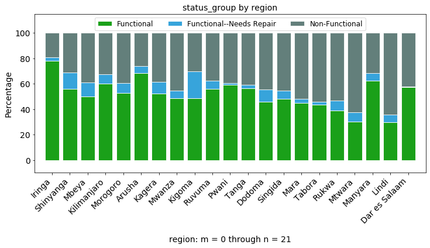


```python
qty_region = dataset_eda_subset(df_train, col1='region', col2='quantity_group', m=0, n=30, 
                                legend=True, colors=None)

```


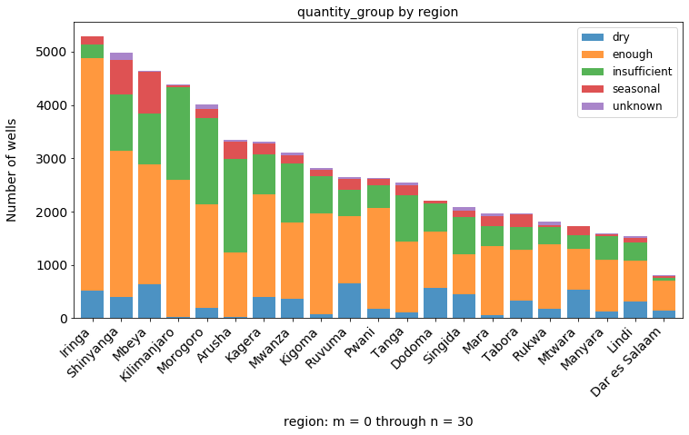


### LGA


```python
status_by_lga = dataset_eda_subset(df_train, col1='lga', col2='status_group', 
                                   figsize=(18, 6), m=0, n=50)
status_by_lga.head(10)
```


<div>
<style scoped>
    .dataframe tbody tr th:only-of-type {
        vertical-align: middle;
    }

    .dataframe tbody tr th {
        vertical-align: top;
    }

    .dataframe thead th {
        text-align: right;
    }
</style>
<table border="1" class="dataframe">
  <thead>
    <tr style="text-align: right;">
      <th>status_group</th>
      <th>functional</th>
      <th>functional needs repair</th>
      <th>non functional</th>
    </tr>
    <tr>
      <th>lga</th>
      <th></th>
      <th></th>
      <th></th>
    </tr>
  </thead>
  <tbody>
    <tr>
      <th>Njombe</th>
      <td>2007</td>
      <td>94</td>
      <td>402</td>
    </tr>
    <tr>
      <th>Arusha Rural</th>
      <td>875</td>
      <td>48</td>
      <td>329</td>
    </tr>
    <tr>
      <th>Moshi Rural</th>
      <td>733</td>
      <td>119</td>
      <td>399</td>
    </tr>
    <tr>
      <th>Bariadi</th>
      <td>580</td>
      <td>409</td>
      <td>188</td>
    </tr>
    <tr>
      <th>Rungwe</th>
      <td>676</td>
      <td>161</td>
      <td>269</td>
    </tr>
    <tr>
      <th>Kilosa</th>
      <td>587</td>
      <td>73</td>
      <td>434</td>
    </tr>
    <tr>
      <th>Kasulu</th>
      <td>611</td>
      <td>201</td>
      <td>235</td>
    </tr>
    <tr>
      <th>Mbozi</th>
      <td>450</td>
      <td>70</td>
      <td>514</td>
    </tr>
    <tr>
      <th>Meru</th>
      <td>657</td>
      <td>32</td>
      <td>320</td>
    </tr>
    <tr>
      <th>Bagamoyo</th>
      <td>730</td>
      <td>2</td>
      <td>265</td>
    </tr>
  </tbody>
</table>
</div>


```python
status_lga_pct = dataset_eda_subset_pct(df_train, col1='lga', col2='status_group', figsize=(16, 5), m=0, n=50)
```


### Extraction type class


```python
status_by_extraction_type_class = dataset_eda_subset(df_train, col1='extraction_type_class', 
                                                     figsize=(10, 5), col2='status_group', n=20)
status_by_extraction_type_class
```


<div>
<style scoped>
    .dataframe tbody tr th:only-of-type {
        vertical-align: middle;
    }

    .dataframe tbody tr th {
        vertical-align: top;
    }

    .dataframe thead th {
        text-align: right;
    }
</style>
<table border="1" class="dataframe">
  <thead>
    <tr style="text-align: right;">
      <th>status_group</th>
      <th>functional</th>
      <th>functional needs repair</th>
      <th>non functional</th>
    </tr>
    <tr>
      <th>extraction_type_class</th>
      <th></th>
      <th></th>
      <th></th>
    </tr>
  </thead>
  <tbody>
    <tr>
      <th>gravity</th>
      <td>16048</td>
      <td>2701</td>
      <td>8031</td>
    </tr>
    <tr>
      <th>handpump</th>
      <td>10375</td>
      <td>995</td>
      <td>5086</td>
    </tr>
    <tr>
      <th>other</th>
      <td>1029</td>
      <td>206</td>
      <td>5195</td>
    </tr>
    <tr>
      <th>submersible</th>
      <td>3329</td>
      <td>253</td>
      <td>2597</td>
    </tr>
    <tr>
      <th>motorpump</th>
      <td>1135</td>
      <td>138</td>
      <td>1714</td>
    </tr>
    <tr>
      <th>rope pump</th>
      <td>293</td>
      <td>17</td>
      <td>141</td>
    </tr>
    <tr>
      <th>wind-powered</th>
      <td>50</td>
      <td>7</td>
      <td>60</td>
    </tr>
  </tbody>
</table>
</div>


```python
status_extr_type_class_pct = dataset_eda_subset_pct(df_train, col1='extraction_type_class', col2='status_group', 
                                                figsize=(10, 5), m=0, n=7)
```


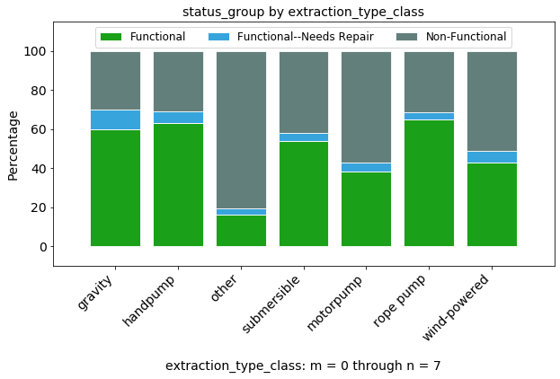


```python
extr_class_status = dataset_eda_subset(df_train, col1='status_group',
                                       col2='extraction_type_class', 
                                       m=0, n=40, figsize=(8, 6), 
                                       legend=True, colors=None, 
                                       rotation=45, fontsize=14)
```


### Quantity


```python
status_by_quantity = dataset_eda_subset(df_train, col1='quantity', figsize=(8, 5), 
                                        col2='status_group', n=20)
status_by_quantity
```


<div>
<style scoped>
    .dataframe tbody tr th:only-of-type {
        vertical-align: middle;
    }

    .dataframe tbody tr th {
        vertical-align: top;
    }

    .dataframe thead th {
        text-align: right;
    }
</style>
<table border="1" class="dataframe">
  <thead>
    <tr style="text-align: right;">
      <th>status_group</th>
      <th>functional</th>
      <th>functional needs repair</th>
      <th>non functional</th>
    </tr>
    <tr>
      <th>quantity</th>
      <th></th>
      <th></th>
      <th></th>
    </tr>
  </thead>
  <tbody>
    <tr>
      <th>enough</th>
      <td>21648</td>
      <td>2400</td>
      <td>9138</td>
    </tr>
    <tr>
      <th>insufficient</th>
      <td>7916</td>
      <td>1450</td>
      <td>5763</td>
    </tr>
    <tr>
      <th>dry</th>
      <td>157</td>
      <td>37</td>
      <td>6052</td>
    </tr>
    <tr>
      <th>seasonal</th>
      <td>2325</td>
      <td>416</td>
      <td>1309</td>
    </tr>
    <tr>
      <th>unknown</th>
      <td>213</td>
      <td>14</td>
      <td>562</td>
    </tr>
  </tbody>
</table>
</div>


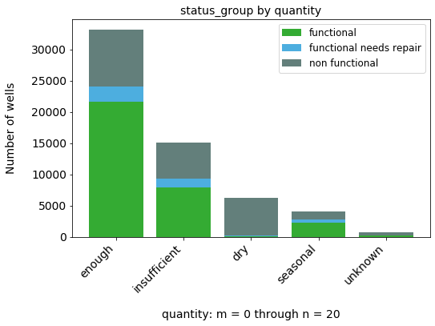


```python
status_quantity_pct = dataset_eda_subset_pct(df_train, col1='quantity', col2='status_group', 
                                                figsize=(8, 5), m=0, n=5)
```


### Source


```python
status_by_source = dataset_eda_subset(df_train, col1='source', col2='status_group', n=20)
status_by_source
```


<div>
<style scoped>
    .dataframe tbody tr th:only-of-type {
        vertical-align: middle;
    }

    .dataframe tbody tr th {
        vertical-align: top;
    }

    .dataframe thead th {
        text-align: right;
    }
</style>
<table border="1" class="dataframe">
  <thead>
    <tr style="text-align: right;">
      <th>status_group</th>
      <th>functional</th>
      <th>functional needs repair</th>
      <th>non functional</th>
    </tr>
    <tr>
      <th>source</th>
      <th></th>
      <th></th>
      <th></th>
    </tr>
  </thead>
  <tbody>
    <tr>
      <th>spring</th>
      <td>10592</td>
      <td>1276</td>
      <td>5153</td>
    </tr>
    <tr>
      <th>shallow well</th>
      <td>8324</td>
      <td>957</td>
      <td>7543</td>
    </tr>
    <tr>
      <th>machine dbh</th>
      <td>5422</td>
      <td>491</td>
      <td>5162</td>
    </tr>
    <tr>
      <th>river</th>
      <td>5465</td>
      <td>1221</td>
      <td>2926</td>
    </tr>
    <tr>
      <th>rainwater harvesting</th>
      <td>1386</td>
      <td>314</td>
      <td>595</td>
    </tr>
    <tr>
      <th>hand dtw</th>
      <td>497</td>
      <td>17</td>
      <td>360</td>
    </tr>
    <tr>
      <th>lake</th>
      <td>162</td>
      <td>12</td>
      <td>591</td>
    </tr>
    <tr>
      <th>dam</th>
      <td>253</td>
      <td>24</td>
      <td>379</td>
    </tr>
    <tr>
      <th>other</th>
      <td>126</td>
      <td>1</td>
      <td>85</td>
    </tr>
    <tr>
      <th>unknown</th>
      <td>32</td>
      <td>4</td>
      <td>30</td>
    </tr>
  </tbody>
</table>
</div>


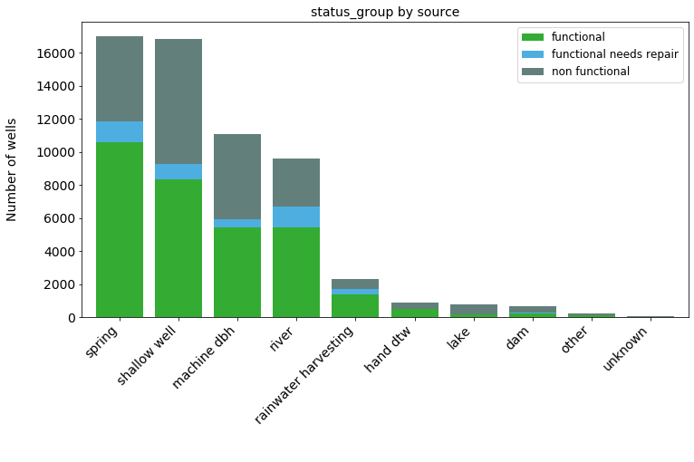


```python
status_source_pct = dataset_eda_subset_pct(df_train, col1='source', col2='status_group', 
                                            figsize=(10, 5), m=0, n=10)
```


### Waterpoint type


```python
status_by_waterpoint_type = dataset_eda_subset(df_train, col1='waterpoint_type', figsize=(8, 5),
                                               col2='status_group', m=0, n=20)
status_by_waterpoint_type
```


<div>
<style scoped>
    .dataframe tbody tr th:only-of-type {
        vertical-align: middle;
    }

    .dataframe tbody tr th {
        vertical-align: top;
    }

    .dataframe thead th {
        text-align: right;
    }
</style>
<table border="1" class="dataframe">
  <thead>
    <tr style="text-align: right;">
      <th>status_group</th>
      <th>functional</th>
      <th>functional needs repair</th>
      <th>non functional</th>
    </tr>
    <tr>
      <th>waterpoint_type</th>
      <th></th>
      <th></th>
      <th></th>
    </tr>
  </thead>
  <tbody>
    <tr>
      <th>communal standpipe</th>
      <td>17726</td>
      <td>2260</td>
      <td>8536</td>
    </tr>
    <tr>
      <th>hand pump</th>
      <td>10805</td>
      <td>1029</td>
      <td>5654</td>
    </tr>
    <tr>
      <th>other</th>
      <td>840</td>
      <td>293</td>
      <td>5247</td>
    </tr>
    <tr>
      <th>communal standpipe multiple</th>
      <td>2235</td>
      <td>648</td>
      <td>3220</td>
    </tr>
    <tr>
      <th>improved spring</th>
      <td>563</td>
      <td>85</td>
      <td>136</td>
    </tr>
    <tr>
      <th>cattle trough</th>
      <td>84</td>
      <td>2</td>
      <td>30</td>
    </tr>
    <tr>
      <th>dam</th>
      <td>6</td>
      <td>0</td>
      <td>1</td>
    </tr>
  </tbody>
</table>
</div>


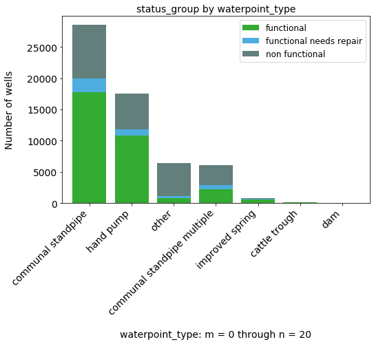


```python
status_waterpt_type_pct = dataset_eda_subset_pct(df_train, col1='waterpoint_type', col2='status_group', 
                                                figsize=(8, 5), m=0, n=7)
```


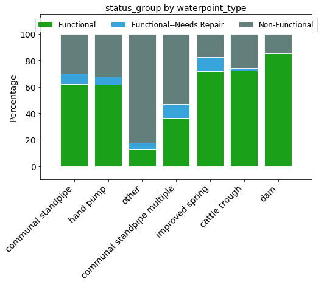


### Management


```python
status_by_management = dataset_eda_subset(df_train, col1='management', 
                                          col2='status_group', 
                                          figsize=(10,6), m=1, n=20)
status_by_management
```


<div>
<style scoped>
    .dataframe tbody tr th:only-of-type {
        vertical-align: middle;
    }

    .dataframe tbody tr th {
        vertical-align: top;
    }

    .dataframe thead th {
        text-align: right;
    }
</style>
<table border="1" class="dataframe">
  <thead>
    <tr style="text-align: right;">
      <th>status_group</th>
      <th>functional</th>
      <th>functional needs repair</th>
      <th>non functional</th>
    </tr>
    <tr>
      <th>management</th>
      <th></th>
      <th></th>
      <th></th>
    </tr>
  </thead>
  <tbody>
    <tr>
      <th>wug</th>
      <td>3906</td>
      <td>645</td>
      <td>1964</td>
    </tr>
    <tr>
      <th>water_board</th>
      <td>2170</td>
      <td>265</td>
      <td>498</td>
    </tr>
    <tr>
      <th>wua</th>
      <td>1751</td>
      <td>205</td>
      <td>579</td>
    </tr>
    <tr>
      <th>private_operator</th>
      <td>1476</td>
      <td>44</td>
      <td>451</td>
    </tr>
    <tr>
      <th>parastatal</th>
      <td>1020</td>
      <td>211</td>
      <td>537</td>
    </tr>
    <tr>
      <th>water_authority</th>
      <td>446</td>
      <td>52</td>
      <td>406</td>
    </tr>
    <tr>
      <th>other</th>
      <td>505</td>
      <td>55</td>
      <td>284</td>
    </tr>
    <tr>
      <th>company</th>
      <td>267</td>
      <td>15</td>
      <td>403</td>
    </tr>
    <tr>
      <th>unknown</th>
      <td>224</td>
      <td>27</td>
      <td>310</td>
    </tr>
    <tr>
      <th>other__school</th>
      <td>23</td>
      <td>1</td>
      <td>75</td>
    </tr>
    <tr>
      <th>trust</th>
      <td>46</td>
      <td>6</td>
      <td>26</td>
    </tr>
  </tbody>
</table>
</div>


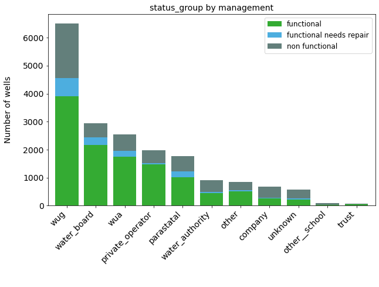


```python
mgmt_pct = dataset_eda_subset_pct(df_train, col1='management', col2='status_group', 
                                           figsize=(10, 5), m=0, n=20)
```


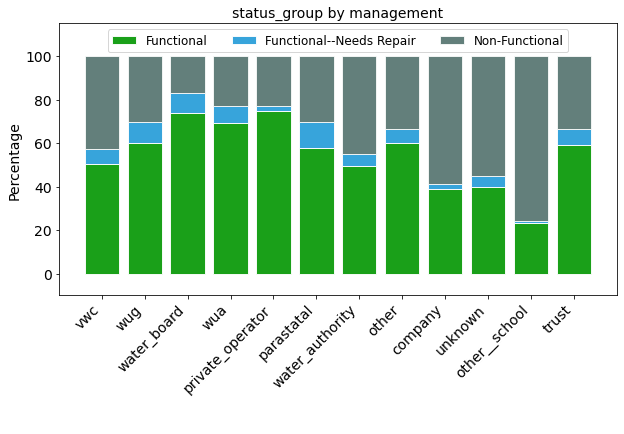


### Public Meeting


```python
status_by_public_meeting = dataset_eda_subset(df_train, col1='public_meeting', col2='status_group', 
                                              figsize=(8, 5), n=12)
status_by_public_meeting

```


<div>
<style scoped>
    .dataframe tbody tr th:only-of-type {
        vertical-align: middle;
    }

    .dataframe tbody tr th {
        vertical-align: top;
    }

    .dataframe thead th {
        text-align: right;
    }
</style>
<table border="1" class="dataframe">
  <thead>
    <tr style="text-align: right;">
      <th>status_group</th>
      <th>functional</th>
      <th>functional needs repair</th>
      <th>non functional</th>
    </tr>
    <tr>
      <th>public_meeting</th>
      <th></th>
      <th></th>
      <th></th>
    </tr>
  </thead>
  <tbody>
    <tr>
      <th>True</th>
      <td>28408</td>
      <td>3719</td>
      <td>18884</td>
    </tr>
    <tr>
      <th>False</th>
      <td>2173</td>
      <td>442</td>
      <td>2440</td>
    </tr>
  </tbody>
</table>
</div>


```python
status_public_mtg_pct = dataset_eda_subset_pct(df_train, col1='public_meeting', col2='status_group', 
                                                figsize=(6, 5), m=0, n=12, legend=False)
```


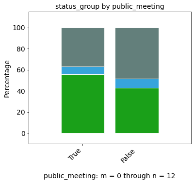


### Permit


```python
status_by_permit = dataset_eda_subset(df_train, col1='permit', col2='status_group', figsize=(7,5), n=12)
status_by_permit
```


<div>
<style scoped>
    .dataframe tbody tr th:only-of-type {
        vertical-align: middle;
    }

    .dataframe tbody tr th {
        vertical-align: top;
    }

    .dataframe thead th {
        text-align: right;
    }
</style>
<table border="1" class="dataframe">
  <thead>
    <tr style="text-align: right;">
      <th>status_group</th>
      <th>functional</th>
      <th>functional needs repair</th>
      <th>non functional</th>
    </tr>
    <tr>
      <th>permit</th>
      <th></th>
      <th></th>
      <th></th>
    </tr>
  </thead>
  <tbody>
    <tr>
      <th>True</th>
      <td>21541</td>
      <td>2697</td>
      <td>14614</td>
    </tr>
    <tr>
      <th>False</th>
      <td>9045</td>
      <td>1320</td>
      <td>7127</td>
    </tr>
  </tbody>
</table>
</div>


```python
status_permit_pct = dataset_eda_subset_pct(df_train, col1='permit', col2='status_group', 
                                                figsize=(6, 5), m=0, n=12, legend=False)
```


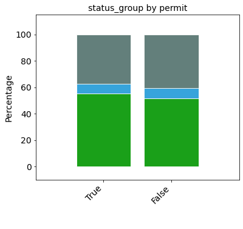


# Modeling:  Baseline Comparison

Before running supervised machine learning models, let's look at what we could expect from the most rudimentary approaches to determining whether a well is functional or not:  random guessing, and the Zero Rule.

## Random Guess

Performance from randomly guessing informed by the overall percentage of wells that are functional, non-functional, or functional but in need of repair would be as follows:

Percent correct = (%functional * %guess functional) + (%non-functional * %guess non-functional) + (%functional, needs repair * %guess functional, needs repair)

In this dataset, this works out to (.543 * .543) + (.384 * .384) + (.0727 * 0.727) = 44%

## Zero Rule

The Zero Rule states that the simple heuristic of always guessing the dominant class (the mode in statistical parlance) for any unknown target will give you a better result than will random guessing (guessing whether a particular well, in this case, is functional, non-functional, or functional but in need of repair in proportion to the overall proportion of each of these classes).  

In this case, the Zero Rule says that if we guess the dominant class ('functional') for each well, we will have an accuracy of 54.3%.  

Since 54.3% is greater than 44%, we would select the Zero Rule result of 54.3% as our baseline accuracy.  We should be able to signficantly improve upon this with skillful modeling. 

Below I will utilize several ML modeling techniques, including decision trees and GridSearchCV for hyperparameter tuning, bagging trees, random forests and hyperparameter tuning, gradient boosting and Adaboost, XGBoost with parameter tuning, and finally support vector machines.

# Modeling: Preparing dataframe

## Columns to use for modeling


I propose using the following columns for modeling:

1. funder OR installer (use only one of these to avoid multi-collinearity)
2. management
3. basin, district_code, region, lga, ward, OR subvillage (use only one to avoid multi-collinearity)
4. payment OR payment_type (choosing payment)
5. scheme_name OR scheme_management (choosing scheme_name for greater specificity and to avoid possible collinearity issues between 'scheme_management' and 'management')
6. water_quality OR quality_group (choosing water_quality) 
7. quantity_group OR quantity (choosing quantity_group)  
8. source, source_type, OR source_class (choosing source, as it is a bit more specific)
9. extraction_type_group, extraction_type, OR extraction_type_class (choosing extraction_type_class)
10. waterpoint_type OR waterpoint_type_group (choosing waterpoint_type)

I've decided to drop columns for the following reasons:
* Data integrity problems, such as missing or unclear entries (e.g., 'amount_tsh', 'construction_year', 'population')
* The data doesn't add anything (e.g., 'date_recorded', 'num_private', 'recorded_by')
* Potential collinearity problems (e.g., choosing 'region_code' over 'district_code' or 'source' over 'source_type')
* I'm not able to utilize it at this time (e.g., 'gps_height', 'longitude', 'latitude', 'public_meeting', 'permit')


## Grouping values below top 'n' in select categories into 'other'

Certain features in this dataframe, such as 'funder' and 'installer', have over 2000 unique values per feature; others, such as 'subvillage', have over 20,000  Creating dummy variables for just one of these features could result in anywhere between 2000 and 20,000 columns!  Since all of the features that I will be using are categorical (and thus will require conversion into dummy variables), the sheer number of dummy variables could exceed 10,000 and result in a dataset that is exceedingly time-consuming to run in models.  

To address this issue, I created a function to select a subset of values and then put the remaining project records into an 'other' category.  For example, I can select the top 50 funders by how many projects they have funded, and place all of the remaining funders' records into an 'other' category.  That would result in 51 dummy variables for 'funder' -- far more manageable than 2000!   The cutoff value for 'n' can be based on an evaluation of the outcomes as one goes further down the list of funders and viewing their results.  For example, if the percentages of functional, non-functional, and 'needs repair' are pretty similar for the remaining funders, or if the number of projects for each funder becomes very small, then it's unlikely that creating separate dummy variables for each of these smaller funders (or installers, or whatever) will produce better outcomes when modeling.  

Preprocessing the data to allow for 'n' plus 'other' (n + 1) requires renaming those records for which the variable value is not on the top-n list to 'other'.  To retain the information in the original records, the function creates a duplicate column for the feature in question and then performs the following actions:   

1. Creates a list of all of the values for that variable, sorted by number of projects from greatest to least 
2. Creates a 'top-n' list with the top 'n' values and a 'not-top-n' list of all the other variable values
3. Replaces the name of the datapoint with 'other' if the name is on the 'not-top-n' list 
4. Returns dataframe with new 'other' values for those not on the 'top-n' list


# Modeling:  Decision trees


```python

```


```python

```

## Decision tree modeling results (before hyperparameter tuning)

### FUNDER (n=125); REGION, management, payment, water_quality, quantity_group, waterpoint_type, source, extraction_type_class, permit, public_meeting, max_depth=20


```python
df.head(3)
```


<div>
<style scoped>
    .dataframe tbody tr th:only-of-type {
        vertical-align: middle;
    }

    .dataframe tbody tr th {
        vertical-align: top;
    }

    .dataframe thead th {
        text-align: right;
    }
</style>
<table border="1" class="dataframe">
  <thead>
    <tr style="text-align: right;">
      <th></th>
      <th>funder</th>
      <th>installer</th>
      <th>wpt_name</th>
      <th>basin</th>
      <th>subvillage</th>
      <th>region</th>
      <th>lga</th>
      <th>ward</th>
      <th>public_meeting</th>
      <th>permit</th>
      <th>construction_year</th>
      <th>extraction_type_class</th>
      <th>management</th>
      <th>payment</th>
      <th>water_quality</th>
      <th>quantity_group</th>
      <th>source</th>
      <th>waterpoint_type</th>
      <th>status_group</th>
      <th>pop_binned</th>
    </tr>
    <tr>
      <th>id</th>
      <th></th>
      <th></th>
      <th></th>
      <th></th>
      <th></th>
      <th></th>
      <th></th>
      <th></th>
      <th></th>
      <th></th>
      <th></th>
      <th></th>
      <th></th>
      <th></th>
      <th></th>
      <th></th>
      <th></th>
      <th></th>
      <th></th>
      <th></th>
    </tr>
  </thead>
  <tbody>
    <tr>
      <th>69572</th>
      <td>roman</td>
      <td>roman</td>
      <td>none</td>
      <td>Lake Nyasa</td>
      <td>mnyusi_b</td>
      <td>Iringa</td>
      <td>Ludewa</td>
      <td>Mundindi</td>
      <td>True</td>
      <td>False</td>
      <td>1999</td>
      <td>gravity</td>
      <td>vwc</td>
      <td>pay annually</td>
      <td>soft</td>
      <td>enough</td>
      <td>spring</td>
      <td>communal standpipe</td>
      <td>functional</td>
      <td>(100, 150]</td>
    </tr>
    <tr>
      <th>8776</th>
      <td>grumeti</td>
      <td>grumeti</td>
      <td>zahanati</td>
      <td>Lake Victoria</td>
      <td>nyamara</td>
      <td>Mara</td>
      <td>Serengeti</td>
      <td>Natta</td>
      <td>NaN</td>
      <td>True</td>
      <td>2010</td>
      <td>gravity</td>
      <td>wug</td>
      <td>never pay</td>
      <td>soft</td>
      <td>insufficient</td>
      <td>rainwater harvesting</td>
      <td>communal standpipe</td>
      <td>functional</td>
      <td>(200, 300]</td>
    </tr>
    <tr>
      <th>34310</th>
      <td>lottery_club</td>
      <td>world_vision</td>
      <td>kwa_mahundi</td>
      <td>Pangani</td>
      <td>majengo</td>
      <td>Manyara</td>
      <td>Simanjiro</td>
      <td>Ngorika</td>
      <td>True</td>
      <td>True</td>
      <td>2009</td>
      <td>gravity</td>
      <td>vwc</td>
      <td>pay per bucket</td>
      <td>soft</td>
      <td>enough</td>
      <td>dam</td>
      <td>communal standpipe multiple</td>
      <td>functional</td>
      <td>(200, 300]</td>
    </tr>
  </tbody>
</table>
</div>


```python
features = ['funder', 'management', 'region', 'payment', 'water_quality', 
            'quantity_group', 'source', 'extraction_type_class', 'status_group',
           'waterpoint_type', 'public_meeting', 'permit']

features_top_n = ['funder']

all_model_features = ['funder_duplicate', 'management', 'region', 'public_meeting', 'permit',
                      'payment', 'water_quality', 'quantity_group', 'source', 
                      'extraction_type_class', 'status_group', 'waterpoint_type']

```


```python
df_n, X_train, clf, accuracy, jaccard, \
clf_feat_imps, clf_params, \
imp_table, summ_imp_table = top_n_features_dt_model(df, features, features_top_n, all_model_features, n=125, p=126, 
                                                    criterion='entropy', max_depth=20, col_title_length = 7, 
                                                    random_state=123)


```

    Accuracy score:  76.47811447811448
    Mean Training Score: 80.84%
    Mean Test Score: 76.48%
    Jaccard score:  [0.69192015 0.20867614 0.5857231 ]
    Individual feature importances--showing top 10:


<div>
<style scoped>
    .dataframe tbody tr th:only-of-type {
        vertical-align: middle;
    }

    .dataframe tbody tr th {
        vertical-align: top;
    }

    .dataframe thead th {
        text-align: right;
    }
</style>
<table border="1" class="dataframe">
  <thead>
    <tr style="text-align: right;">
      <th></th>
      <th>Importance</th>
    </tr>
  </thead>
  <tbody>
    <tr>
      <th>waterpoint_type_other</th>
      <td>0.111437</td>
    </tr>
    <tr>
      <th>quantity_group_seasonal</th>
      <td>0.087162</td>
    </tr>
    <tr>
      <th>quantity_group_enough</th>
      <td>0.062081</td>
    </tr>
    <tr>
      <th>quantity_group_insufficient</th>
      <td>0.050768</td>
    </tr>
    <tr>
      <th>permit_True</th>
      <td>0.034174</td>
    </tr>
    <tr>
      <th>source_spring</th>
      <td>0.024686</td>
    </tr>
    <tr>
      <th>management_vwc</th>
      <td>0.023816</td>
    </tr>
    <tr>
      <th>waterpoint_type_communal standpipe multiple</th>
      <td>0.021151</td>
    </tr>
    <tr>
      <th>payment_pay per bucket</th>
      <td>0.020404</td>
    </tr>
    <tr>
      <th>region_Iringa</th>
      <td>0.019907</td>
    </tr>
  </tbody>
</table>
</div>


    
    Roll-up summary feature importance table, all features:


<div>
<style scoped>
    .dataframe tbody tr th:only-of-type {
        vertical-align: middle;
    }

    .dataframe tbody tr th {
        vertical-align: top;
    }

    .dataframe thead th {
        text-align: right;
    }
</style>
<table border="1" class="dataframe">
  <thead>
    <tr style="text-align: right;">
      <th></th>
      <th>Importance</th>
    </tr>
    <tr>
      <th>var_abbr</th>
      <th></th>
    </tr>
  </thead>
  <tbody>
    <tr>
      <th>quantit</th>
      <td>0.208688</td>
    </tr>
    <tr>
      <th>waterpo</th>
      <td>0.149923</td>
    </tr>
    <tr>
      <th>region_</th>
      <td>0.146657</td>
    </tr>
    <tr>
      <th>funder_</th>
      <td>0.145671</td>
    </tr>
    <tr>
      <th>payment</th>
      <td>0.081613</td>
    </tr>
    <tr>
      <th>source_</th>
      <td>0.075193</td>
    </tr>
    <tr>
      <th>managem</th>
      <td>0.064003</td>
    </tr>
    <tr>
      <th>extract</th>
      <td>0.048248</td>
    </tr>
    <tr>
      <th>permit_</th>
      <td>0.034174</td>
    </tr>
    <tr>
      <th>water_q</th>
      <td>0.028139</td>
    </tr>
    <tr>
      <th>public_</th>
      <td>0.017692</td>
    </tr>
  </tbody>
</table>
</div>


    


### FUNDER, region, multiple 'n' values (same model as above, but multiple 'n' values)


```python
df.head(3)
```


<div>
<style scoped>
    .dataframe tbody tr th:only-of-type {
        vertical-align: middle;
    }

    .dataframe tbody tr th {
        vertical-align: top;
    }

    .dataframe thead th {
        text-align: right;
    }
</style>
<table border="1" class="dataframe">
  <thead>
    <tr style="text-align: right;">
      <th></th>
      <th>funder</th>
      <th>installer</th>
      <th>wpt_name</th>
      <th>basin</th>
      <th>subvillage</th>
      <th>region</th>
      <th>lga</th>
      <th>ward</th>
      <th>public_meeting</th>
      <th>permit</th>
      <th>construction_year</th>
      <th>extraction_type_class</th>
      <th>management</th>
      <th>payment</th>
      <th>water_quality</th>
      <th>quantity_group</th>
      <th>source</th>
      <th>waterpoint_type</th>
      <th>status_group</th>
      <th>pop_binned</th>
    </tr>
    <tr>
      <th>id</th>
      <th></th>
      <th></th>
      <th></th>
      <th></th>
      <th></th>
      <th></th>
      <th></th>
      <th></th>
      <th></th>
      <th></th>
      <th></th>
      <th></th>
      <th></th>
      <th></th>
      <th></th>
      <th></th>
      <th></th>
      <th></th>
      <th></th>
      <th></th>
    </tr>
  </thead>
  <tbody>
    <tr>
      <th>69572</th>
      <td>roman</td>
      <td>roman</td>
      <td>none</td>
      <td>Lake Nyasa</td>
      <td>mnyusi_b</td>
      <td>Iringa</td>
      <td>Ludewa</td>
      <td>Mundindi</td>
      <td>True</td>
      <td>False</td>
      <td>1999</td>
      <td>gravity</td>
      <td>vwc</td>
      <td>pay annually</td>
      <td>soft</td>
      <td>enough</td>
      <td>spring</td>
      <td>communal standpipe</td>
      <td>functional</td>
      <td>(100, 150]</td>
    </tr>
    <tr>
      <th>8776</th>
      <td>grumeti</td>
      <td>grumeti</td>
      <td>zahanati</td>
      <td>Lake Victoria</td>
      <td>nyamara</td>
      <td>Mara</td>
      <td>Serengeti</td>
      <td>Natta</td>
      <td>NaN</td>
      <td>True</td>
      <td>2010</td>
      <td>gravity</td>
      <td>wug</td>
      <td>never pay</td>
      <td>soft</td>
      <td>insufficient</td>
      <td>rainwater harvesting</td>
      <td>communal standpipe</td>
      <td>functional</td>
      <td>(200, 300]</td>
    </tr>
    <tr>
      <th>34310</th>
      <td>lottery_club</td>
      <td>world_vision</td>
      <td>kwa_mahundi</td>
      <td>Pangani</td>
      <td>majengo</td>
      <td>Manyara</td>
      <td>Simanjiro</td>
      <td>Ngorika</td>
      <td>True</td>
      <td>True</td>
      <td>2009</td>
      <td>gravity</td>
      <td>vwc</td>
      <td>pay per bucket</td>
      <td>soft</td>
      <td>enough</td>
      <td>dam</td>
      <td>communal standpipe multiple</td>
      <td>functional</td>
      <td>(200, 300]</td>
    </tr>
  </tbody>
</table>
</div>


```python
features = ['funder', 'management', 'region', 'payment', 'water_quality', 'permit', 'public_meeting', 
            'quantity_group', 'source', 'extraction_type_class', 'status_group',
           'waterpoint_type']

features_top_n = ['funder']

all_model_features = ['funder_duplicate', 'management', 'region', 'permit', 'public_meeting', 
                      'payment', 'water_quality', 'quantity_group', 'source', 
                      'extraction_type_class', 'status_group', 'waterpoint_type']

```


```python
df_ns, X_train_vals_1, clfs_1, \
acc_scores_1, jaccard_scores_1, \
feat_importances_1, parameters_1, \
imp_tables_1, summ_imp_table_1  = top_n_multiple_dt_model(df, features, features_top_n, all_model_features, 
                                                          n_range = [50, 100, 125, 250, 500], criterion='entropy', 
                                                          col_title_length=7, max_depth=20)

```

    Accuracy score, Jaccard score, and confusion matrix for n = 50:
    Accuracy score:  76.1952861952862
    Mean Training Score: 80.74%
    Mean Test Score: 76.20%
    Jaccard score:  [0.68816692 0.20264317 0.58464838]
    Individual feature importances--showing top 10:


<div>
<style scoped>
    .dataframe tbody tr th:only-of-type {
        vertical-align: middle;
    }

    .dataframe tbody tr th {
        vertical-align: top;
    }

    .dataframe thead th {
        text-align: right;
    }
</style>
<table border="1" class="dataframe">
  <thead>
    <tr style="text-align: right;">
      <th></th>
      <th>Importance</th>
    </tr>
  </thead>
  <tbody>
    <tr>
      <th>waterpoint_type_other</th>
      <td>0.111086</td>
    </tr>
    <tr>
      <th>quantity_group_seasonal</th>
      <td>0.086911</td>
    </tr>
    <tr>
      <th>quantity_group_enough</th>
      <td>0.061936</td>
    </tr>
    <tr>
      <th>quantity_group_insufficient</th>
      <td>0.051103</td>
    </tr>
    <tr>
      <th>permit_True</th>
      <td>0.034714</td>
    </tr>
    <tr>
      <th>source_spring</th>
      <td>0.025519</td>
    </tr>
    <tr>
      <th>management_vwc</th>
      <td>0.024150</td>
    </tr>
    <tr>
      <th>waterpoint_type_communal standpipe multiple</th>
      <td>0.020878</td>
    </tr>
    <tr>
      <th>payment_unknown</th>
      <td>0.020769</td>
    </tr>
    <tr>
      <th>funder_duplicate_other</th>
      <td>0.020510</td>
    </tr>
  </tbody>
</table>
</div>


    
    Roll-up summary feature importance table, all features:


<div>
<style scoped>
    .dataframe tbody tr th:only-of-type {
        vertical-align: middle;
    }

    .dataframe tbody tr th {
        vertical-align: top;
    }

    .dataframe thead th {
        text-align: right;
    }
</style>
<table border="1" class="dataframe">
  <thead>
    <tr style="text-align: right;">
      <th></th>
      <th>Importance</th>
    </tr>
    <tr>
      <th>var_abbr</th>
      <th></th>
    </tr>
  </thead>
  <tbody>
    <tr>
      <th>quantit</th>
      <td>0.208769</td>
    </tr>
    <tr>
      <th>region_</th>
      <td>0.153724</td>
    </tr>
    <tr>
      <th>waterpo</th>
      <td>0.149200</td>
    </tr>
    <tr>
      <th>funder_</th>
      <td>0.126225</td>
    </tr>
    <tr>
      <th>payment</th>
      <td>0.085303</td>
    </tr>
    <tr>
      <th>source_</th>
      <td>0.077348</td>
    </tr>
    <tr>
      <th>managem</th>
      <td>0.066712</td>
    </tr>
    <tr>
      <th>extract</th>
      <td>0.049244</td>
    </tr>
    <tr>
      <th>permit_</th>
      <td>0.034714</td>
    </tr>
    <tr>
      <th>water_q</th>
      <td>0.029064</td>
    </tr>
    <tr>
      <th>public_</th>
      <td>0.019695</td>
    </tr>
  </tbody>
</table>
</div>


    
    
    Accuracy score, Jaccard score, and confusion matrix for n = 100:
    Accuracy score:  76.51178451178451
    Mean Training Score: 80.85%
    Mean Test Score: 76.51%
    Jaccard score:  [0.69260812 0.20518519 0.58767334]
    Individual feature importances--showing top 10:


<div>
<style scoped>
    .dataframe tbody tr th:only-of-type {
        vertical-align: middle;
    }

    .dataframe tbody tr th {
        vertical-align: top;
    }

    .dataframe thead th {
        text-align: right;
    }
</style>
<table border="1" class="dataframe">
  <thead>
    <tr style="text-align: right;">
      <th></th>
      <th>Importance</th>
    </tr>
  </thead>
  <tbody>
    <tr>
      <th>waterpoint_type_other</th>
      <td>0.111543</td>
    </tr>
    <tr>
      <th>quantity_group_seasonal</th>
      <td>0.087233</td>
    </tr>
    <tr>
      <th>quantity_group_enough</th>
      <td>0.062395</td>
    </tr>
    <tr>
      <th>quantity_group_insufficient</th>
      <td>0.050773</td>
    </tr>
    <tr>
      <th>permit_True</th>
      <td>0.032396</td>
    </tr>
    <tr>
      <th>source_spring</th>
      <td>0.024203</td>
    </tr>
    <tr>
      <th>management_vwc</th>
      <td>0.023592</td>
    </tr>
    <tr>
      <th>waterpoint_type_communal standpipe multiple</th>
      <td>0.021528</td>
    </tr>
    <tr>
      <th>region_Iringa</th>
      <td>0.019929</td>
    </tr>
    <tr>
      <th>extraction_type_class_submersible</th>
      <td>0.019721</td>
    </tr>
  </tbody>
</table>
</div>


    
    Roll-up summary feature importance table, all features:


<div>
<style scoped>
    .dataframe tbody tr th:only-of-type {
        vertical-align: middle;
    }

    .dataframe tbody tr th {
        vertical-align: top;
    }

    .dataframe thead th {
        text-align: right;
    }
</style>
<table border="1" class="dataframe">
  <thead>
    <tr style="text-align: right;">
      <th></th>
      <th>Importance</th>
    </tr>
    <tr>
      <th>var_abbr</th>
      <th></th>
    </tr>
  </thead>
  <tbody>
    <tr>
      <th>quantit</th>
      <td>0.209085</td>
    </tr>
    <tr>
      <th>waterpo</th>
      <td>0.150932</td>
    </tr>
    <tr>
      <th>region_</th>
      <td>0.150696</td>
    </tr>
    <tr>
      <th>funder_</th>
      <td>0.140043</td>
    </tr>
    <tr>
      <th>payment</th>
      <td>0.079990</td>
    </tr>
    <tr>
      <th>source_</th>
      <td>0.076879</td>
    </tr>
    <tr>
      <th>managem</th>
      <td>0.064003</td>
    </tr>
    <tr>
      <th>extract</th>
      <td>0.047995</td>
    </tr>
    <tr>
      <th>permit_</th>
      <td>0.032396</td>
    </tr>
    <tr>
      <th>water_q</th>
      <td>0.029799</td>
    </tr>
    <tr>
      <th>public_</th>
      <td>0.018183</td>
    </tr>
  </tbody>
</table>
</div>


    
    
    Accuracy score, Jaccard score, and confusion matrix for n = 125:
    Accuracy score:  76.47138047138047
    Mean Training Score: 80.85%
    Mean Test Score: 76.47%
    Jaccard score:  [0.69163498 0.20911128 0.58596762]
    Individual feature importances--showing top 10:


<div>
<style scoped>
    .dataframe tbody tr th:only-of-type {
        vertical-align: middle;
    }

    .dataframe tbody tr th {
        vertical-align: top;
    }

    .dataframe thead th {
        text-align: right;
    }
</style>
<table border="1" class="dataframe">
  <thead>
    <tr style="text-align: right;">
      <th></th>
      <th>Importance</th>
    </tr>
  </thead>
  <tbody>
    <tr>
      <th>waterpoint_type_other</th>
      <td>0.111336</td>
    </tr>
    <tr>
      <th>quantity_group_seasonal</th>
      <td>0.087247</td>
    </tr>
    <tr>
      <th>quantity_group_enough</th>
      <td>0.062080</td>
    </tr>
    <tr>
      <th>quantity_group_insufficient</th>
      <td>0.050528</td>
    </tr>
    <tr>
      <th>permit_True</th>
      <td>0.033464</td>
    </tr>
    <tr>
      <th>source_spring</th>
      <td>0.024736</td>
    </tr>
    <tr>
      <th>management_vwc</th>
      <td>0.023018</td>
    </tr>
    <tr>
      <th>waterpoint_type_communal standpipe multiple</th>
      <td>0.021598</td>
    </tr>
    <tr>
      <th>extraction_type_class_submersible</th>
      <td>0.020724</td>
    </tr>
    <tr>
      <th>region_Iringa</th>
      <td>0.019975</td>
    </tr>
  </tbody>
</table>
</div>


    
    Roll-up summary feature importance table, all features:


<div>
<style scoped>
    .dataframe tbody tr th:only-of-type {
        vertical-align: middle;
    }

    .dataframe tbody tr th {
        vertical-align: top;
    }

    .dataframe thead th {
        text-align: right;
    }
</style>
<table border="1" class="dataframe">
  <thead>
    <tr style="text-align: right;">
      <th></th>
      <th>Importance</th>
    </tr>
    <tr>
      <th>var_abbr</th>
      <th></th>
    </tr>
  </thead>
  <tbody>
    <tr>
      <th>quantit</th>
      <td>0.208523</td>
    </tr>
    <tr>
      <th>waterpo</th>
      <td>0.149925</td>
    </tr>
    <tr>
      <th>region_</th>
      <td>0.148063</td>
    </tr>
    <tr>
      <th>funder_</th>
      <td>0.144578</td>
    </tr>
    <tr>
      <th>payment</th>
      <td>0.078940</td>
    </tr>
    <tr>
      <th>source_</th>
      <td>0.076675</td>
    </tr>
    <tr>
      <th>managem</th>
      <td>0.063930</td>
    </tr>
    <tr>
      <th>extract</th>
      <td>0.048373</td>
    </tr>
    <tr>
      <th>permit_</th>
      <td>0.033464</td>
    </tr>
    <tr>
      <th>water_q</th>
      <td>0.029177</td>
    </tr>
    <tr>
      <th>public_</th>
      <td>0.018353</td>
    </tr>
  </tbody>
</table>
</div>


    
    
    Accuracy score, Jaccard score, and confusion matrix for n = 250:
    Accuracy score:  76.60606060606061
    Mean Training Score: 81.09%
    Mean Test Score: 76.61%
    Jaccard score:  [0.6928968  0.20802377 0.59063074]
    Individual feature importances--showing top 10:


<div>
<style scoped>
    .dataframe tbody tr th:only-of-type {
        vertical-align: middle;
    }

    .dataframe tbody tr th {
        vertical-align: top;
    }

    .dataframe thead th {
        text-align: right;
    }
</style>
<table border="1" class="dataframe">
  <thead>
    <tr style="text-align: right;">
      <th></th>
      <th>Importance</th>
    </tr>
  </thead>
  <tbody>
    <tr>
      <th>waterpoint_type_other</th>
      <td>0.111606</td>
    </tr>
    <tr>
      <th>quantity_group_seasonal</th>
      <td>0.087352</td>
    </tr>
    <tr>
      <th>quantity_group_enough</th>
      <td>0.062380</td>
    </tr>
    <tr>
      <th>quantity_group_insufficient</th>
      <td>0.051064</td>
    </tr>
    <tr>
      <th>permit_True</th>
      <td>0.030394</td>
    </tr>
    <tr>
      <th>management_vwc</th>
      <td>0.024470</td>
    </tr>
    <tr>
      <th>source_spring</th>
      <td>0.023453</td>
    </tr>
    <tr>
      <th>waterpoint_type_communal standpipe multiple</th>
      <td>0.021066</td>
    </tr>
    <tr>
      <th>payment_pay per bucket</th>
      <td>0.020221</td>
    </tr>
    <tr>
      <th>region_Iringa</th>
      <td>0.019419</td>
    </tr>
  </tbody>
</table>
</div>


    
    Roll-up summary feature importance table, all features:


<div>
<style scoped>
    .dataframe tbody tr th:only-of-type {
        vertical-align: middle;
    }

    .dataframe tbody tr th {
        vertical-align: top;
    }

    .dataframe thead th {
        text-align: right;
    }
</style>
<table border="1" class="dataframe">
  <thead>
    <tr style="text-align: right;">
      <th></th>
      <th>Importance</th>
    </tr>
    <tr>
      <th>var_abbr</th>
      <th></th>
    </tr>
  </thead>
  <tbody>
    <tr>
      <th>quantit</th>
      <td>0.209630</td>
    </tr>
    <tr>
      <th>funder_</th>
      <td>0.162961</td>
    </tr>
    <tr>
      <th>waterpo</th>
      <td>0.150031</td>
    </tr>
    <tr>
      <th>region_</th>
      <td>0.143755</td>
    </tr>
    <tr>
      <th>payment</th>
      <td>0.079306</td>
    </tr>
    <tr>
      <th>source_</th>
      <td>0.072283</td>
    </tr>
    <tr>
      <th>managem</th>
      <td>0.060923</td>
    </tr>
    <tr>
      <th>extract</th>
      <td>0.044695</td>
    </tr>
    <tr>
      <th>permit_</th>
      <td>0.030394</td>
    </tr>
    <tr>
      <th>water_q</th>
      <td>0.028604</td>
    </tr>
    <tr>
      <th>public_</th>
      <td>0.017420</td>
    </tr>
  </tbody>
</table>
</div>


    
    
    Accuracy score, Jaccard score, and confusion matrix for n = 500:
    Accuracy score:  76.7003367003367
    Mean Training Score: 81.07%
    Mean Test Score: 76.70%
    Jaccard score:  [0.69273476 0.20182094 0.59388846]
    Individual feature importances--showing top 10:


<div>
<style scoped>
    .dataframe tbody tr th:only-of-type {
        vertical-align: middle;
    }

    .dataframe tbody tr th {
        vertical-align: top;
    }

    .dataframe thead th {
        text-align: right;
    }
</style>
<table border="1" class="dataframe">
  <thead>
    <tr style="text-align: right;">
      <th></th>
      <th>Importance</th>
    </tr>
  </thead>
  <tbody>
    <tr>
      <th>waterpoint_type_other</th>
      <td>0.111531</td>
    </tr>
    <tr>
      <th>quantity_group_seasonal</th>
      <td>0.087341</td>
    </tr>
    <tr>
      <th>quantity_group_enough</th>
      <td>0.061908</td>
    </tr>
    <tr>
      <th>quantity_group_insufficient</th>
      <td>0.051277</td>
    </tr>
    <tr>
      <th>permit_True</th>
      <td>0.029462</td>
    </tr>
    <tr>
      <th>management_vwc</th>
      <td>0.023556</td>
    </tr>
    <tr>
      <th>source_spring</th>
      <td>0.023065</td>
    </tr>
    <tr>
      <th>waterpoint_type_communal standpipe multiple</th>
      <td>0.019907</td>
    </tr>
    <tr>
      <th>region_Iringa</th>
      <td>0.019324</td>
    </tr>
    <tr>
      <th>payment_pay per bucket</th>
      <td>0.018907</td>
    </tr>
  </tbody>
</table>
</div>


    
    Roll-up summary feature importance table, all features:


<div>
<style scoped>
    .dataframe tbody tr th:only-of-type {
        vertical-align: middle;
    }

    .dataframe tbody tr th {
        vertical-align: top;
    }

    .dataframe thead th {
        text-align: right;
    }
</style>
<table border="1" class="dataframe">
  <thead>
    <tr style="text-align: right;">
      <th></th>
      <th>Importance</th>
    </tr>
    <tr>
      <th>var_abbr</th>
      <th></th>
    </tr>
  </thead>
  <tbody>
    <tr>
      <th>quantit</th>
      <td>0.209250</td>
    </tr>
    <tr>
      <th>funder_</th>
      <td>0.174500</td>
    </tr>
    <tr>
      <th>waterpo</th>
      <td>0.148642</td>
    </tr>
    <tr>
      <th>region_</th>
      <td>0.141524</td>
    </tr>
    <tr>
      <th>payment</th>
      <td>0.077334</td>
    </tr>
    <tr>
      <th>source_</th>
      <td>0.071103</td>
    </tr>
    <tr>
      <th>managem</th>
      <td>0.060982</td>
    </tr>
    <tr>
      <th>extract</th>
      <td>0.043479</td>
    </tr>
    <tr>
      <th>permit_</th>
      <td>0.029462</td>
    </tr>
    <tr>
      <th>water_q</th>
      <td>0.027444</td>
    </tr>
    <tr>
      <th>public_</th>
      <td>0.016280</td>
    </tr>
  </tbody>
</table>
</div>


    
    


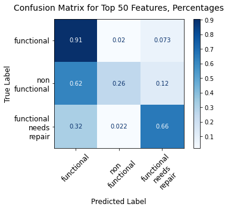


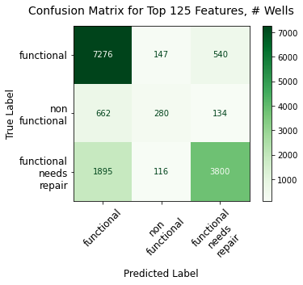


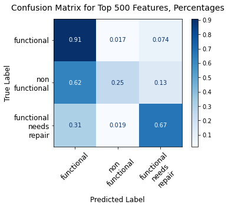


```python
acc_scores_1    # n = [50, 100, 125, 250, 500]
```


    [76.1952861952862,
     76.51178451178451,
     76.47138047138047,
     76.60606060606061,
     76.7003367003367]


### FUNDER, LGA, multiple 'n' values


```python
df.head(3)
```


<div>
<style scoped>
    .dataframe tbody tr th:only-of-type {
        vertical-align: middle;
    }

    .dataframe tbody tr th {
        vertical-align: top;
    }

    .dataframe thead th {
        text-align: right;
    }
</style>
<table border="1" class="dataframe">
  <thead>
    <tr style="text-align: right;">
      <th></th>
      <th>funder</th>
      <th>installer</th>
      <th>wpt_name</th>
      <th>basin</th>
      <th>subvillage</th>
      <th>region</th>
      <th>lga</th>
      <th>ward</th>
      <th>public_meeting</th>
      <th>permit</th>
      <th>construction_year</th>
      <th>extraction_type_class</th>
      <th>management</th>
      <th>payment</th>
      <th>water_quality</th>
      <th>quantity_group</th>
      <th>source</th>
      <th>waterpoint_type</th>
      <th>status_group</th>
      <th>pop_binned</th>
    </tr>
    <tr>
      <th>id</th>
      <th></th>
      <th></th>
      <th></th>
      <th></th>
      <th></th>
      <th></th>
      <th></th>
      <th></th>
      <th></th>
      <th></th>
      <th></th>
      <th></th>
      <th></th>
      <th></th>
      <th></th>
      <th></th>
      <th></th>
      <th></th>
      <th></th>
      <th></th>
    </tr>
  </thead>
  <tbody>
    <tr>
      <th>69572</th>
      <td>roman</td>
      <td>roman</td>
      <td>none</td>
      <td>Lake Nyasa</td>
      <td>mnyusi_b</td>
      <td>Iringa</td>
      <td>Ludewa</td>
      <td>Mundindi</td>
      <td>True</td>
      <td>False</td>
      <td>1999</td>
      <td>gravity</td>
      <td>vwc</td>
      <td>pay annually</td>
      <td>soft</td>
      <td>enough</td>
      <td>spring</td>
      <td>communal standpipe</td>
      <td>functional</td>
      <td>(100, 150]</td>
    </tr>
    <tr>
      <th>8776</th>
      <td>grumeti</td>
      <td>grumeti</td>
      <td>zahanati</td>
      <td>Lake Victoria</td>
      <td>nyamara</td>
      <td>Mara</td>
      <td>Serengeti</td>
      <td>Natta</td>
      <td>NaN</td>
      <td>True</td>
      <td>2010</td>
      <td>gravity</td>
      <td>wug</td>
      <td>never pay</td>
      <td>soft</td>
      <td>insufficient</td>
      <td>rainwater harvesting</td>
      <td>communal standpipe</td>
      <td>functional</td>
      <td>(200, 300]</td>
    </tr>
    <tr>
      <th>34310</th>
      <td>lottery_club</td>
      <td>world_vision</td>
      <td>kwa_mahundi</td>
      <td>Pangani</td>
      <td>majengo</td>
      <td>Manyara</td>
      <td>Simanjiro</td>
      <td>Ngorika</td>
      <td>True</td>
      <td>True</td>
      <td>2009</td>
      <td>gravity</td>
      <td>vwc</td>
      <td>pay per bucket</td>
      <td>soft</td>
      <td>enough</td>
      <td>dam</td>
      <td>communal standpipe multiple</td>
      <td>functional</td>
      <td>(200, 300]</td>
    </tr>
  </tbody>
</table>
</div>


```python
features = ['funder', 'management', 'lga', 'payment', 'water_quality', 
            'quantity_group', 'source', 'extraction_type_class', 'status_group',
           'waterpoint_type', 'permit', 'public_meeting']

features_top_n = ['funder', 'lga']

all_model_features = ['funder_duplicate', 'management', 'lga_duplicate', 'permit', 'public_meeting',
                      'payment', 'water_quality', 'quantity_group', 'source', 
                      'extraction_type_class', 'status_group', 'waterpoint_type']

```


```python
df_ns, X_train_vals_1a, clfs_1a, \
acc_scores_1a, jaccard_scores_1a, \
feat_importances_1a, \
parameters_1a, imp_table_1a, \
summ_imp_table_1a, \
summ_imp_table_subs_1a = top_n_multiple_dt_model_subs(df, features, features_top_n, 
                                                      all_model_features, max_depth=20,
                                                      n_range = [50, 100, 125, 250, 500], 
                                                      criterion='entropy', 
                                                      col_title_length=7, num_feats_incl=100)

```

    Accuracy score, Jaccard score, and confusion matrix for n = 50:
    
    Accuracy score:  76.01346801346801
    Mean Training Score: 79.81%
    Mean Test Score: 76.01%
    Jaccard score:  [0.68834459 0.19112114 0.57554069]
    Individual feature importances, top 10


<div>
<style scoped>
    .dataframe tbody tr th:only-of-type {
        vertical-align: middle;
    }

    .dataframe tbody tr th {
        vertical-align: top;
    }

    .dataframe thead th {
        text-align: right;
    }
</style>
<table border="1" class="dataframe">
  <thead>
    <tr style="text-align: right;">
      <th></th>
      <th>Importance</th>
    </tr>
  </thead>
  <tbody>
    <tr>
      <th>waterpoint_type_other</th>
      <td>0.120131</td>
    </tr>
    <tr>
      <th>quantity_group_seasonal</th>
      <td>0.093963</td>
    </tr>
    <tr>
      <th>quantity_group_enough</th>
      <td>0.066843</td>
    </tr>
    <tr>
      <th>quantity_group_insufficient</th>
      <td>0.054116</td>
    </tr>
    <tr>
      <th>waterpoint_type_communal standpipe multiple</th>
      <td>0.023936</td>
    </tr>
    <tr>
      <th>extraction_type_class_submersible</th>
      <td>0.021236</td>
    </tr>
    <tr>
      <th>payment_pay per bucket</th>
      <td>0.020613</td>
    </tr>
    <tr>
      <th>lga_duplicate_Bariadi</th>
      <td>0.020504</td>
    </tr>
    <tr>
      <th>permit_True</th>
      <td>0.020072</td>
    </tr>
    <tr>
      <th>funder_duplicate_government_of_tanzania</th>
      <td>0.019476</td>
    </tr>
  </tbody>
</table>
</div>


    
    Roll-up summary feature importance table, all features


<div>
<style scoped>
    .dataframe tbody tr th:only-of-type {
        vertical-align: middle;
    }

    .dataframe tbody tr th {
        vertical-align: top;
    }

    .dataframe thead th {
        text-align: right;
    }
</style>
<table border="1" class="dataframe">
  <thead>
    <tr style="text-align: right;">
      <th></th>
      <th>Importance</th>
    </tr>
    <tr>
      <th>var_abbr</th>
      <th></th>
    </tr>
  </thead>
  <tbody>
    <tr>
      <th>quantit</th>
      <td>0.224968</td>
    </tr>
    <tr>
      <th>lga_dup</th>
      <td>0.188334</td>
    </tr>
    <tr>
      <th>waterpo</th>
      <td>0.164545</td>
    </tr>
    <tr>
      <th>funder_</th>
      <td>0.116737</td>
    </tr>
    <tr>
      <th>payment</th>
      <td>0.070129</td>
    </tr>
    <tr>
      <th>source_</th>
      <td>0.065558</td>
    </tr>
    <tr>
      <th>extract</th>
      <td>0.056319</td>
    </tr>
    <tr>
      <th>managem</th>
      <td>0.053821</td>
    </tr>
    <tr>
      <th>water_q</th>
      <td>0.022624</td>
    </tr>
    <tr>
      <th>permit_</th>
      <td>0.020072</td>
    </tr>
    <tr>
      <th>public_</th>
      <td>0.016892</td>
    </tr>
  </tbody>
</table>
</div>


    
    Roll-up summary feature importances, summing up top 100 most important features ONLY:


<div>
<style scoped>
    .dataframe tbody tr th:only-of-type {
        vertical-align: middle;
    }

    .dataframe tbody tr th {
        vertical-align: top;
    }

    .dataframe thead th {
        text-align: right;
    }
</style>
<table border="1" class="dataframe">
  <thead>
    <tr style="text-align: right;">
      <th></th>
      <th>Importance</th>
    </tr>
    <tr>
      <th>var_abbr</th>
      <th></th>
    </tr>
  </thead>
  <tbody>
    <tr>
      <th>quantit</th>
      <td>0.224968</td>
    </tr>
    <tr>
      <th>lga_dup</th>
      <td>0.178932</td>
    </tr>
    <tr>
      <th>waterpo</th>
      <td>0.164545</td>
    </tr>
    <tr>
      <th>funder_</th>
      <td>0.096911</td>
    </tr>
    <tr>
      <th>payment</th>
      <td>0.070129</td>
    </tr>
    <tr>
      <th>source_</th>
      <td>0.064237</td>
    </tr>
    <tr>
      <th>extract</th>
      <td>0.055616</td>
    </tr>
    <tr>
      <th>managem</th>
      <td>0.051305</td>
    </tr>
    <tr>
      <th>permit_</th>
      <td>0.020072</td>
    </tr>
    <tr>
      <th>water_q</th>
      <td>0.019116</td>
    </tr>
    <tr>
      <th>public_</th>
      <td>0.016892</td>
    </tr>
  </tbody>
</table>
</div>


    
    The top 100 dummy variables contribute Importance    0.962723
    dtype: float64
    
    Accuracy score, Jaccard score, and confusion matrix for n = 100:
    
    Accuracy score:  76.23569023569023
    Mean Training Score: 79.61%
    Mean Test Score: 76.24%
    Jaccard score:  [0.69063058 0.2004662  0.57572469]
    Individual feature importances, top 10


<div>
<style scoped>
    .dataframe tbody tr th:only-of-type {
        vertical-align: middle;
    }

    .dataframe tbody tr th {
        vertical-align: top;
    }

    .dataframe thead th {
        text-align: right;
    }
</style>
<table border="1" class="dataframe">
  <thead>
    <tr style="text-align: right;">
      <th></th>
      <th>Importance</th>
    </tr>
  </thead>
  <tbody>
    <tr>
      <th>waterpoint_type_other</th>
      <td>0.124043</td>
    </tr>
    <tr>
      <th>quantity_group_seasonal</th>
      <td>0.096931</td>
    </tr>
    <tr>
      <th>quantity_group_enough</th>
      <td>0.068223</td>
    </tr>
    <tr>
      <th>quantity_group_insufficient</th>
      <td>0.055914</td>
    </tr>
    <tr>
      <th>waterpoint_type_communal standpipe multiple</th>
      <td>0.024281</td>
    </tr>
    <tr>
      <th>lga_duplicate_Bariadi</th>
      <td>0.021026</td>
    </tr>
    <tr>
      <th>payment_pay per bucket</th>
      <td>0.020831</td>
    </tr>
    <tr>
      <th>funder_duplicate_government_of_tanzania</th>
      <td>0.019246</td>
    </tr>
    <tr>
      <th>extraction_type_class_submersible</th>
      <td>0.019133</td>
    </tr>
    <tr>
      <th>source_spring</th>
      <td>0.018473</td>
    </tr>
  </tbody>
</table>
</div>


    
    Roll-up summary feature importance table, all features


<div>
<style scoped>
    .dataframe tbody tr th:only-of-type {
        vertical-align: middle;
    }

    .dataframe tbody tr th {
        vertical-align: top;
    }

    .dataframe thead th {
        text-align: right;
    }
</style>
<table border="1" class="dataframe">
  <thead>
    <tr style="text-align: right;">
      <th></th>
      <th>Importance</th>
    </tr>
    <tr>
      <th>var_abbr</th>
      <th></th>
    </tr>
  </thead>
  <tbody>
    <tr>
      <th>lga_dup</th>
      <td>0.240245</td>
    </tr>
    <tr>
      <th>quantit</th>
      <td>0.231273</td>
    </tr>
    <tr>
      <th>waterpo</th>
      <td>0.169333</td>
    </tr>
    <tr>
      <th>funder_</th>
      <td>0.102980</td>
    </tr>
    <tr>
      <th>payment</th>
      <td>0.066089</td>
    </tr>
    <tr>
      <th>source_</th>
      <td>0.056821</td>
    </tr>
    <tr>
      <th>extract</th>
      <td>0.048442</td>
    </tr>
    <tr>
      <th>managem</th>
      <td>0.042083</td>
    </tr>
    <tr>
      <th>water_q</th>
      <td>0.017696</td>
    </tr>
    <tr>
      <th>public_</th>
      <td>0.012982</td>
    </tr>
    <tr>
      <th>permit_</th>
      <td>0.012056</td>
    </tr>
  </tbody>
</table>
</div>


    
    Roll-up summary feature importances, summing up top 100 most important features ONLY:


<div>
<style scoped>
    .dataframe tbody tr th:only-of-type {
        vertical-align: middle;
    }

    .dataframe tbody tr th {
        vertical-align: top;
    }

    .dataframe thead th {
        text-align: right;
    }
</style>
<table border="1" class="dataframe">
  <thead>
    <tr style="text-align: right;">
      <th></th>
      <th>Importance</th>
    </tr>
    <tr>
      <th>var_abbr</th>
      <th></th>
    </tr>
  </thead>
  <tbody>
    <tr>
      <th>quantit</th>
      <td>0.231273</td>
    </tr>
    <tr>
      <th>lga_dup</th>
      <td>0.191133</td>
    </tr>
    <tr>
      <th>waterpo</th>
      <td>0.169333</td>
    </tr>
    <tr>
      <th>funder_</th>
      <td>0.077398</td>
    </tr>
    <tr>
      <th>payment</th>
      <td>0.066089</td>
    </tr>
    <tr>
      <th>source_</th>
      <td>0.056096</td>
    </tr>
    <tr>
      <th>extract</th>
      <td>0.046657</td>
    </tr>
    <tr>
      <th>managem</th>
      <td>0.038274</td>
    </tr>
    <tr>
      <th>water_q</th>
      <td>0.013572</td>
    </tr>
    <tr>
      <th>public_</th>
      <td>0.012982</td>
    </tr>
    <tr>
      <th>permit_</th>
      <td>0.012056</td>
    </tr>
  </tbody>
</table>
</div>


    
    The top 100 dummy variables contribute Importance    0.914864
    dtype: float64
    
    Accuracy score, Jaccard score, and confusion matrix for n = 125:
    
    Accuracy score:  76.22895622895622
    Mean Training Score: 79.58%
    Mean Test Score: 76.23%
    Jaccard score:  [0.68970381 0.20062451 0.57673267]
    Individual feature importances, top 10


<div>
<style scoped>
    .dataframe tbody tr th:only-of-type {
        vertical-align: middle;
    }

    .dataframe tbody tr th {
        vertical-align: top;
    }

    .dataframe thead th {
        text-align: right;
    }
</style>
<table border="1" class="dataframe">
  <thead>
    <tr style="text-align: right;">
      <th></th>
      <th>Importance</th>
    </tr>
  </thead>
  <tbody>
    <tr>
      <th>waterpoint_type_other</th>
      <td>0.124348</td>
    </tr>
    <tr>
      <th>quantity_group_seasonal</th>
      <td>0.096786</td>
    </tr>
    <tr>
      <th>quantity_group_enough</th>
      <td>0.067913</td>
    </tr>
    <tr>
      <th>quantity_group_insufficient</th>
      <td>0.056126</td>
    </tr>
    <tr>
      <th>waterpoint_type_communal standpipe multiple</th>
      <td>0.023674</td>
    </tr>
    <tr>
      <th>lga_duplicate_Bariadi</th>
      <td>0.021095</td>
    </tr>
    <tr>
      <th>payment_pay per bucket</th>
      <td>0.020288</td>
    </tr>
    <tr>
      <th>funder_duplicate_government_of_tanzania</th>
      <td>0.019567</td>
    </tr>
    <tr>
      <th>extraction_type_class_submersible</th>
      <td>0.018852</td>
    </tr>
    <tr>
      <th>source_spring</th>
      <td>0.018072</td>
    </tr>
  </tbody>
</table>
</div>


    
    Roll-up summary feature importance table, all features


<div>
<style scoped>
    .dataframe tbody tr th:only-of-type {
        vertical-align: middle;
    }

    .dataframe tbody tr th {
        vertical-align: top;
    }

    .dataframe thead th {
        text-align: right;
    }
</style>
<table border="1" class="dataframe">
  <thead>
    <tr style="text-align: right;">
      <th></th>
      <th>Importance</th>
    </tr>
    <tr>
      <th>var_abbr</th>
      <th></th>
    </tr>
  </thead>
  <tbody>
    <tr>
      <th>lga_dup</th>
      <td>0.246554</td>
    </tr>
    <tr>
      <th>quantit</th>
      <td>0.231027</td>
    </tr>
    <tr>
      <th>waterpo</th>
      <td>0.168678</td>
    </tr>
    <tr>
      <th>funder_</th>
      <td>0.102175</td>
    </tr>
    <tr>
      <th>payment</th>
      <td>0.062603</td>
    </tr>
    <tr>
      <th>source_</th>
      <td>0.058762</td>
    </tr>
    <tr>
      <th>extract</th>
      <td>0.047465</td>
    </tr>
    <tr>
      <th>managem</th>
      <td>0.041150</td>
    </tr>
    <tr>
      <th>water_q</th>
      <td>0.017057</td>
    </tr>
    <tr>
      <th>public_</th>
      <td>0.013267</td>
    </tr>
    <tr>
      <th>permit_</th>
      <td>0.011260</td>
    </tr>
  </tbody>
</table>
</div>


    
    Roll-up summary feature importances, summing up top 100 most important features ONLY:


<div>
<style scoped>
    .dataframe tbody tr th:only-of-type {
        vertical-align: middle;
    }

    .dataframe tbody tr th {
        vertical-align: top;
    }

    .dataframe thead th {
        text-align: right;
    }
</style>
<table border="1" class="dataframe">
  <thead>
    <tr style="text-align: right;">
      <th></th>
      <th>Importance</th>
    </tr>
    <tr>
      <th>var_abbr</th>
      <th></th>
    </tr>
  </thead>
  <tbody>
    <tr>
      <th>quantit</th>
      <td>0.231027</td>
    </tr>
    <tr>
      <th>lga_dup</th>
      <td>0.192420</td>
    </tr>
    <tr>
      <th>waterpo</th>
      <td>0.168678</td>
    </tr>
    <tr>
      <th>funder_</th>
      <td>0.073910</td>
    </tr>
    <tr>
      <th>payment</th>
      <td>0.062603</td>
    </tr>
    <tr>
      <th>source_</th>
      <td>0.056316</td>
    </tr>
    <tr>
      <th>extract</th>
      <td>0.046488</td>
    </tr>
    <tr>
      <th>managem</th>
      <td>0.037201</td>
    </tr>
    <tr>
      <th>water_q</th>
      <td>0.014750</td>
    </tr>
    <tr>
      <th>public_</th>
      <td>0.013267</td>
    </tr>
    <tr>
      <th>permit_</th>
      <td>0.011260</td>
    </tr>
  </tbody>
</table>
</div>


    
    The top 100 dummy variables contribute Importance    0.907922
    dtype: float64
    
    Accuracy score, Jaccard score, and confusion matrix for n = 250:
    
    Accuracy score:  76.32323232323233
    Mean Training Score: 79.74%
    Mean Test Score: 76.32%
    Jaccard score:  [0.6909211  0.20544747 0.57810332]
    Individual feature importances, top 10


<div>
<style scoped>
    .dataframe tbody tr th:only-of-type {
        vertical-align: middle;
    }

    .dataframe tbody tr th {
        vertical-align: top;
    }

    .dataframe thead th {
        text-align: right;
    }
</style>
<table border="1" class="dataframe">
  <thead>
    <tr style="text-align: right;">
      <th></th>
      <th>Importance</th>
    </tr>
  </thead>
  <tbody>
    <tr>
      <th>waterpoint_type_other</th>
      <td>0.123565</td>
    </tr>
    <tr>
      <th>quantity_group_seasonal</th>
      <td>0.096097</td>
    </tr>
    <tr>
      <th>quantity_group_enough</th>
      <td>0.067592</td>
    </tr>
    <tr>
      <th>quantity_group_insufficient</th>
      <td>0.055591</td>
    </tr>
    <tr>
      <th>waterpoint_type_communal standpipe multiple</th>
      <td>0.023419</td>
    </tr>
    <tr>
      <th>lga_duplicate_Bariadi</th>
      <td>0.020844</td>
    </tr>
    <tr>
      <th>payment_pay per bucket</th>
      <td>0.019767</td>
    </tr>
    <tr>
      <th>funder_duplicate_government_of_tanzania</th>
      <td>0.018620</td>
    </tr>
    <tr>
      <th>extraction_type_class_submersible</th>
      <td>0.018441</td>
    </tr>
    <tr>
      <th>payment_pay monthly</th>
      <td>0.017372</td>
    </tr>
  </tbody>
</table>
</div>


    
    Roll-up summary feature importance table, all features


<div>
<style scoped>
    .dataframe tbody tr th:only-of-type {
        vertical-align: middle;
    }

    .dataframe tbody tr th {
        vertical-align: top;
    }

    .dataframe thead th {
        text-align: right;
    }
</style>
<table border="1" class="dataframe">
  <thead>
    <tr style="text-align: right;">
      <th></th>
      <th>Importance</th>
    </tr>
    <tr>
      <th>var_abbr</th>
      <th></th>
    </tr>
  </thead>
  <tbody>
    <tr>
      <th>lga_dup</th>
      <td>0.239410</td>
    </tr>
    <tr>
      <th>quantit</th>
      <td>0.229417</td>
    </tr>
    <tr>
      <th>waterpo</th>
      <td>0.167789</td>
    </tr>
    <tr>
      <th>funder_</th>
      <td>0.115997</td>
    </tr>
    <tr>
      <th>payment</th>
      <td>0.062723</td>
    </tr>
    <tr>
      <th>source_</th>
      <td>0.055901</td>
    </tr>
    <tr>
      <th>extract</th>
      <td>0.046158</td>
    </tr>
    <tr>
      <th>managem</th>
      <td>0.042135</td>
    </tr>
    <tr>
      <th>water_q</th>
      <td>0.016476</td>
    </tr>
    <tr>
      <th>public_</th>
      <td>0.013021</td>
    </tr>
    <tr>
      <th>permit_</th>
      <td>0.010973</td>
    </tr>
  </tbody>
</table>
</div>


    
    Roll-up summary feature importances, summing up top 100 most important features ONLY:


<div>
<style scoped>
    .dataframe tbody tr th:only-of-type {
        vertical-align: middle;
    }

    .dataframe tbody tr th {
        vertical-align: top;
    }

    .dataframe thead th {
        text-align: right;
    }
</style>
<table border="1" class="dataframe">
  <thead>
    <tr style="text-align: right;">
      <th></th>
      <th>Importance</th>
    </tr>
    <tr>
      <th>var_abbr</th>
      <th></th>
    </tr>
  </thead>
  <tbody>
    <tr>
      <th>quantit</th>
      <td>0.229417</td>
    </tr>
    <tr>
      <th>lga_dup</th>
      <td>0.188430</td>
    </tr>
    <tr>
      <th>waterpo</th>
      <td>0.167789</td>
    </tr>
    <tr>
      <th>funder_</th>
      <td>0.072461</td>
    </tr>
    <tr>
      <th>payment</th>
      <td>0.062723</td>
    </tr>
    <tr>
      <th>source_</th>
      <td>0.053663</td>
    </tr>
    <tr>
      <th>extract</th>
      <td>0.044934</td>
    </tr>
    <tr>
      <th>managem</th>
      <td>0.037719</td>
    </tr>
    <tr>
      <th>public_</th>
      <td>0.013021</td>
    </tr>
    <tr>
      <th>water_q</th>
      <td>0.012820</td>
    </tr>
    <tr>
      <th>permit_</th>
      <td>0.010973</td>
    </tr>
  </tbody>
</table>
</div>


    
    The top 100 dummy variables contribute Importance    0.893949
    dtype: float64
    
    Accuracy score, Jaccard score, and confusion matrix for n = 500:
    
    Accuracy score:  76.41750841750842
    Mean Training Score: 79.71%
    Mean Test Score: 76.42%
    Jaccard score:  [0.69210502 0.20480993 0.57939714]
    Individual feature importances, top 10


<div>
<style scoped>
    .dataframe tbody tr th:only-of-type {
        vertical-align: middle;
    }

    .dataframe tbody tr th {
        vertical-align: top;
    }

    .dataframe thead th {
        text-align: right;
    }
</style>
<table border="1" class="dataframe">
  <thead>
    <tr style="text-align: right;">
      <th></th>
      <th>Importance</th>
    </tr>
  </thead>
  <tbody>
    <tr>
      <th>waterpoint_type_other</th>
      <td>0.123788</td>
    </tr>
    <tr>
      <th>quantity_group_seasonal</th>
      <td>0.096339</td>
    </tr>
    <tr>
      <th>quantity_group_enough</th>
      <td>0.068182</td>
    </tr>
    <tr>
      <th>quantity_group_insufficient</th>
      <td>0.055267</td>
    </tr>
    <tr>
      <th>waterpoint_type_communal standpipe multiple</th>
      <td>0.023634</td>
    </tr>
    <tr>
      <th>lga_duplicate_Bariadi</th>
      <td>0.020880</td>
    </tr>
    <tr>
      <th>payment_pay per bucket</th>
      <td>0.019987</td>
    </tr>
    <tr>
      <th>funder_duplicate_government_of_tanzania</th>
      <td>0.018424</td>
    </tr>
    <tr>
      <th>source_spring</th>
      <td>0.018011</td>
    </tr>
    <tr>
      <th>extraction_type_class_submersible</th>
      <td>0.017982</td>
    </tr>
  </tbody>
</table>
</div>


    
    Roll-up summary feature importance table, all features


<div>
<style scoped>
    .dataframe tbody tr th:only-of-type {
        vertical-align: middle;
    }

    .dataframe tbody tr th {
        vertical-align: top;
    }

    .dataframe thead th {
        text-align: right;
    }
</style>
<table border="1" class="dataframe">
  <thead>
    <tr style="text-align: right;">
      <th></th>
      <th>Importance</th>
    </tr>
    <tr>
      <th>var_abbr</th>
      <th></th>
    </tr>
  </thead>
  <tbody>
    <tr>
      <th>lga_dup</th>
      <td>0.235530</td>
    </tr>
    <tr>
      <th>quantit</th>
      <td>0.230149</td>
    </tr>
    <tr>
      <th>waterpo</th>
      <td>0.168546</td>
    </tr>
    <tr>
      <th>funder_</th>
      <td>0.120846</td>
    </tr>
    <tr>
      <th>payment</th>
      <td>0.062347</td>
    </tr>
    <tr>
      <th>source_</th>
      <td>0.055121</td>
    </tr>
    <tr>
      <th>extract</th>
      <td>0.046716</td>
    </tr>
    <tr>
      <th>managem</th>
      <td>0.040468</td>
    </tr>
    <tr>
      <th>water_q</th>
      <td>0.016512</td>
    </tr>
    <tr>
      <th>public_</th>
      <td>0.012841</td>
    </tr>
    <tr>
      <th>permit_</th>
      <td>0.010924</td>
    </tr>
  </tbody>
</table>
</div>


    
    Roll-up summary feature importances, summing up top 100 most important features ONLY:


<div>
<style scoped>
    .dataframe tbody tr th:only-of-type {
        vertical-align: middle;
    }

    .dataframe tbody tr th {
        vertical-align: top;
    }

    .dataframe thead th {
        text-align: right;
    }
</style>
<table border="1" class="dataframe">
  <thead>
    <tr style="text-align: right;">
      <th></th>
      <th>Importance</th>
    </tr>
    <tr>
      <th>var_abbr</th>
      <th></th>
    </tr>
  </thead>
  <tbody>
    <tr>
      <th>quantit</th>
      <td>0.230149</td>
    </tr>
    <tr>
      <th>lga_dup</th>
      <td>0.186567</td>
    </tr>
    <tr>
      <th>waterpo</th>
      <td>0.168546</td>
    </tr>
    <tr>
      <th>funder_</th>
      <td>0.064046</td>
    </tr>
    <tr>
      <th>payment</th>
      <td>0.062347</td>
    </tr>
    <tr>
      <th>source_</th>
      <td>0.054369</td>
    </tr>
    <tr>
      <th>extract</th>
      <td>0.045160</td>
    </tr>
    <tr>
      <th>managem</th>
      <td>0.037136</td>
    </tr>
    <tr>
      <th>water_q</th>
      <td>0.014276</td>
    </tr>
    <tr>
      <th>public_</th>
      <td>0.012841</td>
    </tr>
    <tr>
      <th>permit_</th>
      <td>0.010924</td>
    </tr>
  </tbody>
</table>
</div>


    
    The top 100 dummy variables contribute Importance    0.886361
    dtype: float64
    


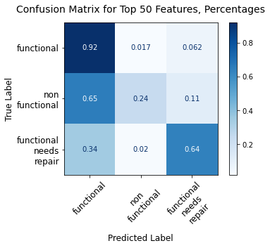


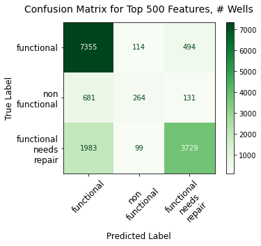


```python
acc_scores_1a    # n = [50, 100, 125, 250, 500]
```


    [76.01346801346801,
     76.23569023569023,
     76.22895622895622,
     76.32323232323233,
     76.41750841750842]


### INSTALLER, LGA, multiple 'n' values


```python
df.head(3)
```


<div>
<style scoped>
    .dataframe tbody tr th:only-of-type {
        vertical-align: middle;
    }

    .dataframe tbody tr th {
        vertical-align: top;
    }

    .dataframe thead th {
        text-align: right;
    }
</style>
<table border="1" class="dataframe">
  <thead>
    <tr style="text-align: right;">
      <th></th>
      <th>funder</th>
      <th>installer</th>
      <th>wpt_name</th>
      <th>basin</th>
      <th>subvillage</th>
      <th>region</th>
      <th>lga</th>
      <th>ward</th>
      <th>public_meeting</th>
      <th>permit</th>
      <th>construction_year</th>
      <th>extraction_type_class</th>
      <th>management</th>
      <th>payment</th>
      <th>water_quality</th>
      <th>quantity_group</th>
      <th>source</th>
      <th>waterpoint_type</th>
      <th>status_group</th>
      <th>pop_binned</th>
    </tr>
    <tr>
      <th>id</th>
      <th></th>
      <th></th>
      <th></th>
      <th></th>
      <th></th>
      <th></th>
      <th></th>
      <th></th>
      <th></th>
      <th></th>
      <th></th>
      <th></th>
      <th></th>
      <th></th>
      <th></th>
      <th></th>
      <th></th>
      <th></th>
      <th></th>
      <th></th>
    </tr>
  </thead>
  <tbody>
    <tr>
      <th>69572</th>
      <td>roman</td>
      <td>roman</td>
      <td>none</td>
      <td>Lake Nyasa</td>
      <td>mnyusi_b</td>
      <td>Iringa</td>
      <td>Ludewa</td>
      <td>Mundindi</td>
      <td>True</td>
      <td>False</td>
      <td>1999</td>
      <td>gravity</td>
      <td>vwc</td>
      <td>pay annually</td>
      <td>soft</td>
      <td>enough</td>
      <td>spring</td>
      <td>communal standpipe</td>
      <td>functional</td>
      <td>(100, 150]</td>
    </tr>
    <tr>
      <th>8776</th>
      <td>grumeti</td>
      <td>grumeti</td>
      <td>zahanati</td>
      <td>Lake Victoria</td>
      <td>nyamara</td>
      <td>Mara</td>
      <td>Serengeti</td>
      <td>Natta</td>
      <td>NaN</td>
      <td>True</td>
      <td>2010</td>
      <td>gravity</td>
      <td>wug</td>
      <td>never pay</td>
      <td>soft</td>
      <td>insufficient</td>
      <td>rainwater harvesting</td>
      <td>communal standpipe</td>
      <td>functional</td>
      <td>(200, 300]</td>
    </tr>
    <tr>
      <th>34310</th>
      <td>lottery_club</td>
      <td>world_vision</td>
      <td>kwa_mahundi</td>
      <td>Pangani</td>
      <td>majengo</td>
      <td>Manyara</td>
      <td>Simanjiro</td>
      <td>Ngorika</td>
      <td>True</td>
      <td>True</td>
      <td>2009</td>
      <td>gravity</td>
      <td>vwc</td>
      <td>pay per bucket</td>
      <td>soft</td>
      <td>enough</td>
      <td>dam</td>
      <td>communal standpipe multiple</td>
      <td>functional</td>
      <td>(200, 300]</td>
    </tr>
  </tbody>
</table>
</div>


```python
features = ['installer', 'management', 'lga', 'payment', 'water_quality', 
            'quantity_group', 'source', 'extraction_type_class', 'status_group',
           'waterpoint_type', 'permit', 'public_meeting']

features_top_n = ['installer', 'lga']

all_model_features = ['installer_duplicate', 'lga_duplicate', 'permit', 'public_meeting',
                      'payment', 'water_quality', 'quantity_group', 'source', 'management', 
                      'extraction_type_class', 'status_group', 'waterpoint_type']

df_ns, X_train_vals_3, clfs_3, accs_3, \
js_3, feat_imp_3, \
params_3, imp_tables_3, \
sum_imps_3, sum_sub_imps_3 = top_n_multiple_dt_model_subs(df, features, features_top_n, 
                                                          all_model_features, max_depth=20,
                                                          n_range = [50, 100, 125, 250, 500], 
                                                          criterion='entropy', col_title_length=7, 
                                                          num_feats_incl=100)

```

    Accuracy score, Jaccard score, and confusion matrix for n = 50:
    
    Accuracy score:  75.8114478114478
    Mean Training Score: 79.59%
    Mean Test Score: 75.81%
    Jaccard score:  [0.68493795 0.18650493 0.57453368]
    Individual feature importances, top 10


<div>
<style scoped>
    .dataframe tbody tr th:only-of-type {
        vertical-align: middle;
    }

    .dataframe tbody tr th {
        vertical-align: top;
    }

    .dataframe thead th {
        text-align: right;
    }
</style>
<table border="1" class="dataframe">
  <thead>
    <tr style="text-align: right;">
      <th></th>
      <th>Importance</th>
    </tr>
  </thead>
  <tbody>
    <tr>
      <th>waterpoint_type_other</th>
      <td>0.123433</td>
    </tr>
    <tr>
      <th>quantity_group_seasonal</th>
      <td>0.097133</td>
    </tr>
    <tr>
      <th>quantity_group_enough</th>
      <td>0.068473</td>
    </tr>
    <tr>
      <th>quantity_group_insufficient</th>
      <td>0.056391</td>
    </tr>
    <tr>
      <th>waterpoint_type_communal standpipe multiple</th>
      <td>0.024777</td>
    </tr>
    <tr>
      <th>extraction_type_class_submersible</th>
      <td>0.023957</td>
    </tr>
    <tr>
      <th>permit_True</th>
      <td>0.022381</td>
    </tr>
    <tr>
      <th>lga_duplicate_Bariadi</th>
      <td>0.021076</td>
    </tr>
    <tr>
      <th>payment_pay per bucket</th>
      <td>0.019104</td>
    </tr>
    <tr>
      <th>public_meeting_True</th>
      <td>0.018963</td>
    </tr>
  </tbody>
</table>
</div>


    
    Roll-up summary feature importance table, all features


<div>
<style scoped>
    .dataframe tbody tr th:only-of-type {
        vertical-align: middle;
    }

    .dataframe tbody tr th {
        vertical-align: top;
    }

    .dataframe thead th {
        text-align: right;
    }
</style>
<table border="1" class="dataframe">
  <thead>
    <tr style="text-align: right;">
      <th></th>
      <th>Importance</th>
    </tr>
    <tr>
      <th>var_abbr</th>
      <th></th>
    </tr>
  </thead>
  <tbody>
    <tr>
      <th>quantit</th>
      <td>0.232379</td>
    </tr>
    <tr>
      <th>lga_dup</th>
      <td>0.186250</td>
    </tr>
    <tr>
      <th>waterpo</th>
      <td>0.167384</td>
    </tr>
    <tr>
      <th>install</th>
      <td>0.105947</td>
    </tr>
    <tr>
      <th>payment</th>
      <td>0.070021</td>
    </tr>
    <tr>
      <th>source_</th>
      <td>0.065102</td>
    </tr>
    <tr>
      <th>managem</th>
      <td>0.055668</td>
    </tr>
    <tr>
      <th>extract</th>
      <td>0.053902</td>
    </tr>
    <tr>
      <th>permit_</th>
      <td>0.022381</td>
    </tr>
    <tr>
      <th>water_q</th>
      <td>0.022001</td>
    </tr>
    <tr>
      <th>public_</th>
      <td>0.018963</td>
    </tr>
  </tbody>
</table>
</div>


    
    Roll-up summary feature importances, summing up top 100 most important features ONLY:


<div>
<style scoped>
    .dataframe tbody tr th:only-of-type {
        vertical-align: middle;
    }

    .dataframe tbody tr th {
        vertical-align: top;
    }

    .dataframe thead th {
        text-align: right;
    }
</style>
<table border="1" class="dataframe">
  <thead>
    <tr style="text-align: right;">
      <th></th>
      <th>Importance</th>
    </tr>
    <tr>
      <th>var_abbr</th>
      <th></th>
    </tr>
  </thead>
  <tbody>
    <tr>
      <th>quantit</th>
      <td>0.232379</td>
    </tr>
    <tr>
      <th>lga_dup</th>
      <td>0.178076</td>
    </tr>
    <tr>
      <th>waterpo</th>
      <td>0.167384</td>
    </tr>
    <tr>
      <th>install</th>
      <td>0.089832</td>
    </tr>
    <tr>
      <th>payment</th>
      <td>0.070021</td>
    </tr>
    <tr>
      <th>source_</th>
      <td>0.063555</td>
    </tr>
    <tr>
      <th>managem</th>
      <td>0.052694</td>
    </tr>
    <tr>
      <th>extract</th>
      <td>0.051708</td>
    </tr>
    <tr>
      <th>permit_</th>
      <td>0.022381</td>
    </tr>
    <tr>
      <th>water_q</th>
      <td>0.021646</td>
    </tr>
    <tr>
      <th>public_</th>
      <td>0.018963</td>
    </tr>
  </tbody>
</table>
</div>


    
    The top 100 dummy variables contribute Importance    0.96864
    dtype: float64
    
    Accuracy score, Jaccard score, and confusion matrix for n = 100:
    
    Accuracy score:  75.83164983164983
    Mean Training Score: 78.81%
    Mean Test Score: 75.83%
    Jaccard score:  [0.68766282 0.19307692 0.56626506]
    Individual feature importances, top 10


<div>
<style scoped>
    .dataframe tbody tr th:only-of-type {
        vertical-align: middle;
    }

    .dataframe tbody tr th {
        vertical-align: top;
    }

    .dataframe thead th {
        text-align: right;
    }
</style>
<table border="1" class="dataframe">
  <thead>
    <tr style="text-align: right;">
      <th></th>
      <th>Importance</th>
    </tr>
  </thead>
  <tbody>
    <tr>
      <th>waterpoint_type_other</th>
      <td>0.128819</td>
    </tr>
    <tr>
      <th>quantity_group_seasonal</th>
      <td>0.100543</td>
    </tr>
    <tr>
      <th>quantity_group_enough</th>
      <td>0.070977</td>
    </tr>
    <tr>
      <th>quantity_group_insufficient</th>
      <td>0.057845</td>
    </tr>
    <tr>
      <th>waterpoint_type_communal standpipe multiple</th>
      <td>0.024720</td>
    </tr>
    <tr>
      <th>lga_duplicate_Bariadi</th>
      <td>0.022103</td>
    </tr>
    <tr>
      <th>extraction_type_class_submersible</th>
      <td>0.021227</td>
    </tr>
    <tr>
      <th>payment_pay monthly</th>
      <td>0.016553</td>
    </tr>
    <tr>
      <th>source_spring</th>
      <td>0.016474</td>
    </tr>
    <tr>
      <th>permit_True</th>
      <td>0.015957</td>
    </tr>
  </tbody>
</table>
</div>


    
    Roll-up summary feature importance table, all features


<div>
<style scoped>
    .dataframe tbody tr th:only-of-type {
        vertical-align: middle;
    }

    .dataframe tbody tr th {
        vertical-align: top;
    }

    .dataframe thead th {
        text-align: right;
    }
</style>
<table border="1" class="dataframe">
  <thead>
    <tr style="text-align: right;">
      <th></th>
      <th>Importance</th>
    </tr>
    <tr>
      <th>var_abbr</th>
      <th></th>
    </tr>
  </thead>
  <tbody>
    <tr>
      <th>lga_dup</th>
      <td>0.241868</td>
    </tr>
    <tr>
      <th>quantit</th>
      <td>0.240242</td>
    </tr>
    <tr>
      <th>waterpo</th>
      <td>0.170026</td>
    </tr>
    <tr>
      <th>install</th>
      <td>0.089189</td>
    </tr>
    <tr>
      <th>payment</th>
      <td>0.060235</td>
    </tr>
    <tr>
      <th>source_</th>
      <td>0.059932</td>
    </tr>
    <tr>
      <th>extract</th>
      <td>0.048080</td>
    </tr>
    <tr>
      <th>managem</th>
      <td>0.043980</td>
    </tr>
    <tr>
      <th>water_q</th>
      <td>0.016606</td>
    </tr>
    <tr>
      <th>permit_</th>
      <td>0.015957</td>
    </tr>
    <tr>
      <th>public_</th>
      <td>0.013884</td>
    </tr>
  </tbody>
</table>
</div>


    
    Roll-up summary feature importances, summing up top 100 most important features ONLY:


<div>
<style scoped>
    .dataframe tbody tr th:only-of-type {
        vertical-align: middle;
    }

    .dataframe tbody tr th {
        vertical-align: top;
    }

    .dataframe thead th {
        text-align: right;
    }
</style>
<table border="1" class="dataframe">
  <thead>
    <tr style="text-align: right;">
      <th></th>
      <th>Importance</th>
    </tr>
    <tr>
      <th>var_abbr</th>
      <th></th>
    </tr>
  </thead>
  <tbody>
    <tr>
      <th>quantit</th>
      <td>0.240242</td>
    </tr>
    <tr>
      <th>lga_dup</th>
      <td>0.204450</td>
    </tr>
    <tr>
      <th>waterpo</th>
      <td>0.170026</td>
    </tr>
    <tr>
      <th>install</th>
      <td>0.060508</td>
    </tr>
    <tr>
      <th>payment</th>
      <td>0.060235</td>
    </tr>
    <tr>
      <th>source_</th>
      <td>0.059113</td>
    </tr>
    <tr>
      <th>extract</th>
      <td>0.047115</td>
    </tr>
    <tr>
      <th>managem</th>
      <td>0.040510</td>
    </tr>
    <tr>
      <th>permit_</th>
      <td>0.015957</td>
    </tr>
    <tr>
      <th>water_q</th>
      <td>0.014521</td>
    </tr>
    <tr>
      <th>public_</th>
      <td>0.013884</td>
    </tr>
  </tbody>
</table>
</div>


    
    The top 100 dummy variables contribute Importance    0.926563
    dtype: float64
    
    Accuracy score, Jaccard score, and confusion matrix for n = 125:
    
    Accuracy score:  75.74410774410775
    Mean Training Score: 78.79%
    Mean Test Score: 75.74%
    Jaccard score:  [0.68697108 0.19266055 0.56470036]
    Individual feature importances, top 10


<div>
<style scoped>
    .dataframe tbody tr th:only-of-type {
        vertical-align: middle;
    }

    .dataframe tbody tr th {
        vertical-align: top;
    }

    .dataframe thead th {
        text-align: right;
    }
</style>
<table border="1" class="dataframe">
  <thead>
    <tr style="text-align: right;">
      <th></th>
      <th>Importance</th>
    </tr>
  </thead>
  <tbody>
    <tr>
      <th>waterpoint_type_other</th>
      <td>0.129063</td>
    </tr>
    <tr>
      <th>quantity_group_seasonal</th>
      <td>0.100507</td>
    </tr>
    <tr>
      <th>quantity_group_enough</th>
      <td>0.070259</td>
    </tr>
    <tr>
      <th>quantity_group_insufficient</th>
      <td>0.058332</td>
    </tr>
    <tr>
      <th>waterpoint_type_communal standpipe multiple</th>
      <td>0.024516</td>
    </tr>
    <tr>
      <th>lga_duplicate_Bariadi</th>
      <td>0.022039</td>
    </tr>
    <tr>
      <th>extraction_type_class_submersible</th>
      <td>0.021292</td>
    </tr>
    <tr>
      <th>payment_pay monthly</th>
      <td>0.016545</td>
    </tr>
    <tr>
      <th>source_spring</th>
      <td>0.015883</td>
    </tr>
    <tr>
      <th>management_vwc</th>
      <td>0.015424</td>
    </tr>
  </tbody>
</table>
</div>


    
    Roll-up summary feature importance table, all features


<div>
<style scoped>
    .dataframe tbody tr th:only-of-type {
        vertical-align: middle;
    }

    .dataframe tbody tr th {
        vertical-align: top;
    }

    .dataframe thead th {
        text-align: right;
    }
</style>
<table border="1" class="dataframe">
  <thead>
    <tr style="text-align: right;">
      <th></th>
      <th>Importance</th>
    </tr>
    <tr>
      <th>var_abbr</th>
      <th></th>
    </tr>
  </thead>
  <tbody>
    <tr>
      <th>lga_dup</th>
      <td>0.244761</td>
    </tr>
    <tr>
      <th>quantit</th>
      <td>0.239786</td>
    </tr>
    <tr>
      <th>waterpo</th>
      <td>0.171971</td>
    </tr>
    <tr>
      <th>install</th>
      <td>0.088306</td>
    </tr>
    <tr>
      <th>source_</th>
      <td>0.059666</td>
    </tr>
    <tr>
      <th>payment</th>
      <td>0.059211</td>
    </tr>
    <tr>
      <th>extract</th>
      <td>0.047282</td>
    </tr>
    <tr>
      <th>managem</th>
      <td>0.043367</td>
    </tr>
    <tr>
      <th>water_q</th>
      <td>0.017193</td>
    </tr>
    <tr>
      <th>permit_</th>
      <td>0.015231</td>
    </tr>
    <tr>
      <th>public_</th>
      <td>0.013227</td>
    </tr>
  </tbody>
</table>
</div>


    
    Roll-up summary feature importances, summing up top 100 most important features ONLY:


<div>
<style scoped>
    .dataframe tbody tr th:only-of-type {
        vertical-align: middle;
    }

    .dataframe tbody tr th {
        vertical-align: top;
    }

    .dataframe thead th {
        text-align: right;
    }
</style>
<table border="1" class="dataframe">
  <thead>
    <tr style="text-align: right;">
      <th></th>
      <th>Importance</th>
    </tr>
    <tr>
      <th>var_abbr</th>
      <th></th>
    </tr>
  </thead>
  <tbody>
    <tr>
      <th>quantit</th>
      <td>0.239786</td>
    </tr>
    <tr>
      <th>lga_dup</th>
      <td>0.201309</td>
    </tr>
    <tr>
      <th>waterpo</th>
      <td>0.171971</td>
    </tr>
    <tr>
      <th>payment</th>
      <td>0.059211</td>
    </tr>
    <tr>
      <th>source_</th>
      <td>0.058989</td>
    </tr>
    <tr>
      <th>install</th>
      <td>0.057211</td>
    </tr>
    <tr>
      <th>extract</th>
      <td>0.046994</td>
    </tr>
    <tr>
      <th>managem</th>
      <td>0.042145</td>
    </tr>
    <tr>
      <th>permit_</th>
      <td>0.015231</td>
    </tr>
    <tr>
      <th>water_q</th>
      <td>0.014776</td>
    </tr>
    <tr>
      <th>public_</th>
      <td>0.013227</td>
    </tr>
  </tbody>
</table>
</div>


    
    The top 100 dummy variables contribute Importance    0.920849
    dtype: float64
    
    Accuracy score, Jaccard score, and confusion matrix for n = 250:
    
    Accuracy score:  75.80471380471381
    Mean Training Score: 78.83%
    Mean Test Score: 75.80%
    Jaccard score:  [0.68697029 0.20229885 0.56506796]
    Individual feature importances, top 10


<div>
<style scoped>
    .dataframe tbody tr th:only-of-type {
        vertical-align: middle;
    }

    .dataframe tbody tr th {
        vertical-align: top;
    }

    .dataframe thead th {
        text-align: right;
    }
</style>
<table border="1" class="dataframe">
  <thead>
    <tr style="text-align: right;">
      <th></th>
      <th>Importance</th>
    </tr>
  </thead>
  <tbody>
    <tr>
      <th>waterpoint_type_other</th>
      <td>0.128883</td>
    </tr>
    <tr>
      <th>quantity_group_seasonal</th>
      <td>0.100044</td>
    </tr>
    <tr>
      <th>quantity_group_enough</th>
      <td>0.070226</td>
    </tr>
    <tr>
      <th>quantity_group_insufficient</th>
      <td>0.058382</td>
    </tr>
    <tr>
      <th>waterpoint_type_communal standpipe multiple</th>
      <td>0.024015</td>
    </tr>
    <tr>
      <th>lga_duplicate_Bariadi</th>
      <td>0.021805</td>
    </tr>
    <tr>
      <th>extraction_type_class_submersible</th>
      <td>0.020800</td>
    </tr>
    <tr>
      <th>payment_pay monthly</th>
      <td>0.016974</td>
    </tr>
    <tr>
      <th>payment_pay per bucket</th>
      <td>0.014937</td>
    </tr>
    <tr>
      <th>source_spring</th>
      <td>0.014908</td>
    </tr>
  </tbody>
</table>
</div>


    
    Roll-up summary feature importance table, all features


<div>
<style scoped>
    .dataframe tbody tr th:only-of-type {
        vertical-align: middle;
    }

    .dataframe tbody tr th {
        vertical-align: top;
    }

    .dataframe thead th {
        text-align: right;
    }
</style>
<table border="1" class="dataframe">
  <thead>
    <tr style="text-align: right;">
      <th></th>
      <th>Importance</th>
    </tr>
    <tr>
      <th>var_abbr</th>
      <th></th>
    </tr>
  </thead>
  <tbody>
    <tr>
      <th>quantit</th>
      <td>0.239225</td>
    </tr>
    <tr>
      <th>lga_dup</th>
      <td>0.238823</td>
    </tr>
    <tr>
      <th>waterpo</th>
      <td>0.169943</td>
    </tr>
    <tr>
      <th>install</th>
      <td>0.100422</td>
    </tr>
    <tr>
      <th>payment</th>
      <td>0.059429</td>
    </tr>
    <tr>
      <th>source_</th>
      <td>0.056929</td>
    </tr>
    <tr>
      <th>extract</th>
      <td>0.047768</td>
    </tr>
    <tr>
      <th>managem</th>
      <td>0.043272</td>
    </tr>
    <tr>
      <th>water_q</th>
      <td>0.016409</td>
    </tr>
    <tr>
      <th>permit_</th>
      <td>0.014651</td>
    </tr>
    <tr>
      <th>public_</th>
      <td>0.013127</td>
    </tr>
  </tbody>
</table>
</div>


    
    Roll-up summary feature importances, summing up top 100 most important features ONLY:


<div>
<style scoped>
    .dataframe tbody tr th:only-of-type {
        vertical-align: middle;
    }

    .dataframe tbody tr th {
        vertical-align: top;
    }

    .dataframe thead th {
        text-align: right;
    }
</style>
<table border="1" class="dataframe">
  <thead>
    <tr style="text-align: right;">
      <th></th>
      <th>Importance</th>
    </tr>
    <tr>
      <th>var_abbr</th>
      <th></th>
    </tr>
  </thead>
  <tbody>
    <tr>
      <th>quantit</th>
      <td>0.239225</td>
    </tr>
    <tr>
      <th>lga_dup</th>
      <td>0.197434</td>
    </tr>
    <tr>
      <th>waterpo</th>
      <td>0.169943</td>
    </tr>
    <tr>
      <th>install</th>
      <td>0.059526</td>
    </tr>
    <tr>
      <th>payment</th>
      <td>0.059429</td>
    </tr>
    <tr>
      <th>source_</th>
      <td>0.056420</td>
    </tr>
    <tr>
      <th>extract</th>
      <td>0.047230</td>
    </tr>
    <tr>
      <th>managem</th>
      <td>0.041922</td>
    </tr>
    <tr>
      <th>permit_</th>
      <td>0.014651</td>
    </tr>
    <tr>
      <th>water_q</th>
      <td>0.013913</td>
    </tr>
    <tr>
      <th>public_</th>
      <td>0.013127</td>
    </tr>
  </tbody>
</table>
</div>


    
    The top 100 dummy variables contribute Importance    0.91282
    dtype: float64
    
    Accuracy score, Jaccard score, and confusion matrix for n = 500:
    
    Accuracy score:  75.84511784511785
    Mean Training Score: 78.84%
    Mean Test Score: 75.85%
    Jaccard score:  [0.68800075 0.20030581 0.56544175]
    Individual feature importances, top 10


<div>
<style scoped>
    .dataframe tbody tr th:only-of-type {
        vertical-align: middle;
    }

    .dataframe tbody tr th {
        vertical-align: top;
    }

    .dataframe thead th {
        text-align: right;
    }
</style>
<table border="1" class="dataframe">
  <thead>
    <tr style="text-align: right;">
      <th></th>
      <th>Importance</th>
    </tr>
  </thead>
  <tbody>
    <tr>
      <th>waterpoint_type_other</th>
      <td>0.129208</td>
    </tr>
    <tr>
      <th>quantity_group_seasonal</th>
      <td>0.100469</td>
    </tr>
    <tr>
      <th>quantity_group_enough</th>
      <td>0.070664</td>
    </tr>
    <tr>
      <th>quantity_group_insufficient</th>
      <td>0.058007</td>
    </tr>
    <tr>
      <th>waterpoint_type_communal standpipe multiple</th>
      <td>0.024181</td>
    </tr>
    <tr>
      <th>lga_duplicate_Bariadi</th>
      <td>0.022019</td>
    </tr>
    <tr>
      <th>extraction_type_class_submersible</th>
      <td>0.020114</td>
    </tr>
    <tr>
      <th>payment_pay monthly</th>
      <td>0.015965</td>
    </tr>
    <tr>
      <th>permit_True</th>
      <td>0.015816</td>
    </tr>
    <tr>
      <th>management_vwc</th>
      <td>0.014788</td>
    </tr>
  </tbody>
</table>
</div>


    
    Roll-up summary feature importance table, all features


<div>
<style scoped>
    .dataframe tbody tr th:only-of-type {
        vertical-align: middle;
    }

    .dataframe tbody tr th {
        vertical-align: top;
    }

    .dataframe thead th {
        text-align: right;
    }
</style>
<table border="1" class="dataframe">
  <thead>
    <tr style="text-align: right;">
      <th></th>
      <th>Importance</th>
    </tr>
    <tr>
      <th>var_abbr</th>
      <th></th>
    </tr>
  </thead>
  <tbody>
    <tr>
      <th>quantit</th>
      <td>0.239845</td>
    </tr>
    <tr>
      <th>lga_dup</th>
      <td>0.235698</td>
    </tr>
    <tr>
      <th>waterpo</th>
      <td>0.169650</td>
    </tr>
    <tr>
      <th>install</th>
      <td>0.108666</td>
    </tr>
    <tr>
      <th>payment</th>
      <td>0.057400</td>
    </tr>
    <tr>
      <th>source_</th>
      <td>0.056452</td>
    </tr>
    <tr>
      <th>extract</th>
      <td>0.046432</td>
    </tr>
    <tr>
      <th>managem</th>
      <td>0.041618</td>
    </tr>
    <tr>
      <th>permit_</th>
      <td>0.015816</td>
    </tr>
    <tr>
      <th>water_q</th>
      <td>0.015669</td>
    </tr>
    <tr>
      <th>public_</th>
      <td>0.012755</td>
    </tr>
  </tbody>
</table>
</div>


    
    Roll-up summary feature importances, summing up top 100 most important features ONLY:


<div>
<style scoped>
    .dataframe tbody tr th:only-of-type {
        vertical-align: middle;
    }

    .dataframe tbody tr th {
        vertical-align: top;
    }

    .dataframe thead th {
        text-align: right;
    }
</style>
<table border="1" class="dataframe">
  <thead>
    <tr style="text-align: right;">
      <th></th>
      <th>Importance</th>
    </tr>
    <tr>
      <th>var_abbr</th>
      <th></th>
    </tr>
  </thead>
  <tbody>
    <tr>
      <th>quantit</th>
      <td>0.239845</td>
    </tr>
    <tr>
      <th>lga_dup</th>
      <td>0.195892</td>
    </tr>
    <tr>
      <th>waterpo</th>
      <td>0.169650</td>
    </tr>
    <tr>
      <th>payment</th>
      <td>0.057400</td>
    </tr>
    <tr>
      <th>source_</th>
      <td>0.055336</td>
    </tr>
    <tr>
      <th>install</th>
      <td>0.053996</td>
    </tr>
    <tr>
      <th>extract</th>
      <td>0.045898</td>
    </tr>
    <tr>
      <th>managem</th>
      <td>0.040244</td>
    </tr>
    <tr>
      <th>permit_</th>
      <td>0.015816</td>
    </tr>
    <tr>
      <th>water_q</th>
      <td>0.013098</td>
    </tr>
    <tr>
      <th>public_</th>
      <td>0.012755</td>
    </tr>
  </tbody>
</table>
</div>


    
    The top 100 dummy variables contribute Importance    0.899931
    dtype: float64
    


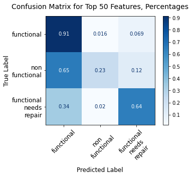


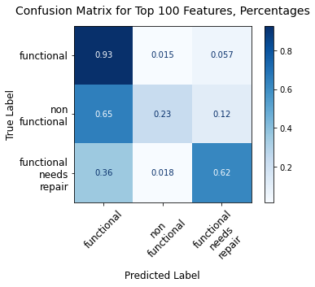


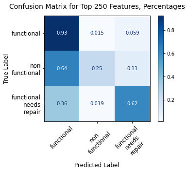


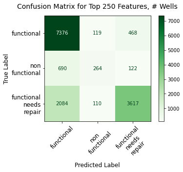


```python
accs_3
```


    [75.8114478114478,
     75.83164983164983,
     75.74410774410775,
     75.76430976430977,
     75.8114478114478]


## Addressing imbalanced classes to get better prediction of non-functional functional-needing-repairs wells

Because class imbalance seems to play an imporantant role in the problems of correctly predicting non-functional and functional-needing-repair wells, it's necessary to address this issue; otherwise, the model is not much good for correctly predicting the wells most in need of repair.  

There are a number of ways to address the imbalanced class issue.  I will utilize two approaches in this decision tree modeling section:  class_weight (setting class_weight='balanced' or to a dictionary of weights for the target classes) and SMOTE (Synthetic Minority Oversampling Technique). 

The class_weight argument is used when instantiating the decision tree classifier in scikit-learn, and enables us to adjust how the algorithm treats errors of different kinds.  The default value for class_weight is 'None', which basically means that classification errors are treated the same whether the error is a false negative (e.g., a non-functional well categorized as functional) or a false positive (e.g., a functional well categorized as non-functional).  However, I would argue that these errors are not equal; mis-identifying non-functional wells as functional is a bigger problem than is identifying functional wells as non-functional.  

SMOTE takes a different approach to the imbalanced classes problem by oversampling the minority classes to arrive at a distribution of classes and supporting data that are equal in size.  Having equal classes gives the algorithm a better shot at correctly predicting a new well that it has not encountered before.  To understand how to perform the SMOTE transformation, I extensively referenced Dr. Jason Brownlee's article "SMOTE for Imbalanced Classification with Python"; URL is https://machinelearningmastery.com/smote-oversampling-for-imbalanced-classification/ .

Whereas the class_weight argument is made when instantiating the decision tree classifier (after train-test-split), SMOTE resampling must be done before train-test-split.  After resampling is completed, the data is fed into the train-test-split process and modeling process as before.  

## Decision Trees: Class_weight='balanced'; FUNDER and LGA; max_depth=20 (optimized hyperparameters)


```python
# criterion='gini', max_depth=20

X_train_vals_cw, clfs_cw, acc_scores_cw, \
jaccard_scores_cw, feat_importances_cw, \
parameters_cw, imp_tables_cw, \
summ_importance_tables_cw = top_n_multiple_dt_model_cw(df, features, features_top_n, all_model_features, 
                                                       n_range=[25, 50, 100, 125, 250], random_state=123, 
                                                       criterion='gini', max_depth=20, col_title_length=7, 
                                                       class_weight='balanced', min_samples_split=2)

```

    Accuracy score, Jaccard score, and confusion matrix for n = 25:
    Accuracy score:  64.53872053872054
    Mean Training Score: 69.62%
    Mean Test Score: 64.54%
    Jaccard score:  [0.54757074 0.17560976 0.56172004]
    Individual feature importances--showing top 10:


<div>
<style scoped>
    .dataframe tbody tr th:only-of-type {
        vertical-align: middle;
    }

    .dataframe tbody tr th {
        vertical-align: top;
    }

    .dataframe thead th {
        text-align: right;
    }
</style>
<table border="1" class="dataframe">
  <thead>
    <tr style="text-align: right;">
      <th></th>
      <th>Importance</th>
    </tr>
  </thead>
  <tbody>
    <tr>
      <th>quantity_group_seasonal</th>
      <td>0.085884</td>
    </tr>
    <tr>
      <th>extraction_type_class_other</th>
      <td>0.085085</td>
    </tr>
    <tr>
      <th>quantity_group_insufficient</th>
      <td>0.046654</td>
    </tr>
    <tr>
      <th>quantity_group_enough</th>
      <td>0.044859</td>
    </tr>
    <tr>
      <th>lga_duplicate_Bariadi</th>
      <td>0.040066</td>
    </tr>
    <tr>
      <th>lga_duplicate_Kigoma Rural</th>
      <td>0.034261</td>
    </tr>
    <tr>
      <th>source_spring</th>
      <td>0.028937</td>
    </tr>
    <tr>
      <th>payment_pay per bucket</th>
      <td>0.025807</td>
    </tr>
    <tr>
      <th>permit_True</th>
      <td>0.025131</td>
    </tr>
    <tr>
      <th>waterpoint_type_hand pump</th>
      <td>0.023470</td>
    </tr>
  </tbody>
</table>
</div>


    
    Roll-up summary feature importance table, all features:


<div>
<style scoped>
    .dataframe tbody tr th:only-of-type {
        vertical-align: middle;
    }

    .dataframe tbody tr th {
        vertical-align: top;
    }

    .dataframe thead th {
        text-align: right;
    }
</style>
<table border="1" class="dataframe">
  <thead>
    <tr style="text-align: right;">
      <th></th>
      <th>Importance</th>
    </tr>
    <tr>
      <th>var_abbr</th>
      <th></th>
    </tr>
  </thead>
  <tbody>
    <tr>
      <th>lga_dup</th>
      <td>0.194618</td>
    </tr>
    <tr>
      <th>quantit</th>
      <td>0.180077</td>
    </tr>
    <tr>
      <th>extract</th>
      <td>0.121008</td>
    </tr>
    <tr>
      <th>funder_</th>
      <td>0.109894</td>
    </tr>
    <tr>
      <th>payment</th>
      <td>0.094605</td>
    </tr>
    <tr>
      <th>source_</th>
      <td>0.090686</td>
    </tr>
    <tr>
      <th>managem</th>
      <td>0.078027</td>
    </tr>
    <tr>
      <th>waterpo</th>
      <td>0.060813</td>
    </tr>
    <tr>
      <th>water_q</th>
      <td>0.025142</td>
    </tr>
    <tr>
      <th>permit_</th>
      <td>0.025131</td>
    </tr>
    <tr>
      <th>public_</th>
      <td>0.019999</td>
    </tr>
  </tbody>
</table>
</div>


    
    
    Accuracy score, Jaccard score, and confusion matrix for n = 50:
    Accuracy score:  63.87878787878788
    Mean Training Score: 68.12%
    Mean Test Score: 63.88%
    Jaccard score:  [0.54120172 0.16951896 0.56453577]
    Individual feature importances--showing top 10:


<div>
<style scoped>
    .dataframe tbody tr th:only-of-type {
        vertical-align: middle;
    }

    .dataframe tbody tr th {
        vertical-align: top;
    }

    .dataframe thead th {
        text-align: right;
    }
</style>
<table border="1" class="dataframe">
  <thead>
    <tr style="text-align: right;">
      <th></th>
      <th>Importance</th>
    </tr>
  </thead>
  <tbody>
    <tr>
      <th>quantity_group_seasonal</th>
      <td>0.087736</td>
    </tr>
    <tr>
      <th>extraction_type_class_other</th>
      <td>0.086747</td>
    </tr>
    <tr>
      <th>quantity_group_insufficient</th>
      <td>0.047230</td>
    </tr>
    <tr>
      <th>quantity_group_enough</th>
      <td>0.045568</td>
    </tr>
    <tr>
      <th>lga_duplicate_Bariadi</th>
      <td>0.040551</td>
    </tr>
    <tr>
      <th>lga_duplicate_Kigoma Rural</th>
      <td>0.033951</td>
    </tr>
    <tr>
      <th>source_spring</th>
      <td>0.029435</td>
    </tr>
    <tr>
      <th>payment_pay per bucket</th>
      <td>0.022500</td>
    </tr>
    <tr>
      <th>waterpoint_type_hand pump</th>
      <td>0.021935</td>
    </tr>
    <tr>
      <th>funder_duplicate_government_of_tanzania</th>
      <td>0.021283</td>
    </tr>
  </tbody>
</table>
</div>


    
    Roll-up summary feature importance table, all features:


<div>
<style scoped>
    .dataframe tbody tr th:only-of-type {
        vertical-align: middle;
    }

    .dataframe tbody tr th {
        vertical-align: top;
    }

    .dataframe thead th {
        text-align: right;
    }
</style>
<table border="1" class="dataframe">
  <thead>
    <tr style="text-align: right;">
      <th></th>
      <th>Importance</th>
    </tr>
    <tr>
      <th>var_abbr</th>
      <th></th>
    </tr>
  </thead>
  <tbody>
    <tr>
      <th>lga_dup</th>
      <td>0.243795</td>
    </tr>
    <tr>
      <th>quantit</th>
      <td>0.183267</td>
    </tr>
    <tr>
      <th>extract</th>
      <td>0.120405</td>
    </tr>
    <tr>
      <th>funder_</th>
      <td>0.103287</td>
    </tr>
    <tr>
      <th>source_</th>
      <td>0.082157</td>
    </tr>
    <tr>
      <th>managem</th>
      <td>0.074885</td>
    </tr>
    <tr>
      <th>payment</th>
      <td>0.073947</td>
    </tr>
    <tr>
      <th>waterpo</th>
      <td>0.060365</td>
    </tr>
    <tr>
      <th>water_q</th>
      <td>0.021816</td>
    </tr>
    <tr>
      <th>public_</th>
      <td>0.020530</td>
    </tr>
    <tr>
      <th>permit_</th>
      <td>0.015548</td>
    </tr>
  </tbody>
</table>
</div>


    
    
    Accuracy score, Jaccard score, and confusion matrix for n = 100:
    Accuracy score:  64.24242424242425
    Mean Training Score: 68.19%
    Mean Test Score: 64.24%
    Jaccard score:  [0.54438951 0.17715112 0.55762636]
    Individual feature importances--showing top 10:


<div>
<style scoped>
    .dataframe tbody tr th:only-of-type {
        vertical-align: middle;
    }

    .dataframe tbody tr th {
        vertical-align: top;
    }

    .dataframe thead th {
        text-align: right;
    }
</style>
<table border="1" class="dataframe">
  <thead>
    <tr style="text-align: right;">
      <th></th>
      <th>Importance</th>
    </tr>
  </thead>
  <tbody>
    <tr>
      <th>quantity_group_seasonal</th>
      <td>0.090144</td>
    </tr>
    <tr>
      <th>extraction_type_class_other</th>
      <td>0.088943</td>
    </tr>
    <tr>
      <th>quantity_group_insufficient</th>
      <td>0.047977</td>
    </tr>
    <tr>
      <th>quantity_group_enough</th>
      <td>0.046659</td>
    </tr>
    <tr>
      <th>lga_duplicate_Bariadi</th>
      <td>0.041499</td>
    </tr>
    <tr>
      <th>lga_duplicate_Kigoma Rural</th>
      <td>0.033358</td>
    </tr>
    <tr>
      <th>source_spring</th>
      <td>0.026797</td>
    </tr>
    <tr>
      <th>funder_duplicate_government_of_tanzania</th>
      <td>0.022967</td>
    </tr>
    <tr>
      <th>waterpoint_type_hand pump</th>
      <td>0.022071</td>
    </tr>
    <tr>
      <th>payment_unknown</th>
      <td>0.019918</td>
    </tr>
  </tbody>
</table>
</div>


    
    Roll-up summary feature importance table, all features:


<div>
<style scoped>
    .dataframe tbody tr th:only-of-type {
        vertical-align: middle;
    }

    .dataframe tbody tr th {
        vertical-align: top;
    }

    .dataframe thead th {
        text-align: right;
    }
</style>
<table border="1" class="dataframe">
  <thead>
    <tr style="text-align: right;">
      <th></th>
      <th>Importance</th>
    </tr>
    <tr>
      <th>var_abbr</th>
      <th></th>
    </tr>
  </thead>
  <tbody>
    <tr>
      <th>lga_dup</th>
      <td>0.303698</td>
    </tr>
    <tr>
      <th>quantit</th>
      <td>0.187580</td>
    </tr>
    <tr>
      <th>extract</th>
      <td>0.120618</td>
    </tr>
    <tr>
      <th>funder_</th>
      <td>0.100349</td>
    </tr>
    <tr>
      <th>source_</th>
      <td>0.069444</td>
    </tr>
    <tr>
      <th>payment</th>
      <td>0.065834</td>
    </tr>
    <tr>
      <th>managem</th>
      <td>0.058061</td>
    </tr>
    <tr>
      <th>waterpo</th>
      <td>0.053156</td>
    </tr>
    <tr>
      <th>water_q</th>
      <td>0.017012</td>
    </tr>
    <tr>
      <th>public_</th>
      <td>0.013542</td>
    </tr>
    <tr>
      <th>permit_</th>
      <td>0.010706</td>
    </tr>
  </tbody>
</table>
</div>


    
    
    Accuracy score, Jaccard score, and confusion matrix for n = 125:
    Accuracy score:  64.16835016835016
    Mean Training Score: 68.20%
    Mean Test Score: 64.17%
    Jaccard score:  [0.54256808 0.17624336 0.55773226]
    Individual feature importances--showing top 10:


<div>
<style scoped>
    .dataframe tbody tr th:only-of-type {
        vertical-align: middle;
    }

    .dataframe tbody tr th {
        vertical-align: top;
    }

    .dataframe thead th {
        text-align: right;
    }
</style>
<table border="1" class="dataframe">
  <thead>
    <tr style="text-align: right;">
      <th></th>
      <th>Importance</th>
    </tr>
  </thead>
  <tbody>
    <tr>
      <th>quantity_group_seasonal</th>
      <td>0.089948</td>
    </tr>
    <tr>
      <th>extraction_type_class_other</th>
      <td>0.088932</td>
    </tr>
    <tr>
      <th>quantity_group_enough</th>
      <td>0.047872</td>
    </tr>
    <tr>
      <th>quantity_group_insufficient</th>
      <td>0.047862</td>
    </tr>
    <tr>
      <th>lga_duplicate_Bariadi</th>
      <td>0.041621</td>
    </tr>
    <tr>
      <th>lga_duplicate_Kigoma Rural</th>
      <td>0.033356</td>
    </tr>
    <tr>
      <th>source_spring</th>
      <td>0.025837</td>
    </tr>
    <tr>
      <th>funder_duplicate_government_of_tanzania</th>
      <td>0.022832</td>
    </tr>
    <tr>
      <th>waterpoint_type_hand pump</th>
      <td>0.021894</td>
    </tr>
    <tr>
      <th>payment_unknown</th>
      <td>0.019841</td>
    </tr>
  </tbody>
</table>
</div>


    
    Roll-up summary feature importance table, all features:


<div>
<style scoped>
    .dataframe tbody tr th:only-of-type {
        vertical-align: middle;
    }

    .dataframe tbody tr th {
        vertical-align: top;
    }

    .dataframe thead th {
        text-align: right;
    }
</style>
<table border="1" class="dataframe">
  <thead>
    <tr style="text-align: right;">
      <th></th>
      <th>Importance</th>
    </tr>
    <tr>
      <th>var_abbr</th>
      <th></th>
    </tr>
  </thead>
  <tbody>
    <tr>
      <th>lga_dup</th>
      <td>0.305735</td>
    </tr>
    <tr>
      <th>quantit</th>
      <td>0.188482</td>
    </tr>
    <tr>
      <th>extract</th>
      <td>0.119037</td>
    </tr>
    <tr>
      <th>funder_</th>
      <td>0.100861</td>
    </tr>
    <tr>
      <th>source_</th>
      <td>0.069887</td>
    </tr>
    <tr>
      <th>payment</th>
      <td>0.064469</td>
    </tr>
    <tr>
      <th>managem</th>
      <td>0.056845</td>
    </tr>
    <tr>
      <th>waterpo</th>
      <td>0.053109</td>
    </tr>
    <tr>
      <th>water_q</th>
      <td>0.016942</td>
    </tr>
    <tr>
      <th>public_</th>
      <td>0.013122</td>
    </tr>
    <tr>
      <th>permit_</th>
      <td>0.011510</td>
    </tr>
  </tbody>
</table>
</div>


    
    
    Accuracy score, Jaccard score, and confusion matrix for n = 250:
    Accuracy score:  63.77777777777778
    Mean Training Score: 67.85%
    Mean Test Score: 63.78%
    Jaccard score:  [0.53751881 0.17410926 0.55649844]
    Individual feature importances--showing top 10:


<div>
<style scoped>
    .dataframe tbody tr th:only-of-type {
        vertical-align: middle;
    }

    .dataframe tbody tr th {
        vertical-align: top;
    }

    .dataframe thead th {
        text-align: right;
    }
</style>
<table border="1" class="dataframe">
  <thead>
    <tr style="text-align: right;">
      <th></th>
      <th>Importance</th>
    </tr>
  </thead>
  <tbody>
    <tr>
      <th>quantity_group_seasonal</th>
      <td>0.090825</td>
    </tr>
    <tr>
      <th>extraction_type_class_other</th>
      <td>0.089302</td>
    </tr>
    <tr>
      <th>quantity_group_insufficient</th>
      <td>0.048172</td>
    </tr>
    <tr>
      <th>quantity_group_enough</th>
      <td>0.048099</td>
    </tr>
    <tr>
      <th>lga_duplicate_Bariadi</th>
      <td>0.041667</td>
    </tr>
    <tr>
      <th>lga_duplicate_Kigoma Rural</th>
      <td>0.033493</td>
    </tr>
    <tr>
      <th>source_spring</th>
      <td>0.026834</td>
    </tr>
    <tr>
      <th>funder_duplicate_government_of_tanzania</th>
      <td>0.022704</td>
    </tr>
    <tr>
      <th>waterpoint_type_hand pump</th>
      <td>0.022080</td>
    </tr>
    <tr>
      <th>payment_unknown</th>
      <td>0.019171</td>
    </tr>
  </tbody>
</table>
</div>


    
    Roll-up summary feature importance table, all features:


<div>
<style scoped>
    .dataframe tbody tr th:only-of-type {
        vertical-align: middle;
    }

    .dataframe tbody tr th {
        vertical-align: top;
    }

    .dataframe thead th {
        text-align: right;
    }
</style>
<table border="1" class="dataframe">
  <thead>
    <tr style="text-align: right;">
      <th></th>
      <th>Importance</th>
    </tr>
    <tr>
      <th>var_abbr</th>
      <th></th>
    </tr>
  </thead>
  <tbody>
    <tr>
      <th>lga_dup</th>
      <td>0.299581</td>
    </tr>
    <tr>
      <th>quantit</th>
      <td>0.189895</td>
    </tr>
    <tr>
      <th>extract</th>
      <td>0.118867</td>
    </tr>
    <tr>
      <th>funder_</th>
      <td>0.108153</td>
    </tr>
    <tr>
      <th>source_</th>
      <td>0.071803</td>
    </tr>
    <tr>
      <th>payment</th>
      <td>0.064297</td>
    </tr>
    <tr>
      <th>managem</th>
      <td>0.054970</td>
    </tr>
    <tr>
      <th>waterpo</th>
      <td>0.052514</td>
    </tr>
    <tr>
      <th>water_q</th>
      <td>0.015431</td>
    </tr>
    <tr>
      <th>public_</th>
      <td>0.012648</td>
    </tr>
    <tr>
      <th>permit_</th>
      <td>0.011842</td>
    </tr>
  </tbody>
</table>
</div>


    
    


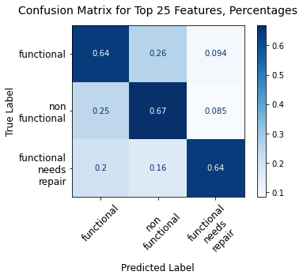


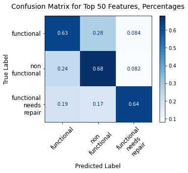


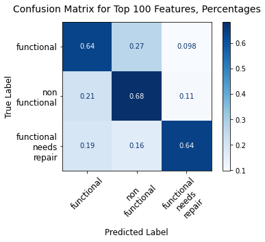


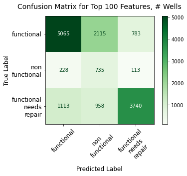


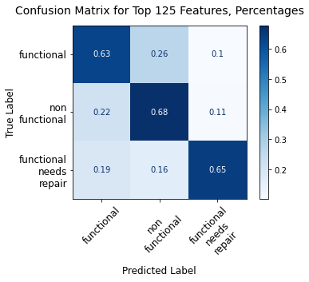


```python
acc_scores_cw
```


    [64.53872053872054,
     63.87878787878788,
     64.24242424242425,
     64.16835016835016,
     63.77777777777778]


## Decision Trees:  SMOTE-rebalanced

### SMOTE modeling:  FUNDER, LGA (multiple 'n'), payment, water_quality, quantity_group, source, extraction_type_class, waterpoint_type, public_meeting, permit; max_depth=20, criterion='entropy'


```python
df.head(3)
```


<div>
<style scoped>
    .dataframe tbody tr th:only-of-type {
        vertical-align: middle;
    }

    .dataframe tbody tr th {
        vertical-align: top;
    }

    .dataframe thead th {
        text-align: right;
    }
</style>
<table border="1" class="dataframe">
  <thead>
    <tr style="text-align: right;">
      <th></th>
      <th>funder</th>
      <th>installer</th>
      <th>wpt_name</th>
      <th>basin</th>
      <th>subvillage</th>
      <th>region</th>
      <th>lga</th>
      <th>ward</th>
      <th>public_meeting</th>
      <th>permit</th>
      <th>construction_year</th>
      <th>extraction_type_class</th>
      <th>management</th>
      <th>payment</th>
      <th>water_quality</th>
      <th>quantity_group</th>
      <th>source</th>
      <th>waterpoint_type</th>
      <th>status_group</th>
      <th>pop_binned</th>
    </tr>
    <tr>
      <th>id</th>
      <th></th>
      <th></th>
      <th></th>
      <th></th>
      <th></th>
      <th></th>
      <th></th>
      <th></th>
      <th></th>
      <th></th>
      <th></th>
      <th></th>
      <th></th>
      <th></th>
      <th></th>
      <th></th>
      <th></th>
      <th></th>
      <th></th>
      <th></th>
    </tr>
  </thead>
  <tbody>
    <tr>
      <th>69572</th>
      <td>roman</td>
      <td>roman</td>
      <td>none</td>
      <td>Lake Nyasa</td>
      <td>mnyusi_b</td>
      <td>Iringa</td>
      <td>Ludewa</td>
      <td>Mundindi</td>
      <td>True</td>
      <td>False</td>
      <td>1999</td>
      <td>gravity</td>
      <td>vwc</td>
      <td>pay annually</td>
      <td>soft</td>
      <td>enough</td>
      <td>spring</td>
      <td>communal standpipe</td>
      <td>functional</td>
      <td>(100, 150]</td>
    </tr>
    <tr>
      <th>8776</th>
      <td>grumeti</td>
      <td>grumeti</td>
      <td>zahanati</td>
      <td>Lake Victoria</td>
      <td>nyamara</td>
      <td>Mara</td>
      <td>Serengeti</td>
      <td>Natta</td>
      <td>NaN</td>
      <td>True</td>
      <td>2010</td>
      <td>gravity</td>
      <td>wug</td>
      <td>never pay</td>
      <td>soft</td>
      <td>insufficient</td>
      <td>rainwater harvesting</td>
      <td>communal standpipe</td>
      <td>functional</td>
      <td>(200, 300]</td>
    </tr>
    <tr>
      <th>34310</th>
      <td>lottery_club</td>
      <td>world_vision</td>
      <td>kwa_mahundi</td>
      <td>Pangani</td>
      <td>majengo</td>
      <td>Manyara</td>
      <td>Simanjiro</td>
      <td>Ngorika</td>
      <td>True</td>
      <td>True</td>
      <td>2009</td>
      <td>gravity</td>
      <td>vwc</td>
      <td>pay per bucket</td>
      <td>soft</td>
      <td>enough</td>
      <td>dam</td>
      <td>communal standpipe multiple</td>
      <td>functional</td>
      <td>(200, 300]</td>
    </tr>
  </tbody>
</table>
</div>


```python
features = ['funder', 'lga', 'management', 'payment', 'water_quality', 'quantity_group', 'source', 
            'extraction_type_class', 'status_group', 'waterpoint_type', 'permit', 'public_meeting']

features_top_n = ['funder', 'lga']

all_model_features = ['funder_duplicate', 'lga_duplicate', 'management', 'permit', 'public_meeting', 
                      'payment', 'water_quality', 'quantity_group', 'source', 
                      'extraction_type_class', 'status_group', 'waterpoint_type']

```


```python
df_ns, X_trains_SMOTE, clfs_SMOTE, \
acc_scores_SMOTE, train_scores_SMOTE, \
test_scores_SMOTE, jaccard_scores_SMOTE, \
feat_importances_SMOTE, \
parameters_SMOTE, imp_tables_SMOTE, \
summ_importance_tables_SMOTE = imb_mult_top_n_SMOTE_dt(df, features, features_top_n, all_model_features, 
                                                       random_state=123, n_range=[50, 100, 125], criterion='gini', 
                                                       max_depth=20, col_title_length=7, cmap=plt.cm.Blues)

```

    
    Accuracy score, Jaccard score, and confusion matrix for n = 50:
    
    Counter({0: 24296, 2: 17013, 1: 3241})
    Counter({0: 24296, 1: 24296, 2: 24296})
    Accuracy score:  66.27609427609428
    Mean Training Score: 72.32%
    Mean Test Score: 66.28%
    Jaccard score:  [0.57178218 0.1706716  0.5394656 ]
    
    Individual feature importances--showing top 10:


<div>
<style scoped>
    .dataframe tbody tr th:only-of-type {
        vertical-align: middle;
    }

    .dataframe tbody tr th {
        vertical-align: top;
    }

    .dataframe thead th {
        text-align: right;
    }
</style>
<table border="1" class="dataframe">
  <thead>
    <tr style="text-align: right;">
      <th></th>
      <th>Importance</th>
    </tr>
  </thead>
  <tbody>
    <tr>
      <th>extraction_type_class_other</th>
      <td>0.096429</td>
    </tr>
    <tr>
      <th>quantity_group_seasonal</th>
      <td>0.096424</td>
    </tr>
    <tr>
      <th>quantity_group_insufficient</th>
      <td>0.061958</td>
    </tr>
    <tr>
      <th>quantity_group_enough</th>
      <td>0.053714</td>
    </tr>
    <tr>
      <th>lga_duplicate_Bariadi</th>
      <td>0.041181</td>
    </tr>
    <tr>
      <th>lga_duplicate_Kigoma Rural</th>
      <td>0.030926</td>
    </tr>
    <tr>
      <th>payment_pay per bucket</th>
      <td>0.028159</td>
    </tr>
    <tr>
      <th>source_spring</th>
      <td>0.024387</td>
    </tr>
    <tr>
      <th>funder_duplicate_government_of_tanzania</th>
      <td>0.023829</td>
    </tr>
    <tr>
      <th>waterpoint_type_hand pump</th>
      <td>0.022935</td>
    </tr>
  </tbody>
</table>
</div>


    
    Roll-up summary feature importance table, all features:


<div>
<style scoped>
    .dataframe tbody tr th:only-of-type {
        vertical-align: middle;
    }

    .dataframe tbody tr th {
        vertical-align: top;
    }

    .dataframe thead th {
        text-align: right;
    }
</style>
<table border="1" class="dataframe">
  <thead>
    <tr style="text-align: right;">
      <th></th>
      <th>Importance</th>
    </tr>
    <tr>
      <th>var_abbr</th>
      <th></th>
    </tr>
  </thead>
  <tbody>
    <tr>
      <th>lga_dup</th>
      <td>0.231069</td>
    </tr>
    <tr>
      <th>quantit</th>
      <td>0.215917</td>
    </tr>
    <tr>
      <th>extract</th>
      <td>0.121833</td>
    </tr>
    <tr>
      <th>funder_</th>
      <td>0.100069</td>
    </tr>
    <tr>
      <th>payment</th>
      <td>0.082413</td>
    </tr>
    <tr>
      <th>source_</th>
      <td>0.072599</td>
    </tr>
    <tr>
      <th>waterpo</th>
      <td>0.065667</td>
    </tr>
    <tr>
      <th>managem</th>
      <td>0.061738</td>
    </tr>
    <tr>
      <th>permit_</th>
      <td>0.018639</td>
    </tr>
    <tr>
      <th>water_q</th>
      <td>0.015330</td>
    </tr>
    <tr>
      <th>public_</th>
      <td>0.014725</td>
    </tr>
  </tbody>
</table>
</div>


    
    
    
    Accuracy score, Jaccard score, and confusion matrix for n = 100:
    
    Counter({0: 24296, 2: 17013, 1: 3241})
    Counter({0: 24296, 1: 24296, 2: 24296})
    Accuracy score:  62.525252525252526
    Mean Training Score: 72.42%
    Mean Test Score: 62.53%
    Jaccard score:  [0.54433677 0.15844913 0.52769037]
    
    Individual feature importances--showing top 10:


<div>
<style scoped>
    .dataframe tbody tr th:only-of-type {
        vertical-align: middle;
    }

    .dataframe tbody tr th {
        vertical-align: top;
    }

    .dataframe thead th {
        text-align: right;
    }
</style>
<table border="1" class="dataframe">
  <thead>
    <tr style="text-align: right;">
      <th></th>
      <th>Importance</th>
    </tr>
  </thead>
  <tbody>
    <tr>
      <th>extraction_type_class_other</th>
      <td>0.096964</td>
    </tr>
    <tr>
      <th>quantity_group_seasonal</th>
      <td>0.094750</td>
    </tr>
    <tr>
      <th>quantity_group_insufficient</th>
      <td>0.060141</td>
    </tr>
    <tr>
      <th>quantity_group_enough</th>
      <td>0.053134</td>
    </tr>
    <tr>
      <th>lga_duplicate_Bariadi</th>
      <td>0.040815</td>
    </tr>
    <tr>
      <th>lga_duplicate_Kigoma Rural</th>
      <td>0.030398</td>
    </tr>
    <tr>
      <th>source_spring</th>
      <td>0.025638</td>
    </tr>
    <tr>
      <th>funder_duplicate_government_of_tanzania</th>
      <td>0.024605</td>
    </tr>
    <tr>
      <th>waterpoint_type_hand pump</th>
      <td>0.024327</td>
    </tr>
    <tr>
      <th>payment_pay per bucket</th>
      <td>0.019510</td>
    </tr>
  </tbody>
</table>
</div>


    
    Roll-up summary feature importance table, all features:


<div>
<style scoped>
    .dataframe tbody tr th:only-of-type {
        vertical-align: middle;
    }

    .dataframe tbody tr th {
        vertical-align: top;
    }

    .dataframe thead th {
        text-align: right;
    }
</style>
<table border="1" class="dataframe">
  <thead>
    <tr style="text-align: right;">
      <th></th>
      <th>Importance</th>
    </tr>
    <tr>
      <th>var_abbr</th>
      <th></th>
    </tr>
  </thead>
  <tbody>
    <tr>
      <th>lga_dup</th>
      <td>0.278911</td>
    </tr>
    <tr>
      <th>quantit</th>
      <td>0.211861</td>
    </tr>
    <tr>
      <th>extract</th>
      <td>0.123222</td>
    </tr>
    <tr>
      <th>funder_</th>
      <td>0.094923</td>
    </tr>
    <tr>
      <th>payment</th>
      <td>0.067003</td>
    </tr>
    <tr>
      <th>waterpo</th>
      <td>0.065889</td>
    </tr>
    <tr>
      <th>source_</th>
      <td>0.063000</td>
    </tr>
    <tr>
      <th>managem</th>
      <td>0.055845</td>
    </tr>
    <tr>
      <th>water_q</th>
      <td>0.017013</td>
    </tr>
    <tr>
      <th>public_</th>
      <td>0.012418</td>
    </tr>
    <tr>
      <th>permit_</th>
      <td>0.009916</td>
    </tr>
  </tbody>
</table>
</div>


    
    
    
    Accuracy score, Jaccard score, and confusion matrix for n = 125:
    
    Counter({0: 24296, 2: 17013, 1: 3241})
    Counter({0: 24296, 1: 24296, 2: 24296})
    Accuracy score:  66.1010101010101
    Mean Training Score: 73.02%
    Mean Test Score: 66.10%
    Jaccard score:  [0.56890816 0.17399157 0.54117116]
    
    Individual feature importances--showing top 10:


<div>
<style scoped>
    .dataframe tbody tr th:only-of-type {
        vertical-align: middle;
    }

    .dataframe tbody tr th {
        vertical-align: top;
    }

    .dataframe thead th {
        text-align: right;
    }
</style>
<table border="1" class="dataframe">
  <thead>
    <tr style="text-align: right;">
      <th></th>
      <th>Importance</th>
    </tr>
  </thead>
  <tbody>
    <tr>
      <th>extraction_type_class_other</th>
      <td>0.095555</td>
    </tr>
    <tr>
      <th>quantity_group_seasonal</th>
      <td>0.094592</td>
    </tr>
    <tr>
      <th>quantity_group_insufficient</th>
      <td>0.059975</td>
    </tr>
    <tr>
      <th>quantity_group_enough</th>
      <td>0.054945</td>
    </tr>
    <tr>
      <th>lga_duplicate_Bariadi</th>
      <td>0.040529</td>
    </tr>
    <tr>
      <th>lga_duplicate_Kigoma Rural</th>
      <td>0.030436</td>
    </tr>
    <tr>
      <th>funder_duplicate_government_of_tanzania</th>
      <td>0.024614</td>
    </tr>
    <tr>
      <th>waterpoint_type_hand pump</th>
      <td>0.024382</td>
    </tr>
    <tr>
      <th>source_spring</th>
      <td>0.024235</td>
    </tr>
    <tr>
      <th>payment_pay per bucket</th>
      <td>0.020381</td>
    </tr>
  </tbody>
</table>
</div>


    
    Roll-up summary feature importance table, all features:


<div>
<style scoped>
    .dataframe tbody tr th:only-of-type {
        vertical-align: middle;
    }

    .dataframe tbody tr th {
        vertical-align: top;
    }

    .dataframe thead th {
        text-align: right;
    }
</style>
<table border="1" class="dataframe">
  <thead>
    <tr style="text-align: right;">
      <th></th>
      <th>Importance</th>
    </tr>
    <tr>
      <th>var_abbr</th>
      <th></th>
    </tr>
  </thead>
  <tbody>
    <tr>
      <th>lga_dup</th>
      <td>0.279871</td>
    </tr>
    <tr>
      <th>quantit</th>
      <td>0.213325</td>
    </tr>
    <tr>
      <th>extract</th>
      <td>0.120562</td>
    </tr>
    <tr>
      <th>funder_</th>
      <td>0.097217</td>
    </tr>
    <tr>
      <th>waterpo</th>
      <td>0.067902</td>
    </tr>
    <tr>
      <th>payment</th>
      <td>0.064426</td>
    </tr>
    <tr>
      <th>source_</th>
      <td>0.064181</td>
    </tr>
    <tr>
      <th>managem</th>
      <td>0.059491</td>
    </tr>
    <tr>
      <th>water_q</th>
      <td>0.013926</td>
    </tr>
    <tr>
      <th>public_</th>
      <td>0.010556</td>
    </tr>
    <tr>
      <th>permit_</th>
      <td>0.008544</td>
    </tr>
  </tbody>
</table>
</div>


    
    


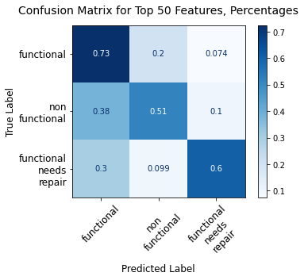


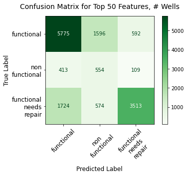


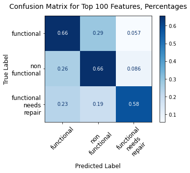


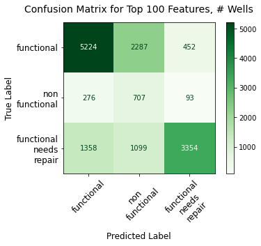


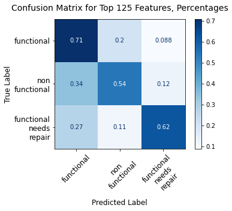


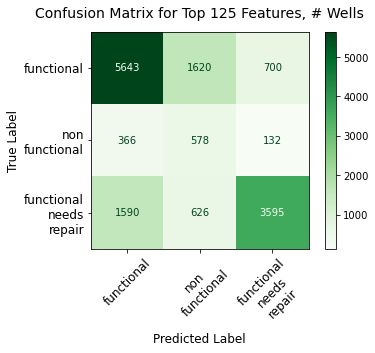


```python
train_scores_SMOTE
```


    [0.7232191855998243, 0.7241795631654044, 0.7301887827900341]


```python
test_scores_SMOTE
```


    [0.6627609427609428, 0.6252525252525253, 0.661010101010101]


### SMOTE DT: INSTALLER, LGA (multiple 'n'), payment, water_quality, quantity_group, source, extraction_type_class, waterpoint_type, public_meeting, permit; max_depth=20, criterion='entropy'


```python
df.head(3)
```


<div>
<style scoped>
    .dataframe tbody tr th:only-of-type {
        vertical-align: middle;
    }

    .dataframe tbody tr th {
        vertical-align: top;
    }

    .dataframe thead th {
        text-align: right;
    }
</style>
<table border="1" class="dataframe">
  <thead>
    <tr style="text-align: right;">
      <th></th>
      <th>funder</th>
      <th>installer</th>
      <th>wpt_name</th>
      <th>basin</th>
      <th>subvillage</th>
      <th>region</th>
      <th>lga</th>
      <th>ward</th>
      <th>public_meeting</th>
      <th>permit</th>
      <th>construction_year</th>
      <th>extraction_type_class</th>
      <th>management</th>
      <th>payment</th>
      <th>water_quality</th>
      <th>quantity_group</th>
      <th>source</th>
      <th>waterpoint_type</th>
      <th>status_group</th>
      <th>pop_binned</th>
    </tr>
    <tr>
      <th>id</th>
      <th></th>
      <th></th>
      <th></th>
      <th></th>
      <th></th>
      <th></th>
      <th></th>
      <th></th>
      <th></th>
      <th></th>
      <th></th>
      <th></th>
      <th></th>
      <th></th>
      <th></th>
      <th></th>
      <th></th>
      <th></th>
      <th></th>
      <th></th>
    </tr>
  </thead>
  <tbody>
    <tr>
      <th>69572</th>
      <td>roman</td>
      <td>roman</td>
      <td>none</td>
      <td>Lake Nyasa</td>
      <td>mnyusi_b</td>
      <td>Iringa</td>
      <td>Ludewa</td>
      <td>Mundindi</td>
      <td>True</td>
      <td>False</td>
      <td>1999</td>
      <td>gravity</td>
      <td>vwc</td>
      <td>pay annually</td>
      <td>soft</td>
      <td>enough</td>
      <td>spring</td>
      <td>communal standpipe</td>
      <td>functional</td>
      <td>(100, 150]</td>
    </tr>
    <tr>
      <th>8776</th>
      <td>grumeti</td>
      <td>grumeti</td>
      <td>zahanati</td>
      <td>Lake Victoria</td>
      <td>nyamara</td>
      <td>Mara</td>
      <td>Serengeti</td>
      <td>Natta</td>
      <td>NaN</td>
      <td>True</td>
      <td>2010</td>
      <td>gravity</td>
      <td>wug</td>
      <td>never pay</td>
      <td>soft</td>
      <td>insufficient</td>
      <td>rainwater harvesting</td>
      <td>communal standpipe</td>
      <td>functional</td>
      <td>(200, 300]</td>
    </tr>
    <tr>
      <th>34310</th>
      <td>lottery_club</td>
      <td>world_vision</td>
      <td>kwa_mahundi</td>
      <td>Pangani</td>
      <td>majengo</td>
      <td>Manyara</td>
      <td>Simanjiro</td>
      <td>Ngorika</td>
      <td>True</td>
      <td>True</td>
      <td>2009</td>
      <td>gravity</td>
      <td>vwc</td>
      <td>pay per bucket</td>
      <td>soft</td>
      <td>enough</td>
      <td>dam</td>
      <td>communal standpipe multiple</td>
      <td>functional</td>
      <td>(200, 300]</td>
    </tr>
  </tbody>
</table>
</div>


```python
features = ['installer', 'lga', 'management', 'payment', 'water_quality', 'quantity_group', 'source', 
            'extraction_type_class', 'status_group', 'waterpoint_type', 'permit', 'public_meeting']

features_top_n = ['installer', 'lga']

all_model_features = ['installer_duplicate', 'lga_duplicate', 'management', 'permit', 'public_meeting', 
                      'payment', 'water_quality', 'quantity_group', 'source', 
                      'extraction_type_class', 'status_group', 'waterpoint_type']

```


```python
# optimized parameters:  {'criterion': 'gini', 'max_depth': 20, 'min_samples_split': 5}

df_ns, X_trains_SMOTE, clfs_SMOTE, \
acc_scores_SMOTE, train_scores_SMOTE, \
test_scores_SMOTE, jaccard_scores_SMOTE, \
feat_importances_SMOTE, \
parameters_SMOTE, imp_tables_SMOTE, \
summ_importance_tables_SMOTE = imb_mult_top_n_SMOTE_dt(df, features, features_top_n, all_model_features, 
                                                       random_state=123, n_range=[50, 100, 125], 
                                                       criterion='gini', max_depth=20, min_samples_split=5, 
                                                       col_title_length=7, cmap=plt.cm.Blues)

```

    
    Accuracy score, Jaccard score, and confusion matrix for n = 50:
    
    Counter({0: 24296, 2: 17013, 1: 3241})
    Counter({0: 24296, 1: 24296, 2: 24296})
    Accuracy score:  64.74747474747474
    Mean Training Score: 71.66%
    Mean Test Score: 64.75%
    Jaccard score:  [0.55784501 0.16931788 0.53477517]
    
    Individual feature importances--showing top 10:


<div>
<style scoped>
    .dataframe tbody tr th:only-of-type {
        vertical-align: middle;
    }

    .dataframe tbody tr th {
        vertical-align: top;
    }

    .dataframe thead th {
        text-align: right;
    }
</style>
<table border="1" class="dataframe">
  <thead>
    <tr style="text-align: right;">
      <th></th>
      <th>Importance</th>
    </tr>
  </thead>
  <tbody>
    <tr>
      <th>quantity_group_seasonal</th>
      <td>0.098449</td>
    </tr>
    <tr>
      <th>extraction_type_class_other</th>
      <td>0.097110</td>
    </tr>
    <tr>
      <th>quantity_group_insufficient</th>
      <td>0.065400</td>
    </tr>
    <tr>
      <th>quantity_group_enough</th>
      <td>0.053018</td>
    </tr>
    <tr>
      <th>lga_duplicate_Bariadi</th>
      <td>0.042206</td>
    </tr>
    <tr>
      <th>lga_duplicate_Kigoma Rural</th>
      <td>0.031588</td>
    </tr>
    <tr>
      <th>source_spring</th>
      <td>0.024729</td>
    </tr>
    <tr>
      <th>waterpoint_type_hand pump</th>
      <td>0.020042</td>
    </tr>
    <tr>
      <th>installer_duplicate_government</th>
      <td>0.018692</td>
    </tr>
    <tr>
      <th>payment_pay per bucket</th>
      <td>0.018578</td>
    </tr>
  </tbody>
</table>
</div>


    
    Roll-up summary feature importance table, all features:


<div>
<style scoped>
    .dataframe tbody tr th:only-of-type {
        vertical-align: middle;
    }

    .dataframe tbody tr th {
        vertical-align: top;
    }

    .dataframe thead th {
        text-align: right;
    }
</style>
<table border="1" class="dataframe">
  <thead>
    <tr style="text-align: right;">
      <th></th>
      <th>Importance</th>
    </tr>
    <tr>
      <th>var_abbr</th>
      <th></th>
    </tr>
  </thead>
  <tbody>
    <tr>
      <th>lga_dup</th>
      <td>0.239407</td>
    </tr>
    <tr>
      <th>quantit</th>
      <td>0.221165</td>
    </tr>
    <tr>
      <th>extract</th>
      <td>0.132984</td>
    </tr>
    <tr>
      <th>install</th>
      <td>0.090175</td>
    </tr>
    <tr>
      <th>source_</th>
      <td>0.076019</td>
    </tr>
    <tr>
      <th>payment</th>
      <td>0.069727</td>
    </tr>
    <tr>
      <th>managem</th>
      <td>0.069251</td>
    </tr>
    <tr>
      <th>waterpo</th>
      <td>0.055876</td>
    </tr>
    <tr>
      <th>water_q</th>
      <td>0.017165</td>
    </tr>
    <tr>
      <th>permit_</th>
      <td>0.015868</td>
    </tr>
    <tr>
      <th>public_</th>
      <td>0.012363</td>
    </tr>
  </tbody>
</table>
</div>


    
    
    
    Accuracy score, Jaccard score, and confusion matrix for n = 100:
    
    Counter({0: 24296, 2: 17013, 1: 3241})
    Counter({0: 24296, 1: 24296, 2: 24296})
    Accuracy score:  64.47138047138047
    Mean Training Score: 70.84%
    Mean Test Score: 64.47%
    Jaccard score:  [0.55957828 0.16031957 0.52968181]
    
    Individual feature importances--showing top 10:


<div>
<style scoped>
    .dataframe tbody tr th:only-of-type {
        vertical-align: middle;
    }

    .dataframe tbody tr th {
        vertical-align: top;
    }

    .dataframe thead th {
        text-align: right;
    }
</style>
<table border="1" class="dataframe">
  <thead>
    <tr style="text-align: right;">
      <th></th>
      <th>Importance</th>
    </tr>
  </thead>
  <tbody>
    <tr>
      <th>extraction_type_class_other</th>
      <td>0.100764</td>
    </tr>
    <tr>
      <th>quantity_group_seasonal</th>
      <td>0.100697</td>
    </tr>
    <tr>
      <th>quantity_group_insufficient</th>
      <td>0.064602</td>
    </tr>
    <tr>
      <th>quantity_group_enough</th>
      <td>0.056432</td>
    </tr>
    <tr>
      <th>lga_duplicate_Bariadi</th>
      <td>0.043382</td>
    </tr>
    <tr>
      <th>lga_duplicate_Kigoma Rural</th>
      <td>0.032377</td>
    </tr>
    <tr>
      <th>source_spring</th>
      <td>0.025120</td>
    </tr>
    <tr>
      <th>payment_pay per bucket</th>
      <td>0.023654</td>
    </tr>
    <tr>
      <th>payment_pay monthly</th>
      <td>0.019514</td>
    </tr>
    <tr>
      <th>waterpoint_type_hand pump</th>
      <td>0.019009</td>
    </tr>
  </tbody>
</table>
</div>


    
    Roll-up summary feature importance table, all features:


<div>
<style scoped>
    .dataframe tbody tr th:only-of-type {
        vertical-align: middle;
    }

    .dataframe tbody tr th {
        vertical-align: top;
    }

    .dataframe thead th {
        text-align: right;
    }
</style>
<table border="1" class="dataframe">
  <thead>
    <tr style="text-align: right;">
      <th></th>
      <th>Importance</th>
    </tr>
    <tr>
      <th>var_abbr</th>
      <th></th>
    </tr>
  </thead>
  <tbody>
    <tr>
      <th>lga_dup</th>
      <td>0.271306</td>
    </tr>
    <tr>
      <th>quantit</th>
      <td>0.226431</td>
    </tr>
    <tr>
      <th>extract</th>
      <td>0.137797</td>
    </tr>
    <tr>
      <th>install</th>
      <td>0.089114</td>
    </tr>
    <tr>
      <th>payment</th>
      <td>0.069509</td>
    </tr>
    <tr>
      <th>source_</th>
      <td>0.065482</td>
    </tr>
    <tr>
      <th>waterpo</th>
      <td>0.059245</td>
    </tr>
    <tr>
      <th>managem</th>
      <td>0.052718</td>
    </tr>
    <tr>
      <th>water_q</th>
      <td>0.010980</td>
    </tr>
    <tr>
      <th>permit_</th>
      <td>0.009357</td>
    </tr>
    <tr>
      <th>public_</th>
      <td>0.008060</td>
    </tr>
  </tbody>
</table>
</div>


    
    
    
    Accuracy score, Jaccard score, and confusion matrix for n = 125:
    
    Counter({0: 24296, 2: 17013, 1: 3241})
    Counter({0: 24296, 1: 24296, 2: 24296})
    Accuracy score:  60.86868686868687
    Mean Training Score: 70.94%
    Mean Test Score: 60.87%
    Jaccard score:  [0.52284372 0.15104696 0.53310323]
    
    Individual feature importances--showing top 10:


<div>
<style scoped>
    .dataframe tbody tr th:only-of-type {
        vertical-align: middle;
    }

    .dataframe tbody tr th {
        vertical-align: top;
    }

    .dataframe thead th {
        text-align: right;
    }
</style>
<table border="1" class="dataframe">
  <thead>
    <tr style="text-align: right;">
      <th></th>
      <th>Importance</th>
    </tr>
  </thead>
  <tbody>
    <tr>
      <th>quantity_group_seasonal</th>
      <td>0.100069</td>
    </tr>
    <tr>
      <th>extraction_type_class_other</th>
      <td>0.099106</td>
    </tr>
    <tr>
      <th>quantity_group_insufficient</th>
      <td>0.064578</td>
    </tr>
    <tr>
      <th>quantity_group_enough</th>
      <td>0.058144</td>
    </tr>
    <tr>
      <th>lga_duplicate_Bariadi</th>
      <td>0.043075</td>
    </tr>
    <tr>
      <th>lga_duplicate_Kigoma Rural</th>
      <td>0.032627</td>
    </tr>
    <tr>
      <th>source_spring</th>
      <td>0.024942</td>
    </tr>
    <tr>
      <th>payment_pay per bucket</th>
      <td>0.023515</td>
    </tr>
    <tr>
      <th>waterpoint_type_hand pump</th>
      <td>0.021033</td>
    </tr>
    <tr>
      <th>installer_duplicate_government</th>
      <td>0.018575</td>
    </tr>
  </tbody>
</table>
</div>


    
    Roll-up summary feature importance table, all features:


<div>
<style scoped>
    .dataframe tbody tr th:only-of-type {
        vertical-align: middle;
    }

    .dataframe tbody tr th {
        vertical-align: top;
    }

    .dataframe thead th {
        text-align: right;
    }
</style>
<table border="1" class="dataframe">
  <thead>
    <tr style="text-align: right;">
      <th></th>
      <th>Importance</th>
    </tr>
    <tr>
      <th>var_abbr</th>
      <th></th>
    </tr>
  </thead>
  <tbody>
    <tr>
      <th>lga_dup</th>
      <td>0.270949</td>
    </tr>
    <tr>
      <th>quantit</th>
      <td>0.227465</td>
    </tr>
    <tr>
      <th>extract</th>
      <td>0.134814</td>
    </tr>
    <tr>
      <th>install</th>
      <td>0.091466</td>
    </tr>
    <tr>
      <th>payment</th>
      <td>0.066924</td>
    </tr>
    <tr>
      <th>source_</th>
      <td>0.065976</td>
    </tr>
    <tr>
      <th>waterpo</th>
      <td>0.061739</td>
    </tr>
    <tr>
      <th>managem</th>
      <td>0.051696</td>
    </tr>
    <tr>
      <th>water_q</th>
      <td>0.010758</td>
    </tr>
    <tr>
      <th>permit_</th>
      <td>0.009610</td>
    </tr>
    <tr>
      <th>public_</th>
      <td>0.008602</td>
    </tr>
  </tbody>
</table>
</div>


    
    


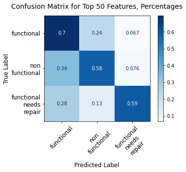


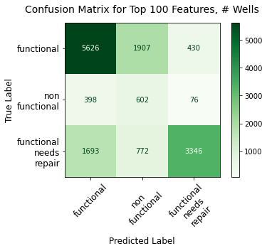


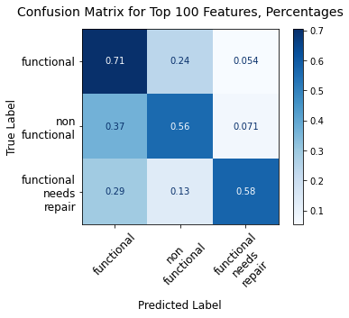


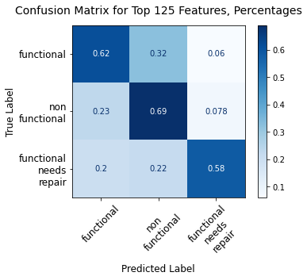


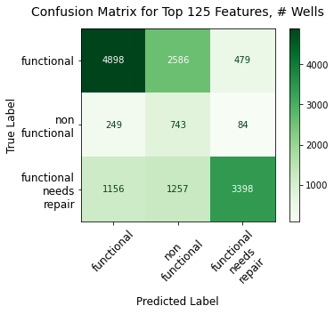


```python
acc_scores_SMOTE
```


    [64.74747474747474, 64.47138047138047, 60.86868686868687]


## Findings on class_weight vs. SMOTE (resampling) for reducing false negatives

In looking at the confusion matrices that result from using class_weight vs. resampling (SMOTE) using decision trees for modeling, we can see that both approaches do significantly better at correctly predicting wells that need repair or are non-functional ('false negatives').  This is an important finding, since such wells are more important to identify correctly than functional wells, as discussed above.

Overall accuracy levels are just slightly higher with SMOTE than in using the class_weight argument in the decision tree classifier.  However, class_weight = 'balanced' does a much better job of reducing costly false negatives (non-functional and needing-repair wells categorized as 'functional'--0.19 and 0.2, respectively for balanced class_weight vs. SMOTE, which ranged from 26% up to 40%).

__Note__:  while not providing the highest overall accuracy score, the rebalanced DT model (class_weight='balanced') with funder, scheme_name, and lga n=25 provide the _lowest false negatives_ (non-functional and needing-repair wells categorized as 'functional') that I've seen with decision tree models (0.11 and 0.20, respectively).

**_Final thoughts_**:  If overall accuracy of prediction is the goal, then the original (non-resampled) data set will give the highest accuracy scores for decision tree models.  However, if the goal is to more accurately predict non-functional or functional-needs-repairs wells, then it's critically important to use a rebalancing method.  Between SMOTE and class_weight='balanced' approaches, I found that class_weight='balanced' provided better performance in reducing false-negative errors, while giving overall accuracy scores that are only 1-2% less than SMOTE overall.

# Modeling:  Bagged Trees

## Bagged Trees model, no resampling, using 'lga' as geographic locator


```python
from sklearn.metrics import classification_report
from sklearn.ensemble import BaggingClassifier, RandomForestClassifier
```


```python
df.head(3)
```


<div>
<style scoped>
    .dataframe tbody tr th:only-of-type {
        vertical-align: middle;
    }

    .dataframe tbody tr th {
        vertical-align: top;
    }

    .dataframe thead th {
        text-align: right;
    }
</style>
<table border="1" class="dataframe">
  <thead>
    <tr style="text-align: right;">
      <th></th>
      <th>funder</th>
      <th>installer</th>
      <th>wpt_name</th>
      <th>basin</th>
      <th>subvillage</th>
      <th>region</th>
      <th>lga</th>
      <th>ward</th>
      <th>public_meeting</th>
      <th>permit</th>
      <th>construction_year</th>
      <th>extraction_type_class</th>
      <th>management</th>
      <th>payment</th>
      <th>water_quality</th>
      <th>quantity_group</th>
      <th>source</th>
      <th>waterpoint_type</th>
      <th>status_group</th>
      <th>pop_binned</th>
    </tr>
    <tr>
      <th>id</th>
      <th></th>
      <th></th>
      <th></th>
      <th></th>
      <th></th>
      <th></th>
      <th></th>
      <th></th>
      <th></th>
      <th></th>
      <th></th>
      <th></th>
      <th></th>
      <th></th>
      <th></th>
      <th></th>
      <th></th>
      <th></th>
      <th></th>
      <th></th>
    </tr>
  </thead>
  <tbody>
    <tr>
      <th>69572</th>
      <td>roman</td>
      <td>roman</td>
      <td>none</td>
      <td>Lake Nyasa</td>
      <td>mnyusi_b</td>
      <td>Iringa</td>
      <td>Ludewa</td>
      <td>Mundindi</td>
      <td>True</td>
      <td>False</td>
      <td>1999</td>
      <td>gravity</td>
      <td>vwc</td>
      <td>pay annually</td>
      <td>soft</td>
      <td>enough</td>
      <td>spring</td>
      <td>communal standpipe</td>
      <td>functional</td>
      <td>(100, 150]</td>
    </tr>
    <tr>
      <th>8776</th>
      <td>grumeti</td>
      <td>grumeti</td>
      <td>zahanati</td>
      <td>Lake Victoria</td>
      <td>nyamara</td>
      <td>Mara</td>
      <td>Serengeti</td>
      <td>Natta</td>
      <td>NaN</td>
      <td>True</td>
      <td>2010</td>
      <td>gravity</td>
      <td>wug</td>
      <td>never pay</td>
      <td>soft</td>
      <td>insufficient</td>
      <td>rainwater harvesting</td>
      <td>communal standpipe</td>
      <td>functional</td>
      <td>(200, 300]</td>
    </tr>
    <tr>
      <th>34310</th>
      <td>lottery_club</td>
      <td>world_vision</td>
      <td>kwa_mahundi</td>
      <td>Pangani</td>
      <td>majengo</td>
      <td>Manyara</td>
      <td>Simanjiro</td>
      <td>Ngorika</td>
      <td>True</td>
      <td>True</td>
      <td>2009</td>
      <td>gravity</td>
      <td>vwc</td>
      <td>pay per bucket</td>
      <td>soft</td>
      <td>enough</td>
      <td>dam</td>
      <td>communal standpipe multiple</td>
      <td>functional</td>
      <td>(200, 300]</td>
    </tr>
  </tbody>
</table>
</div>


```python
features = ['funder', 'lga', 'management', 'payment', 'water_quality', 'quantity_group', 'source', 
            'extraction_type_class', 'status_group', 'waterpoint_type', 'permit', 'public_meeting']

features_top_n = ['funder', 'lga']

all_model_features = ['funder_duplicate', 'lga_duplicate', 'management', 'permit', 'public_meeting', 
                      'payment', 'water_quality', 'quantity_group', 'source', 
                      'extraction_type_class', 'status_group', 'waterpoint_type']

```


```python
# Run function without resampling first

df, X, y = top_n_encode(df, features, features_top_n, all_model_features, n=125, p=126)

X_train, X_test, y_train, y_test = train_test_split(X, y, test_size=0.25, random_state=123)
```

##### Max_depth=20


```python
# Instantiate a BaggingClassifier
bagged_tree = BaggingClassifier(DecisionTreeClassifier(criterion='gini', max_depth=20, 
                                                       random_state=123), n_estimators=20)

# Fit to the training data
bagged_tree.fit(X_train, y_train)

```


    BaggingClassifier(base_estimator=DecisionTreeClassifier(max_depth=20,
                                                            random_state=123),
                      n_estimators=20)


```python
# Training accuracy score
bagged_train_score = bagged_tree.score(X_train, y_train)
bagged_train_score
```


    0.8138271604938272


```python
# Testing accuracy score
bagged_test_score = bagged_tree.score(X_test, y_test)
bagged_test_score
```


    0.7786531986531987


```python
# Model predictions
bagged_tree_train_preds = bagged_tree.predict(X_train)
bagged_tree_test_preds = bagged_tree.predict(X_test)

```


```python
# Bagged tree plot_confusion_matrix

plot_conf_matrix_norm_abs(df, bagged_tree, X_test, y_test, title='Confusion Matrix', 
                          titlefont=14, x_y_tick_font=12, pad=14, x_y_label_font=12, 
                          xticks_rotation=45, cmap=plt.cm.Blues)

```


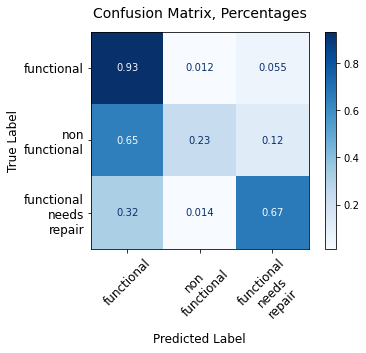


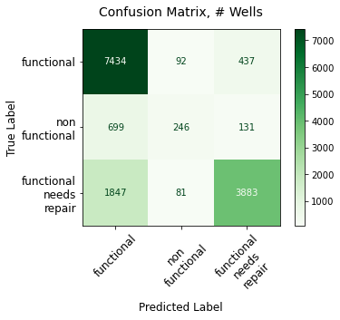


We can see that bagged trees gives similar results as previous tree models in terms of false negative errors (miscategorizing 68% of non-functional wells as functional and 33% of functional-needing-repair wells as functional).  Let's look at bagged trees with SMOTE-resampled data.

### Running bagged tree model with SMOTE data and optimized n_estimators parameter (max_depth=20) 


```python
# Instantiate a BaggingClassifier
bagged_tree_20 = BaggingClassifier(DecisionTreeClassifier(random_state=123, criterion='gini', max_depth=20, 
                                                          min_samples_split=5), n_jobs=-1, n_estimators=1000)

# Fit to the training data
bagged_tree_20.fit(X_train_SMOTE, y_train_SMOTE)
print(bagged_tree_20.get_params())

```

    {'base_estimator__ccp_alpha': 0.0, 'base_estimator__class_weight': None, 'base_estimator__criterion': 'gini', 'base_estimator__max_depth': 20, 'base_estimator__max_features': None, 'base_estimator__max_leaf_nodes': None, 'base_estimator__min_impurity_decrease': 0.0, 'base_estimator__min_impurity_split': None, 'base_estimator__min_samples_leaf': 1, 'base_estimator__min_samples_split': 5, 'base_estimator__min_weight_fraction_leaf': 0.0, 'base_estimator__presort': 'deprecated', 'base_estimator__random_state': 123, 'base_estimator__splitter': 'best', 'base_estimator': DecisionTreeClassifier(max_depth=20, min_samples_split=5, random_state=123), 'bootstrap': True, 'bootstrap_features': False, 'max_features': 1.0, 'max_samples': 1.0, 'n_estimators': 1000, 'n_jobs': -1, 'oob_score': False, 'random_state': None, 'verbose': 0, 'warm_start': False}


```python
# Training accuracy score
bagged_train_score_20 = bagged_tree_20.score(X_train_SMOTE, y_train_SMOTE)
print("Bagged tree training score:  {}".format(bagged_train_score_20))

# Testing accuracy score
bagged_test_score_20 = bagged_tree_20.score(X_test, y_test)
print("Bagged tree test score:  {}".format(bagged_test_score_20))

# Model predictions
bagged_tree_train_preds_20 = bagged_tree_20.predict(X_train_SMOTE)
bagged_tree_test_preds_20 = bagged_tree_20.predict(X_test)

```

    Bagged tree training score:  0.7684941279771704
    Bagged tree test score:  0.6812121212121212


```python
disp_bagged_tree_20 = plot_conf_matrix_norm_abs(df_n, bagged_tree_20, X_test, y_test, 
                                                title='Confusion Matrix', titlefont=14, x_y_tick_font=12, 
                                                pad=14, x_y_label_font=12, xticks_rotation=45, cmap=plt.cm.Blues)
```


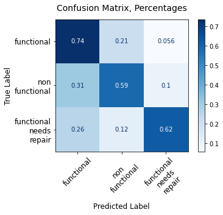


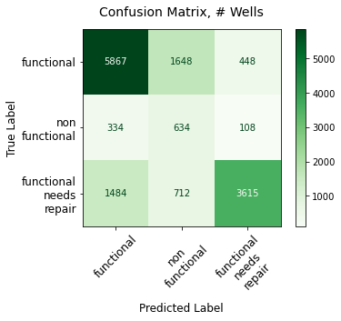


### Findings on performance of bagged tree models

As with decision trees, bagged trees require rebalancing to minimize costly false negatives.  And similar to decision trees, max_depth is a very important parameter.  When max_depth=30 with SMOTE data, training accuracy is 81% and test accuracy is 78%.  When max_depth=20, however, these values fall to 74.7% and 71.7%, respectively.

# Modeling:  Random Forest

## Modeling--Random Forest, non-rebalanced data


```python
df.head(3)
```


<div>
<style scoped>
    .dataframe tbody tr th:only-of-type {
        vertical-align: middle;
    }

    .dataframe tbody tr th {
        vertical-align: top;
    }

    .dataframe thead th {
        text-align: right;
    }
</style>
<table border="1" class="dataframe">
  <thead>
    <tr style="text-align: right;">
      <th></th>
      <th>funder</th>
      <th>installer</th>
      <th>wpt_name</th>
      <th>basin</th>
      <th>subvillage</th>
      <th>region</th>
      <th>lga</th>
      <th>ward</th>
      <th>public_meeting</th>
      <th>permit</th>
      <th>construction_year</th>
      <th>extraction_type_class</th>
      <th>management</th>
      <th>payment</th>
      <th>water_quality</th>
      <th>quantity_group</th>
      <th>source</th>
      <th>waterpoint_type</th>
      <th>status_group</th>
      <th>pop_binned</th>
    </tr>
    <tr>
      <th>id</th>
      <th></th>
      <th></th>
      <th></th>
      <th></th>
      <th></th>
      <th></th>
      <th></th>
      <th></th>
      <th></th>
      <th></th>
      <th></th>
      <th></th>
      <th></th>
      <th></th>
      <th></th>
      <th></th>
      <th></th>
      <th></th>
      <th></th>
      <th></th>
    </tr>
  </thead>
  <tbody>
    <tr>
      <th>69572</th>
      <td>roman</td>
      <td>roman</td>
      <td>none</td>
      <td>Lake Nyasa</td>
      <td>mnyusi_b</td>
      <td>Iringa</td>
      <td>Ludewa</td>
      <td>Mundindi</td>
      <td>True</td>
      <td>False</td>
      <td>1999</td>
      <td>gravity</td>
      <td>vwc</td>
      <td>pay annually</td>
      <td>soft</td>
      <td>enough</td>
      <td>spring</td>
      <td>communal standpipe</td>
      <td>functional</td>
      <td>(100, 150]</td>
    </tr>
    <tr>
      <th>8776</th>
      <td>grumeti</td>
      <td>grumeti</td>
      <td>zahanati</td>
      <td>Lake Victoria</td>
      <td>nyamara</td>
      <td>Mara</td>
      <td>Serengeti</td>
      <td>Natta</td>
      <td>NaN</td>
      <td>True</td>
      <td>2010</td>
      <td>gravity</td>
      <td>wug</td>
      <td>never pay</td>
      <td>soft</td>
      <td>insufficient</td>
      <td>rainwater harvesting</td>
      <td>communal standpipe</td>
      <td>functional</td>
      <td>(200, 300]</td>
    </tr>
    <tr>
      <th>34310</th>
      <td>lottery_club</td>
      <td>world_vision</td>
      <td>kwa_mahundi</td>
      <td>Pangani</td>
      <td>majengo</td>
      <td>Manyara</td>
      <td>Simanjiro</td>
      <td>Ngorika</td>
      <td>True</td>
      <td>True</td>
      <td>2009</td>
      <td>gravity</td>
      <td>vwc</td>
      <td>pay per bucket</td>
      <td>soft</td>
      <td>enough</td>
      <td>dam</td>
      <td>communal standpipe multiple</td>
      <td>functional</td>
      <td>(200, 300]</td>
    </tr>
  </tbody>
</table>
</div>


### Funder, LGA (n=125); permit, public_meeting; max_depth=20


```python
features = ['funder', 'lga', 'management', 'payment', 'water_quality', 'quantity_group', 'source', 
            'extraction_type_class', 'status_group', 'waterpoint_type', 'permit', 'public_meeting']

features_top_n = ['funder', 'lga']

all_model_features = ['funder_duplicate', 'lga_duplicate', 'management', 'permit', 'public_meeting', 
                      'payment', 'water_quality', 'quantity_group', 'source', 
                      'extraction_type_class', 'status_group', 'waterpoint_type']

```


```python
df1, X_train, clf_rf, \
train_score, test_score, \
params, imp_table, \
summ_imp_table = rf_model_run(df, features, features_top_n, all_model_features, n=125, p=126, 
                              run_SMOTE=False, test_size=0.25, random_state=123, criterion='entropy', 
                              n_estimators=20, max_depth=20, n_jobs=-1, min_samples_leaf=1, 
                              min_samples_split=2)

```

    0.7955106621773288
    0.7643097643097643
    Individual feature importances--showing top 10:


<div>
<style scoped>
    .dataframe tbody tr th:only-of-type {
        vertical-align: middle;
    }

    .dataframe tbody tr th {
        vertical-align: top;
    }

    .dataframe thead th {
        text-align: right;
    }
</style>
<table border="1" class="dataframe">
  <thead>
    <tr style="text-align: right;">
      <th></th>
      <th>Importance</th>
    </tr>
  </thead>
  <tbody>
    <tr>
      <th>quantity_group_enough</th>
      <td>0.078093</td>
    </tr>
    <tr>
      <th>extraction_type_class_other</th>
      <td>0.060578</td>
    </tr>
    <tr>
      <th>waterpoint_type_other</th>
      <td>0.043387</td>
    </tr>
    <tr>
      <th>quantity_group_insufficient</th>
      <td>0.039997</td>
    </tr>
    <tr>
      <th>waterpoint_type_communal standpipe</th>
      <td>0.035302</td>
    </tr>
    <tr>
      <th>payment_pay per bucket</th>
      <td>0.024424</td>
    </tr>
    <tr>
      <th>waterpoint_type_hand pump</th>
      <td>0.022998</td>
    </tr>
    <tr>
      <th>extraction_type_class_handpump</th>
      <td>0.021937</td>
    </tr>
    <tr>
      <th>payment_pay monthly</th>
      <td>0.021220</td>
    </tr>
    <tr>
      <th>public_meeting_True</th>
      <td>0.018275</td>
    </tr>
  </tbody>
</table>
</div>


    
    Roll-up summary feature importance table, all features:


<div>
<style scoped>
    .dataframe tbody tr th:only-of-type {
        vertical-align: middle;
    }

    .dataframe tbody tr th {
        vertical-align: top;
    }

    .dataframe thead th {
        text-align: right;
    }
</style>
<table border="1" class="dataframe">
  <thead>
    <tr style="text-align: right;">
      <th></th>
      <th>Importance</th>
    </tr>
    <tr>
      <th>var_abbr</th>
      <th></th>
    </tr>
  </thead>
  <tbody>
    <tr>
      <th>lga_dup</th>
      <td>0.211396</td>
    </tr>
    <tr>
      <th>quantit</th>
      <td>0.139955</td>
    </tr>
    <tr>
      <th>funder_</th>
      <td>0.134374</td>
    </tr>
    <tr>
      <th>waterpo</th>
      <td>0.118894</td>
    </tr>
    <tr>
      <th>extract</th>
      <td>0.106727</td>
    </tr>
    <tr>
      <th>payment</th>
      <td>0.085410</td>
    </tr>
    <tr>
      <th>source_</th>
      <td>0.070862</td>
    </tr>
    <tr>
      <th>managem</th>
      <td>0.055778</td>
    </tr>
    <tr>
      <th>water_q</th>
      <td>0.040666</td>
    </tr>
    <tr>
      <th>public_</th>
      <td>0.018275</td>
    </tr>
    <tr>
      <th>permit_</th>
      <td>0.017663</td>
    </tr>
  </tbody>
</table>
</div>


    


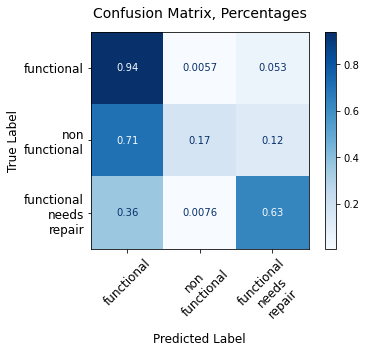


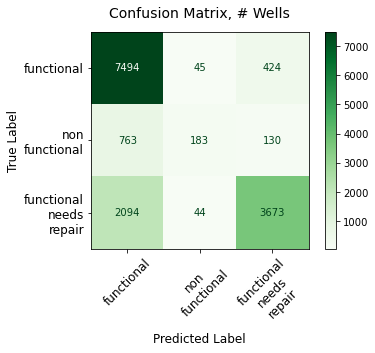


```python
imp_table.head(30)
```


<div>
<style scoped>
    .dataframe tbody tr th:only-of-type {
        vertical-align: middle;
    }

    .dataframe tbody tr th {
        vertical-align: top;
    }

    .dataframe thead th {
        text-align: right;
    }
</style>
<table border="1" class="dataframe">
  <thead>
    <tr style="text-align: right;">
      <th></th>
      <th>Importance</th>
    </tr>
  </thead>
  <tbody>
    <tr>
      <th>quantity_group_enough</th>
      <td>0.078093</td>
    </tr>
    <tr>
      <th>extraction_type_class_other</th>
      <td>0.060578</td>
    </tr>
    <tr>
      <th>waterpoint_type_other</th>
      <td>0.043387</td>
    </tr>
    <tr>
      <th>quantity_group_insufficient</th>
      <td>0.039997</td>
    </tr>
    <tr>
      <th>waterpoint_type_communal standpipe</th>
      <td>0.035302</td>
    </tr>
    <tr>
      <th>payment_pay per bucket</th>
      <td>0.024424</td>
    </tr>
    <tr>
      <th>waterpoint_type_hand pump</th>
      <td>0.022998</td>
    </tr>
    <tr>
      <th>extraction_type_class_handpump</th>
      <td>0.021937</td>
    </tr>
    <tr>
      <th>payment_pay monthly</th>
      <td>0.021220</td>
    </tr>
    <tr>
      <th>public_meeting_True</th>
      <td>0.018275</td>
    </tr>
    <tr>
      <th>quantity_group_seasonal</th>
      <td>0.018087</td>
    </tr>
    <tr>
      <th>source_spring</th>
      <td>0.017877</td>
    </tr>
    <tr>
      <th>permit_True</th>
      <td>0.017663</td>
    </tr>
    <tr>
      <th>payment_unknown</th>
      <td>0.017497</td>
    </tr>
    <tr>
      <th>funder_duplicate_government_of_tanzania</th>
      <td>0.016777</td>
    </tr>
    <tr>
      <th>management_vwc</th>
      <td>0.016047</td>
    </tr>
    <tr>
      <th>water_quality_soft</th>
      <td>0.015590</td>
    </tr>
    <tr>
      <th>source_shallow well</th>
      <td>0.015162</td>
    </tr>
    <tr>
      <th>water_quality_unknown</th>
      <td>0.014160</td>
    </tr>
    <tr>
      <th>waterpoint_type_communal standpipe multiple</th>
      <td>0.013827</td>
    </tr>
    <tr>
      <th>lga_duplicate_Bariadi</th>
      <td>0.013689</td>
    </tr>
    <tr>
      <th>payment_pay annually</th>
      <td>0.012404</td>
    </tr>
    <tr>
      <th>extraction_type_class_submersible</th>
      <td>0.012100</td>
    </tr>
    <tr>
      <th>source_machine dbh</th>
      <td>0.011702</td>
    </tr>
    <tr>
      <th>funder_duplicate_other</th>
      <td>0.011635</td>
    </tr>
    <tr>
      <th>lga_duplicate_Kigoma Rural</th>
      <td>0.011275</td>
    </tr>
    <tr>
      <th>source_river</th>
      <td>0.010645</td>
    </tr>
    <tr>
      <th>lga_duplicate_Njombe</th>
      <td>0.010222</td>
    </tr>
    <tr>
      <th>extraction_type_class_motorpump</th>
      <td>0.009978</td>
    </tr>
    <tr>
      <th>source_rainwater harvesting</th>
      <td>0.009344</td>
    </tr>
  </tbody>
</table>
</div>


```python
summ_imp_table
```


<div>
<style scoped>
    .dataframe tbody tr th:only-of-type {
        vertical-align: middle;
    }

    .dataframe tbody tr th {
        vertical-align: top;
    }

    .dataframe thead th {
        text-align: right;
    }
</style>
<table border="1" class="dataframe">
  <thead>
    <tr style="text-align: right;">
      <th></th>
      <th>Importance</th>
    </tr>
    <tr>
      <th>var_abbr</th>
      <th></th>
    </tr>
  </thead>
  <tbody>
    <tr>
      <th>lga_dup</th>
      <td>0.211396</td>
    </tr>
    <tr>
      <th>quantit</th>
      <td>0.139955</td>
    </tr>
    <tr>
      <th>funder_</th>
      <td>0.134374</td>
    </tr>
    <tr>
      <th>waterpo</th>
      <td>0.118894</td>
    </tr>
    <tr>
      <th>extract</th>
      <td>0.106727</td>
    </tr>
    <tr>
      <th>payment</th>
      <td>0.085410</td>
    </tr>
    <tr>
      <th>source_</th>
      <td>0.070862</td>
    </tr>
    <tr>
      <th>managem</th>
      <td>0.055778</td>
    </tr>
    <tr>
      <th>water_q</th>
      <td>0.040666</td>
    </tr>
    <tr>
      <th>public_</th>
      <td>0.018275</td>
    </tr>
    <tr>
      <th>permit_</th>
      <td>0.017663</td>
    </tr>
  </tbody>
</table>
</div>


Still need to address class imbalance issue due to poor performance on false negatives 

## Modeling--Random Forest, class_weight='balanced'


```python
df.head(3)
```


<div>
<style scoped>
    .dataframe tbody tr th:only-of-type {
        vertical-align: middle;
    }

    .dataframe tbody tr th {
        vertical-align: top;
    }

    .dataframe thead th {
        text-align: right;
    }
</style>
<table border="1" class="dataframe">
  <thead>
    <tr style="text-align: right;">
      <th></th>
      <th>funder</th>
      <th>installer</th>
      <th>wpt_name</th>
      <th>basin</th>
      <th>subvillage</th>
      <th>region</th>
      <th>lga</th>
      <th>ward</th>
      <th>public_meeting</th>
      <th>permit</th>
      <th>construction_year</th>
      <th>extraction_type_class</th>
      <th>management</th>
      <th>payment</th>
      <th>water_quality</th>
      <th>quantity_group</th>
      <th>source</th>
      <th>waterpoint_type</th>
      <th>status_group</th>
      <th>pop_binned</th>
    </tr>
    <tr>
      <th>id</th>
      <th></th>
      <th></th>
      <th></th>
      <th></th>
      <th></th>
      <th></th>
      <th></th>
      <th></th>
      <th></th>
      <th></th>
      <th></th>
      <th></th>
      <th></th>
      <th></th>
      <th></th>
      <th></th>
      <th></th>
      <th></th>
      <th></th>
      <th></th>
    </tr>
  </thead>
  <tbody>
    <tr>
      <th>69572</th>
      <td>roman</td>
      <td>roman</td>
      <td>none</td>
      <td>Lake Nyasa</td>
      <td>mnyusi_b</td>
      <td>Iringa</td>
      <td>Ludewa</td>
      <td>Mundindi</td>
      <td>True</td>
      <td>False</td>
      <td>1999</td>
      <td>gravity</td>
      <td>vwc</td>
      <td>pay annually</td>
      <td>soft</td>
      <td>enough</td>
      <td>spring</td>
      <td>communal standpipe</td>
      <td>functional</td>
      <td>(100, 150]</td>
    </tr>
    <tr>
      <th>8776</th>
      <td>grumeti</td>
      <td>grumeti</td>
      <td>zahanati</td>
      <td>Lake Victoria</td>
      <td>nyamara</td>
      <td>Mara</td>
      <td>Serengeti</td>
      <td>Natta</td>
      <td>NaN</td>
      <td>True</td>
      <td>2010</td>
      <td>gravity</td>
      <td>wug</td>
      <td>never pay</td>
      <td>soft</td>
      <td>insufficient</td>
      <td>rainwater harvesting</td>
      <td>communal standpipe</td>
      <td>functional</td>
      <td>(200, 300]</td>
    </tr>
    <tr>
      <th>34310</th>
      <td>lottery_club</td>
      <td>world_vision</td>
      <td>kwa_mahundi</td>
      <td>Pangani</td>
      <td>majengo</td>
      <td>Manyara</td>
      <td>Simanjiro</td>
      <td>Ngorika</td>
      <td>True</td>
      <td>True</td>
      <td>2009</td>
      <td>gravity</td>
      <td>vwc</td>
      <td>pay per bucket</td>
      <td>soft</td>
      <td>enough</td>
      <td>dam</td>
      <td>communal standpipe multiple</td>
      <td>functional</td>
      <td>(200, 300]</td>
    </tr>
  </tbody>
</table>
</div>


### FUNDER, LGA, n=125, optimized hyperparameters (max_depth=20)


```python
df.head(3)
```


<div>
<style scoped>
    .dataframe tbody tr th:only-of-type {
        vertical-align: middle;
    }

    .dataframe tbody tr th {
        vertical-align: top;
    }

    .dataframe thead th {
        text-align: right;
    }
</style>
<table border="1" class="dataframe">
  <thead>
    <tr style="text-align: right;">
      <th></th>
      <th>funder</th>
      <th>installer</th>
      <th>wpt_name</th>
      <th>basin</th>
      <th>subvillage</th>
      <th>region</th>
      <th>lga</th>
      <th>ward</th>
      <th>public_meeting</th>
      <th>permit</th>
      <th>construction_year</th>
      <th>extraction_type_class</th>
      <th>management</th>
      <th>payment</th>
      <th>water_quality</th>
      <th>quantity_group</th>
      <th>source</th>
      <th>waterpoint_type</th>
      <th>status_group</th>
      <th>pop_binned</th>
    </tr>
    <tr>
      <th>id</th>
      <th></th>
      <th></th>
      <th></th>
      <th></th>
      <th></th>
      <th></th>
      <th></th>
      <th></th>
      <th></th>
      <th></th>
      <th></th>
      <th></th>
      <th></th>
      <th></th>
      <th></th>
      <th></th>
      <th></th>
      <th></th>
      <th></th>
      <th></th>
    </tr>
  </thead>
  <tbody>
    <tr>
      <th>69572</th>
      <td>roman</td>
      <td>roman</td>
      <td>none</td>
      <td>Lake Nyasa</td>
      <td>mnyusi_b</td>
      <td>Iringa</td>
      <td>Ludewa</td>
      <td>Mundindi</td>
      <td>True</td>
      <td>False</td>
      <td>1999</td>
      <td>gravity</td>
      <td>vwc</td>
      <td>pay annually</td>
      <td>soft</td>
      <td>enough</td>
      <td>spring</td>
      <td>communal standpipe</td>
      <td>functional</td>
      <td>(100, 150]</td>
    </tr>
    <tr>
      <th>8776</th>
      <td>grumeti</td>
      <td>grumeti</td>
      <td>zahanati</td>
      <td>Lake Victoria</td>
      <td>nyamara</td>
      <td>Mara</td>
      <td>Serengeti</td>
      <td>Natta</td>
      <td>NaN</td>
      <td>True</td>
      <td>2010</td>
      <td>gravity</td>
      <td>wug</td>
      <td>never pay</td>
      <td>soft</td>
      <td>insufficient</td>
      <td>rainwater harvesting</td>
      <td>communal standpipe</td>
      <td>functional</td>
      <td>(200, 300]</td>
    </tr>
    <tr>
      <th>34310</th>
      <td>lottery_club</td>
      <td>world_vision</td>
      <td>kwa_mahundi</td>
      <td>Pangani</td>
      <td>majengo</td>
      <td>Manyara</td>
      <td>Simanjiro</td>
      <td>Ngorika</td>
      <td>True</td>
      <td>True</td>
      <td>2009</td>
      <td>gravity</td>
      <td>vwc</td>
      <td>pay per bucket</td>
      <td>soft</td>
      <td>enough</td>
      <td>dam</td>
      <td>communal standpipe multiple</td>
      <td>functional</td>
      <td>(200, 300]</td>
    </tr>
  </tbody>
</table>
</div>


```python
features = ['funder', 'lga', 'management', 'payment', 'water_quality', 'quantity_group', 'source', 
            'extraction_type_class', 'status_group', 'waterpoint_type', 'permit', 'public_meeting']

features_top_n = ['funder', 'lga']

all_model_features = ['funder_duplicate', 'lga_duplicate', 'management', 'permit', 'public_meeting', 
                      'payment', 'water_quality', 'quantity_group', 'source', 
                      'extraction_type_class', 'status_group', 'waterpoint_type']

```


```python
# Optimal Parameters: {'criterion': 'gini', 'max_depth': 20, 'min_samples_leaf': 1, 
#                      'min_samples_split': 2, 'n_estimators': 100}

df_n, X_train, clf_rf, \
train_score, test_score, \
params, imp_table, \
summ_imp_table = rf_model_run_cw(df, features, features_top_n, all_model_features, n=125, p=126, 
                                 test_size=0.25, random_state=123, criterion='gini', max_depth=20, 
                                 min_samples_leaf=1, min_samples_split=2, class_weight='balanced', 
                                 n_estimators=100, n_jobs=-1)


```

    0.7726599326599327
    0.7207407407407408
    Individual feature importances--showing top 10:


<div>
<style scoped>
    .dataframe tbody tr th:only-of-type {
        vertical-align: middle;
    }

    .dataframe tbody tr th {
        vertical-align: top;
    }

    .dataframe thead th {
        text-align: right;
    }
</style>
<table border="1" class="dataframe">
  <thead>
    <tr style="text-align: right;">
      <th></th>
      <th>Importance</th>
    </tr>
  </thead>
  <tbody>
    <tr>
      <th>quantity_group_enough</th>
      <td>0.058334</td>
    </tr>
    <tr>
      <th>extraction_type_class_other</th>
      <td>0.047728</td>
    </tr>
    <tr>
      <th>waterpoint_type_other</th>
      <td>0.042880</td>
    </tr>
    <tr>
      <th>quantity_group_insufficient</th>
      <td>0.041509</td>
    </tr>
    <tr>
      <th>lga_duplicate_Bariadi</th>
      <td>0.030109</td>
    </tr>
    <tr>
      <th>payment_pay per bucket</th>
      <td>0.023973</td>
    </tr>
    <tr>
      <th>payment_pay monthly</th>
      <td>0.021833</td>
    </tr>
    <tr>
      <th>source_spring</th>
      <td>0.021473</td>
    </tr>
    <tr>
      <th>source_river</th>
      <td>0.021108</td>
    </tr>
    <tr>
      <th>waterpoint_type_communal standpipe</th>
      <td>0.020121</td>
    </tr>
  </tbody>
</table>
</div>


    
    Roll-up summary feature importance table, all features:


<div>
<style scoped>
    .dataframe tbody tr th:only-of-type {
        vertical-align: middle;
    }

    .dataframe tbody tr th {
        vertical-align: top;
    }

    .dataframe thead th {
        text-align: right;
    }
</style>
<table border="1" class="dataframe">
  <thead>
    <tr style="text-align: right;">
      <th></th>
      <th>Importance</th>
    </tr>
    <tr>
      <th>var_abbr</th>
      <th></th>
    </tr>
  </thead>
  <tbody>
    <tr>
      <th>lga_dup</th>
      <td>0.250031</td>
    </tr>
    <tr>
      <th>funder_</th>
      <td>0.145549</td>
    </tr>
    <tr>
      <th>quantit</th>
      <td>0.120140</td>
    </tr>
    <tr>
      <th>waterpo</th>
      <td>0.097304</td>
    </tr>
    <tr>
      <th>source_</th>
      <td>0.090849</td>
    </tr>
    <tr>
      <th>extract</th>
      <td>0.086905</td>
    </tr>
    <tr>
      <th>payment</th>
      <td>0.081604</td>
    </tr>
    <tr>
      <th>managem</th>
      <td>0.056346</td>
    </tr>
    <tr>
      <th>water_q</th>
      <td>0.038125</td>
    </tr>
    <tr>
      <th>permit_</th>
      <td>0.018161</td>
    </tr>
    <tr>
      <th>public_</th>
      <td>0.014988</td>
    </tr>
  </tbody>
</table>
</div>


    


```python
imp_table.head(50)
```


<div>
<style scoped>
    .dataframe tbody tr th:only-of-type {
        vertical-align: middle;
    }

    .dataframe tbody tr th {
        vertical-align: top;
    }

    .dataframe thead th {
        text-align: right;
    }
</style>
<table border="1" class="dataframe">
  <thead>
    <tr style="text-align: right;">
      <th></th>
      <th>Importance</th>
    </tr>
  </thead>
  <tbody>
    <tr>
      <th>quantity_group_enough</th>
      <td>0.058334</td>
    </tr>
    <tr>
      <th>extraction_type_class_other</th>
      <td>0.047728</td>
    </tr>
    <tr>
      <th>waterpoint_type_other</th>
      <td>0.042880</td>
    </tr>
    <tr>
      <th>quantity_group_insufficient</th>
      <td>0.041509</td>
    </tr>
    <tr>
      <th>lga_duplicate_Bariadi</th>
      <td>0.030109</td>
    </tr>
    <tr>
      <th>payment_pay per bucket</th>
      <td>0.023973</td>
    </tr>
    <tr>
      <th>payment_pay monthly</th>
      <td>0.021833</td>
    </tr>
    <tr>
      <th>source_spring</th>
      <td>0.021473</td>
    </tr>
    <tr>
      <th>source_river</th>
      <td>0.021108</td>
    </tr>
    <tr>
      <th>waterpoint_type_communal standpipe</th>
      <td>0.020121</td>
    </tr>
    <tr>
      <th>lga_duplicate_Kigoma Rural</th>
      <td>0.019129</td>
    </tr>
    <tr>
      <th>permit_True</th>
      <td>0.018161</td>
    </tr>
    <tr>
      <th>management_vwc</th>
      <td>0.017045</td>
    </tr>
    <tr>
      <th>quantity_group_seasonal</th>
      <td>0.016665</td>
    </tr>
    <tr>
      <th>payment_unknown</th>
      <td>0.016657</td>
    </tr>
    <tr>
      <th>waterpoint_type_hand pump</th>
      <td>0.016406</td>
    </tr>
    <tr>
      <th>source_shallow well</th>
      <td>0.015490</td>
    </tr>
    <tr>
      <th>funder_duplicate_government_of_tanzania</th>
      <td>0.015214</td>
    </tr>
    <tr>
      <th>public_meeting_True</th>
      <td>0.014988</td>
    </tr>
    <tr>
      <th>extraction_type_class_handpump</th>
      <td>0.014876</td>
    </tr>
    <tr>
      <th>source_machine dbh</th>
      <td>0.014643</td>
    </tr>
    <tr>
      <th>waterpoint_type_communal standpipe multiple</th>
      <td>0.014415</td>
    </tr>
    <tr>
      <th>water_quality_unknown</th>
      <td>0.013788</td>
    </tr>
    <tr>
      <th>water_quality_soft</th>
      <td>0.013402</td>
    </tr>
    <tr>
      <th>extraction_type_class_submersible</th>
      <td>0.012630</td>
    </tr>
    <tr>
      <th>funder_duplicate_dwsp</th>
      <td>0.011949</td>
    </tr>
    <tr>
      <th>funder_duplicate_other</th>
      <td>0.011174</td>
    </tr>
    <tr>
      <th>source_rainwater harvesting</th>
      <td>0.010756</td>
    </tr>
    <tr>
      <th>management_wug</th>
      <td>0.010305</td>
    </tr>
    <tr>
      <th>extraction_type_class_motorpump</th>
      <td>0.010208</td>
    </tr>
    <tr>
      <th>funder_duplicate_missing</th>
      <td>0.009643</td>
    </tr>
    <tr>
      <th>lga_duplicate_Njombe</th>
      <td>0.009615</td>
    </tr>
    <tr>
      <th>payment_pay annually</th>
      <td>0.009450</td>
    </tr>
    <tr>
      <th>lga_duplicate_Chunya</th>
      <td>0.007824</td>
    </tr>
    <tr>
      <th>funder_duplicate_hesawa</th>
      <td>0.007013</td>
    </tr>
    <tr>
      <th>management_water_board</th>
      <td>0.006853</td>
    </tr>
    <tr>
      <th>management_private_operator</th>
      <td>0.006620</td>
    </tr>
    <tr>
      <th>lga_duplicate_Kyela</th>
      <td>0.006564</td>
    </tr>
    <tr>
      <th>water_quality_salty</th>
      <td>0.006186</td>
    </tr>
    <tr>
      <th>lga_duplicate_Kasulu</th>
      <td>0.006117</td>
    </tr>
    <tr>
      <th>payment_pay when scheme fails</th>
      <td>0.006100</td>
    </tr>
    <tr>
      <th>lga_duplicate_Makete</th>
      <td>0.005734</td>
    </tr>
    <tr>
      <th>funder_duplicate_danida</th>
      <td>0.005715</td>
    </tr>
    <tr>
      <th>lga_duplicate_Magu</th>
      <td>0.005429</td>
    </tr>
    <tr>
      <th>management_wua</th>
      <td>0.004763</td>
    </tr>
    <tr>
      <th>lga_duplicate_Ukerewe</th>
      <td>0.004576</td>
    </tr>
    <tr>
      <th>source_lake</th>
      <td>0.004512</td>
    </tr>
    <tr>
      <th>funder_duplicate_lga</th>
      <td>0.004482</td>
    </tr>
    <tr>
      <th>lga_duplicate_Rombo</th>
      <td>0.004186</td>
    </tr>
    <tr>
      <th>funder_duplicate_norad</th>
      <td>0.004138</td>
    </tr>
  </tbody>
</table>
</div>


```python
summ_imp_table
```


<div>
<style scoped>
    .dataframe tbody tr th:only-of-type {
        vertical-align: middle;
    }

    .dataframe tbody tr th {
        vertical-align: top;
    }

    .dataframe thead th {
        text-align: right;
    }
</style>
<table border="1" class="dataframe">
  <thead>
    <tr style="text-align: right;">
      <th></th>
      <th>Importance</th>
    </tr>
    <tr>
      <th>var_abbr</th>
      <th></th>
    </tr>
  </thead>
  <tbody>
    <tr>
      <th>lga_dup</th>
      <td>0.250031</td>
    </tr>
    <tr>
      <th>funder_</th>
      <td>0.145549</td>
    </tr>
    <tr>
      <th>quantit</th>
      <td>0.120140</td>
    </tr>
    <tr>
      <th>waterpo</th>
      <td>0.097304</td>
    </tr>
    <tr>
      <th>source_</th>
      <td>0.090849</td>
    </tr>
    <tr>
      <th>extract</th>
      <td>0.086905</td>
    </tr>
    <tr>
      <th>payment</th>
      <td>0.081604</td>
    </tr>
    <tr>
      <th>managem</th>
      <td>0.056346</td>
    </tr>
    <tr>
      <th>water_q</th>
      <td>0.038125</td>
    </tr>
    <tr>
      <th>permit_</th>
      <td>0.018161</td>
    </tr>
    <tr>
      <th>public_</th>
      <td>0.014988</td>
    </tr>
  </tbody>
</table>
</div>


### FUNDER, LGA, n=250, optimized hyperparameters (max_depth=20) 


```python
df.head(3)
```


<div>
<style scoped>
    .dataframe tbody tr th:only-of-type {
        vertical-align: middle;
    }

    .dataframe tbody tr th {
        vertical-align: top;
    }

    .dataframe thead th {
        text-align: right;
    }
</style>
<table border="1" class="dataframe">
  <thead>
    <tr style="text-align: right;">
      <th></th>
      <th>funder</th>
      <th>installer</th>
      <th>wpt_name</th>
      <th>basin</th>
      <th>subvillage</th>
      <th>region</th>
      <th>lga</th>
      <th>ward</th>
      <th>public_meeting</th>
      <th>permit</th>
      <th>construction_year</th>
      <th>extraction_type_class</th>
      <th>management</th>
      <th>payment</th>
      <th>water_quality</th>
      <th>quantity_group</th>
      <th>source</th>
      <th>waterpoint_type</th>
      <th>status_group</th>
      <th>pop_binned</th>
    </tr>
    <tr>
      <th>id</th>
      <th></th>
      <th></th>
      <th></th>
      <th></th>
      <th></th>
      <th></th>
      <th></th>
      <th></th>
      <th></th>
      <th></th>
      <th></th>
      <th></th>
      <th></th>
      <th></th>
      <th></th>
      <th></th>
      <th></th>
      <th></th>
      <th></th>
      <th></th>
    </tr>
  </thead>
  <tbody>
    <tr>
      <th>69572</th>
      <td>roman</td>
      <td>roman</td>
      <td>none</td>
      <td>Lake Nyasa</td>
      <td>mnyusi_b</td>
      <td>Iringa</td>
      <td>Ludewa</td>
      <td>Mundindi</td>
      <td>True</td>
      <td>False</td>
      <td>1999</td>
      <td>gravity</td>
      <td>vwc</td>
      <td>pay annually</td>
      <td>soft</td>
      <td>enough</td>
      <td>spring</td>
      <td>communal standpipe</td>
      <td>functional</td>
      <td>(100, 150]</td>
    </tr>
    <tr>
      <th>8776</th>
      <td>grumeti</td>
      <td>grumeti</td>
      <td>zahanati</td>
      <td>Lake Victoria</td>
      <td>nyamara</td>
      <td>Mara</td>
      <td>Serengeti</td>
      <td>Natta</td>
      <td>NaN</td>
      <td>True</td>
      <td>2010</td>
      <td>gravity</td>
      <td>wug</td>
      <td>never pay</td>
      <td>soft</td>
      <td>insufficient</td>
      <td>rainwater harvesting</td>
      <td>communal standpipe</td>
      <td>functional</td>
      <td>(200, 300]</td>
    </tr>
    <tr>
      <th>34310</th>
      <td>lottery_club</td>
      <td>world_vision</td>
      <td>kwa_mahundi</td>
      <td>Pangani</td>
      <td>majengo</td>
      <td>Manyara</td>
      <td>Simanjiro</td>
      <td>Ngorika</td>
      <td>True</td>
      <td>True</td>
      <td>2009</td>
      <td>gravity</td>
      <td>vwc</td>
      <td>pay per bucket</td>
      <td>soft</td>
      <td>enough</td>
      <td>dam</td>
      <td>communal standpipe multiple</td>
      <td>functional</td>
      <td>(200, 300]</td>
    </tr>
  </tbody>
</table>
</div>


```python
features = ['funder', 'lga', 'management', 'payment', 'water_quality', 'quantity_group', 'source', 
            'extraction_type_class', 'status_group', 'waterpoint_type', 'permit', 'public_meeting']

features_top_n = ['funder', 'lga']

all_model_features = ['funder_duplicate', 'lga_duplicate', 'management', 'permit', 'public_meeting', 
                      'payment', 'water_quality', 'quantity_group', 'source', 
                      'extraction_type_class', 'status_group', 'waterpoint_type']

```


```python
df_n, X_train, clf_rf, \
train_score, test_score, \
params, imp_table, \
summ_imp_table = rf_model_run_cw(df, features, features_top_n, all_model_features, n=250, p=251, 
                                 test_size=0.25, random_state=123, criterion='entropy', max_depth=30, 
                                 min_samples_leaf=1, min_samples_split=2, class_weight='balanced', 
                                 n_estimators=100, n_jobs=-1)


```

    0.8080808080808081
    0.7346801346801347
    Individual feature importances--showing top 10:


<div>
<style scoped>
    .dataframe tbody tr th:only-of-type {
        vertical-align: middle;
    }

    .dataframe tbody tr th {
        vertical-align: top;
    }

    .dataframe thead th {
        text-align: right;
    }
</style>
<table border="1" class="dataframe">
  <thead>
    <tr style="text-align: right;">
      <th></th>
      <th>Importance</th>
    </tr>
  </thead>
  <tbody>
    <tr>
      <th>quantity_group_enough</th>
      <td>0.055201</td>
    </tr>
    <tr>
      <th>quantity_group_insufficient</th>
      <td>0.041919</td>
    </tr>
    <tr>
      <th>extraction_type_class_other</th>
      <td>0.032165</td>
    </tr>
    <tr>
      <th>waterpoint_type_other</th>
      <td>0.030803</td>
    </tr>
    <tr>
      <th>lga_duplicate_Bariadi</th>
      <td>0.023160</td>
    </tr>
    <tr>
      <th>payment_pay per bucket</th>
      <td>0.022424</td>
    </tr>
    <tr>
      <th>payment_pay monthly</th>
      <td>0.021474</td>
    </tr>
    <tr>
      <th>permit_True</th>
      <td>0.020828</td>
    </tr>
    <tr>
      <th>public_meeting_True</th>
      <td>0.019283</td>
    </tr>
    <tr>
      <th>quantity_group_seasonal</th>
      <td>0.019252</td>
    </tr>
  </tbody>
</table>
</div>


    
    Roll-up summary feature importance table, all features:


<div>
<style scoped>
    .dataframe tbody tr th:only-of-type {
        vertical-align: middle;
    }

    .dataframe tbody tr th {
        vertical-align: top;
    }

    .dataframe thead th {
        text-align: right;
    }
</style>
<table border="1" class="dataframe">
  <thead>
    <tr style="text-align: right;">
      <th></th>
      <th>Importance</th>
    </tr>
    <tr>
      <th>var_abbr</th>
      <th></th>
    </tr>
  </thead>
  <tbody>
    <tr>
      <th>lga_dup</th>
      <td>0.252178</td>
    </tr>
    <tr>
      <th>funder_</th>
      <td>0.184044</td>
    </tr>
    <tr>
      <th>quantit</th>
      <td>0.119421</td>
    </tr>
    <tr>
      <th>payment</th>
      <td>0.085573</td>
    </tr>
    <tr>
      <th>source_</th>
      <td>0.078696</td>
    </tr>
    <tr>
      <th>waterpo</th>
      <td>0.076489</td>
    </tr>
    <tr>
      <th>extract</th>
      <td>0.065667</td>
    </tr>
    <tr>
      <th>managem</th>
      <td>0.059296</td>
    </tr>
    <tr>
      <th>water_q</th>
      <td>0.038525</td>
    </tr>
    <tr>
      <th>permit_</th>
      <td>0.020828</td>
    </tr>
    <tr>
      <th>public_</th>
      <td>0.019283</td>
    </tr>
  </tbody>
</table>
</div>


    


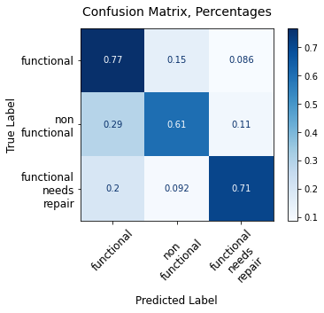


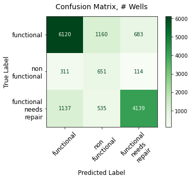


```python
imp_table.head(50)
```


<div>
<style scoped>
    .dataframe tbody tr th:only-of-type {
        vertical-align: middle;
    }

    .dataframe tbody tr th {
        vertical-align: top;
    }

    .dataframe thead th {
        text-align: right;
    }
</style>
<table border="1" class="dataframe">
  <thead>
    <tr style="text-align: right;">
      <th></th>
      <th>Importance</th>
    </tr>
  </thead>
  <tbody>
    <tr>
      <th>quantity_group_enough</th>
      <td>0.055201</td>
    </tr>
    <tr>
      <th>quantity_group_insufficient</th>
      <td>0.041919</td>
    </tr>
    <tr>
      <th>extraction_type_class_other</th>
      <td>0.032165</td>
    </tr>
    <tr>
      <th>waterpoint_type_other</th>
      <td>0.030803</td>
    </tr>
    <tr>
      <th>lga_duplicate_Bariadi</th>
      <td>0.023160</td>
    </tr>
    <tr>
      <th>payment_pay per bucket</th>
      <td>0.022424</td>
    </tr>
    <tr>
      <th>payment_pay monthly</th>
      <td>0.021474</td>
    </tr>
    <tr>
      <th>permit_True</th>
      <td>0.020828</td>
    </tr>
    <tr>
      <th>public_meeting_True</th>
      <td>0.019283</td>
    </tr>
    <tr>
      <th>quantity_group_seasonal</th>
      <td>0.019252</td>
    </tr>
    <tr>
      <th>payment_unknown</th>
      <td>0.017975</td>
    </tr>
    <tr>
      <th>source_spring</th>
      <td>0.017610</td>
    </tr>
    <tr>
      <th>waterpoint_type_communal standpipe</th>
      <td>0.017365</td>
    </tr>
    <tr>
      <th>management_vwc</th>
      <td>0.016622</td>
    </tr>
    <tr>
      <th>funder_duplicate_government_of_tanzania</th>
      <td>0.016385</td>
    </tr>
    <tr>
      <th>source_river</th>
      <td>0.016260</td>
    </tr>
    <tr>
      <th>source_shallow well</th>
      <td>0.015062</td>
    </tr>
    <tr>
      <th>source_machine dbh</th>
      <td>0.013794</td>
    </tr>
    <tr>
      <th>lga_duplicate_Kigoma Rural</th>
      <td>0.013723</td>
    </tr>
    <tr>
      <th>water_quality_soft</th>
      <td>0.013080</td>
    </tr>
    <tr>
      <th>extraction_type_class_submersible</th>
      <td>0.013036</td>
    </tr>
    <tr>
      <th>waterpoint_type_hand pump</th>
      <td>0.012951</td>
    </tr>
    <tr>
      <th>funder_duplicate_other</th>
      <td>0.012639</td>
    </tr>
    <tr>
      <th>water_quality_unknown</th>
      <td>0.012370</td>
    </tr>
    <tr>
      <th>waterpoint_type_communal standpipe multiple</th>
      <td>0.012250</td>
    </tr>
    <tr>
      <th>extraction_type_class_handpump</th>
      <td>0.011168</td>
    </tr>
    <tr>
      <th>payment_pay annually</th>
      <td>0.010073</td>
    </tr>
    <tr>
      <th>management_wug</th>
      <td>0.009670</td>
    </tr>
    <tr>
      <th>source_rainwater harvesting</th>
      <td>0.009234</td>
    </tr>
    <tr>
      <th>funder_duplicate_missing</th>
      <td>0.009132</td>
    </tr>
    <tr>
      <th>payment_pay when scheme fails</th>
      <td>0.009057</td>
    </tr>
    <tr>
      <th>funder_duplicate_hesawa</th>
      <td>0.008286</td>
    </tr>
    <tr>
      <th>lga_duplicate_Njombe</th>
      <td>0.008260</td>
    </tr>
    <tr>
      <th>water_quality_salty</th>
      <td>0.007436</td>
    </tr>
    <tr>
      <th>extraction_type_class_motorpump</th>
      <td>0.007336</td>
    </tr>
    <tr>
      <th>management_water_board</th>
      <td>0.007257</td>
    </tr>
    <tr>
      <th>funder_duplicate_danida</th>
      <td>0.007035</td>
    </tr>
    <tr>
      <th>funder_duplicate_dwsp</th>
      <td>0.007013</td>
    </tr>
    <tr>
      <th>management_private_operator</th>
      <td>0.006511</td>
    </tr>
    <tr>
      <th>management_wua</th>
      <td>0.005969</td>
    </tr>
    <tr>
      <th>lga_duplicate_Chunya</th>
      <td>0.005943</td>
    </tr>
    <tr>
      <th>lga_duplicate_Makete</th>
      <td>0.005394</td>
    </tr>
    <tr>
      <th>lga_duplicate_Kasulu</th>
      <td>0.005149</td>
    </tr>
    <tr>
      <th>lga_duplicate_Magu</th>
      <td>0.004995</td>
    </tr>
    <tr>
      <th>lga_duplicate_Kyela</th>
      <td>0.004980</td>
    </tr>
    <tr>
      <th>management_parastatal</th>
      <td>0.004911</td>
    </tr>
    <tr>
      <th>payment_other</th>
      <td>0.004568</td>
    </tr>
    <tr>
      <th>funder_duplicate_world_bank</th>
      <td>0.004533</td>
    </tr>
    <tr>
      <th>funder_duplicate_world_vision</th>
      <td>0.004403</td>
    </tr>
    <tr>
      <th>lga_duplicate_Moshi Rural</th>
      <td>0.004286</td>
    </tr>
  </tbody>
</table>
</div>


```python
summ_imp_table
```


<div>
<style scoped>
    .dataframe tbody tr th:only-of-type {
        vertical-align: middle;
    }

    .dataframe tbody tr th {
        vertical-align: top;
    }

    .dataframe thead th {
        text-align: right;
    }
</style>
<table border="1" class="dataframe">
  <thead>
    <tr style="text-align: right;">
      <th></th>
      <th>Importance</th>
    </tr>
    <tr>
      <th>var_abbr</th>
      <th></th>
    </tr>
  </thead>
  <tbody>
    <tr>
      <th>lga_dup</th>
      <td>0.252178</td>
    </tr>
    <tr>
      <th>funder_</th>
      <td>0.184044</td>
    </tr>
    <tr>
      <th>quantit</th>
      <td>0.119421</td>
    </tr>
    <tr>
      <th>payment</th>
      <td>0.085573</td>
    </tr>
    <tr>
      <th>source_</th>
      <td>0.078696</td>
    </tr>
    <tr>
      <th>waterpo</th>
      <td>0.076489</td>
    </tr>
    <tr>
      <th>extract</th>
      <td>0.065667</td>
    </tr>
    <tr>
      <th>managem</th>
      <td>0.059296</td>
    </tr>
    <tr>
      <th>water_q</th>
      <td>0.038525</td>
    </tr>
    <tr>
      <th>permit_</th>
      <td>0.020828</td>
    </tr>
    <tr>
      <th>public_</th>
      <td>0.019283</td>
    </tr>
  </tbody>
</table>
</div>


## Modeling--Random Forest, SMOTE resampled data (max_depth=20, criterion='gini')

### FUNDER, LGA, n=125, optimized hyperparameters (max_depth=20)


```python
df.head(3)
```


<div>
<style scoped>
    .dataframe tbody tr th:only-of-type {
        vertical-align: middle;
    }

    .dataframe tbody tr th {
        vertical-align: top;
    }

    .dataframe thead th {
        text-align: right;
    }
</style>
<table border="1" class="dataframe">
  <thead>
    <tr style="text-align: right;">
      <th></th>
      <th>funder</th>
      <th>installer</th>
      <th>wpt_name</th>
      <th>basin</th>
      <th>subvillage</th>
      <th>region</th>
      <th>lga</th>
      <th>ward</th>
      <th>public_meeting</th>
      <th>permit</th>
      <th>construction_year</th>
      <th>extraction_type_class</th>
      <th>management</th>
      <th>payment</th>
      <th>water_quality</th>
      <th>quantity_group</th>
      <th>source</th>
      <th>waterpoint_type</th>
      <th>status_group</th>
      <th>pop_binned</th>
    </tr>
    <tr>
      <th>id</th>
      <th></th>
      <th></th>
      <th></th>
      <th></th>
      <th></th>
      <th></th>
      <th></th>
      <th></th>
      <th></th>
      <th></th>
      <th></th>
      <th></th>
      <th></th>
      <th></th>
      <th></th>
      <th></th>
      <th></th>
      <th></th>
      <th></th>
      <th></th>
    </tr>
  </thead>
  <tbody>
    <tr>
      <th>69572</th>
      <td>roman</td>
      <td>roman</td>
      <td>none</td>
      <td>Lake Nyasa</td>
      <td>mnyusi_b</td>
      <td>Iringa</td>
      <td>Ludewa</td>
      <td>Mundindi</td>
      <td>True</td>
      <td>False</td>
      <td>1999</td>
      <td>gravity</td>
      <td>vwc</td>
      <td>pay annually</td>
      <td>soft</td>
      <td>enough</td>
      <td>spring</td>
      <td>communal standpipe</td>
      <td>functional</td>
      <td>(100, 150]</td>
    </tr>
    <tr>
      <th>8776</th>
      <td>grumeti</td>
      <td>grumeti</td>
      <td>zahanati</td>
      <td>Lake Victoria</td>
      <td>nyamara</td>
      <td>Mara</td>
      <td>Serengeti</td>
      <td>Natta</td>
      <td>NaN</td>
      <td>True</td>
      <td>2010</td>
      <td>gravity</td>
      <td>wug</td>
      <td>never pay</td>
      <td>soft</td>
      <td>insufficient</td>
      <td>rainwater harvesting</td>
      <td>communal standpipe</td>
      <td>functional</td>
      <td>(200, 300]</td>
    </tr>
    <tr>
      <th>34310</th>
      <td>lottery_club</td>
      <td>world_vision</td>
      <td>kwa_mahundi</td>
      <td>Pangani</td>
      <td>majengo</td>
      <td>Manyara</td>
      <td>Simanjiro</td>
      <td>Ngorika</td>
      <td>True</td>
      <td>True</td>
      <td>2009</td>
      <td>gravity</td>
      <td>vwc</td>
      <td>pay per bucket</td>
      <td>soft</td>
      <td>enough</td>
      <td>dam</td>
      <td>communal standpipe multiple</td>
      <td>functional</td>
      <td>(200, 300]</td>
    </tr>
  </tbody>
</table>
</div>


```python
features = ['funder', 'lga', 'management', 'payment', 'water_quality', 'quantity_group', 'source', 
            'extraction_type_class', 'status_group', 'waterpoint_type', 'permit', 'public_meeting']

features_top_n = ['funder', 'lga']

all_model_features = ['funder_duplicate', 'lga_duplicate', 'management', 'permit', 'public_meeting', 
                      'payment', 'water_quality', 'quantity_group', 'source', 
                      'extraction_type_class', 'status_group', 'waterpoint_type']

```


```python
# Optimal Parameters, n=50, p=51: {'criterion': 'entropy', 'max_depth': 20, 'min_samples_leaf': 1, 
#                      'min_samples_split': 2, 'n_estimators': 100}

# using n=125 with parameters for n=50 gives a good accuracy result 
# but worse performance on false negatives  (.32, .22)


df_SMOTE_rf, X_train_SMOTE_rf, \
clf_rf, rf_train_score, rf_test_score, \
rf_params, rf_imp_table, \
rf_summ_imp_table = rf_model_run(df, features, features_top_n, all_model_features, 
                                 n=125, p=126, run_SMOTE=True, test_size=0.25, 
                                 random_state=123, criterion='entropy', n_estimators=100, 
                                 max_depth=20, n_jobs=-1, min_samples_leaf=1, min_samples_split=2)


```

    Counter({0: 24296, 2: 17013, 1: 3241})
    Counter({0: 24296, 1: 24296, 2: 24296})
    0.798910657447042
    0.7193265993265994
    Individual feature importances--showing top 10:


<div>
<style scoped>
    .dataframe tbody tr th:only-of-type {
        vertical-align: middle;
    }

    .dataframe tbody tr th {
        vertical-align: top;
    }

    .dataframe thead th {
        text-align: right;
    }
</style>
<table border="1" class="dataframe">
  <thead>
    <tr style="text-align: right;">
      <th></th>
      <th>Importance</th>
    </tr>
  </thead>
  <tbody>
    <tr>
      <th>quantity_group_enough</th>
      <td>0.058226</td>
    </tr>
    <tr>
      <th>extraction_type_class_other</th>
      <td>0.049438</td>
    </tr>
    <tr>
      <th>waterpoint_type_other</th>
      <td>0.048217</td>
    </tr>
    <tr>
      <th>quantity_group_insufficient</th>
      <td>0.043979</td>
    </tr>
    <tr>
      <th>lga_duplicate_Bariadi</th>
      <td>0.028741</td>
    </tr>
    <tr>
      <th>payment_pay per bucket</th>
      <td>0.027693</td>
    </tr>
    <tr>
      <th>payment_pay monthly</th>
      <td>0.026210</td>
    </tr>
    <tr>
      <th>waterpoint_type_communal standpipe</th>
      <td>0.021410</td>
    </tr>
    <tr>
      <th>source_spring</th>
      <td>0.019368</td>
    </tr>
    <tr>
      <th>source_river</th>
      <td>0.018985</td>
    </tr>
  </tbody>
</table>
</div>


    
    Roll-up summary feature importance table, all features:


<div>
<style scoped>
    .dataframe tbody tr th:only-of-type {
        vertical-align: middle;
    }

    .dataframe tbody tr th {
        vertical-align: top;
    }

    .dataframe thead th {
        text-align: right;
    }
</style>
<table border="1" class="dataframe">
  <thead>
    <tr style="text-align: right;">
      <th></th>
      <th>Importance</th>
    </tr>
    <tr>
      <th>var_abbr</th>
      <th></th>
    </tr>
  </thead>
  <tbody>
    <tr>
      <th>lga_dup</th>
      <td>0.236472</td>
    </tr>
    <tr>
      <th>funder_</th>
      <td>0.145474</td>
    </tr>
    <tr>
      <th>quantit</th>
      <td>0.120363</td>
    </tr>
    <tr>
      <th>waterpo</th>
      <td>0.103738</td>
    </tr>
    <tr>
      <th>payment</th>
      <td>0.093194</td>
    </tr>
    <tr>
      <th>source_</th>
      <td>0.087061</td>
    </tr>
    <tr>
      <th>extract</th>
      <td>0.085766</td>
    </tr>
    <tr>
      <th>managem</th>
      <td>0.055743</td>
    </tr>
    <tr>
      <th>water_q</th>
      <td>0.039062</td>
    </tr>
    <tr>
      <th>permit_</th>
      <td>0.017034</td>
    </tr>
    <tr>
      <th>public_</th>
      <td>0.016092</td>
    </tr>
  </tbody>
</table>
</div>


    


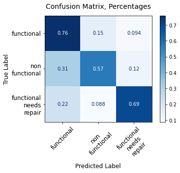


##### Feature importance findings


```python
rf_imp_table.head(30)
```


<div>
<style scoped>
    .dataframe tbody tr th:only-of-type {
        vertical-align: middle;
    }

    .dataframe tbody tr th {
        vertical-align: top;
    }

    .dataframe thead th {
        text-align: right;
    }
</style>
<table border="1" class="dataframe">
  <thead>
    <tr style="text-align: right;">
      <th></th>
      <th>Importance</th>
    </tr>
  </thead>
  <tbody>
    <tr>
      <th>quantity_group_enough</th>
      <td>0.058226</td>
    </tr>
    <tr>
      <th>extraction_type_class_other</th>
      <td>0.049438</td>
    </tr>
    <tr>
      <th>waterpoint_type_other</th>
      <td>0.048217</td>
    </tr>
    <tr>
      <th>quantity_group_insufficient</th>
      <td>0.043979</td>
    </tr>
    <tr>
      <th>lga_duplicate_Bariadi</th>
      <td>0.028741</td>
    </tr>
    <tr>
      <th>payment_pay per bucket</th>
      <td>0.027693</td>
    </tr>
    <tr>
      <th>payment_pay monthly</th>
      <td>0.026210</td>
    </tr>
    <tr>
      <th>waterpoint_type_communal standpipe</th>
      <td>0.021410</td>
    </tr>
    <tr>
      <th>source_spring</th>
      <td>0.019368</td>
    </tr>
    <tr>
      <th>source_river</th>
      <td>0.018985</td>
    </tr>
    <tr>
      <th>payment_unknown</th>
      <td>0.018117</td>
    </tr>
    <tr>
      <th>permit_True</th>
      <td>0.017034</td>
    </tr>
    <tr>
      <th>lga_duplicate_Kigoma Rural</th>
      <td>0.016922</td>
    </tr>
    <tr>
      <th>source_machine dbh</th>
      <td>0.016907</td>
    </tr>
    <tr>
      <th>management_vwc</th>
      <td>0.016767</td>
    </tr>
    <tr>
      <th>waterpoint_type_communal standpipe multiple</th>
      <td>0.016745</td>
    </tr>
    <tr>
      <th>funder_duplicate_government_of_tanzania</th>
      <td>0.016369</td>
    </tr>
    <tr>
      <th>public_meeting_True</th>
      <td>0.016092</td>
    </tr>
    <tr>
      <th>source_shallow well</th>
      <td>0.015552</td>
    </tr>
    <tr>
      <th>funder_duplicate_other</th>
      <td>0.015440</td>
    </tr>
    <tr>
      <th>quantity_group_seasonal</th>
      <td>0.015301</td>
    </tr>
    <tr>
      <th>water_quality_unknown</th>
      <td>0.014191</td>
    </tr>
    <tr>
      <th>waterpoint_type_hand pump</th>
      <td>0.013672</td>
    </tr>
    <tr>
      <th>extraction_type_class_handpump</th>
      <td>0.013335</td>
    </tr>
    <tr>
      <th>extraction_type_class_submersible</th>
      <td>0.013278</td>
    </tr>
    <tr>
      <th>water_quality_soft</th>
      <td>0.011609</td>
    </tr>
    <tr>
      <th>lga_duplicate_Njombe</th>
      <td>0.011182</td>
    </tr>
    <tr>
      <th>payment_pay annually</th>
      <td>0.010863</td>
    </tr>
    <tr>
      <th>funder_duplicate_missing</th>
      <td>0.010771</td>
    </tr>
    <tr>
      <th>funder_duplicate_dwsp</th>
      <td>0.010738</td>
    </tr>
  </tbody>
</table>
</div>


```python
plot_feature_importances(rf_imp_table, n=100)
```


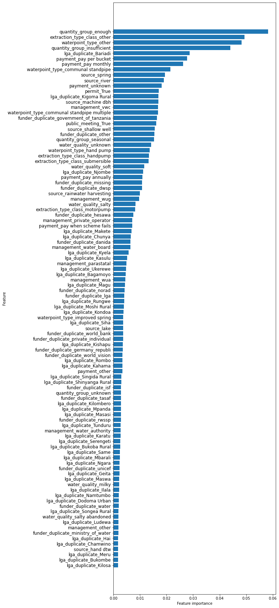


## Commentary:  Random Forest models

As with both decision trees and bagged trees, we find that rebalancing is necessary to minimize costly false negative errors.  Further, max_depth = 20 vs. max_depth=30 makes a big difference in both training and test scores, and can result in further minimizing false negatives; however, it's important to review the confusion matrix for any given result to evaluate performance in reducing false negatives. 

Finally, as model performance increases, the overall importance of the LGA feature increases.

# Modeling:  Gradient Boost and AdaBoost

Baseline gradient boosting and AdaBoost don't perform particularly well relative to other models.  In the interest of time, I'm moving on to XGBoost and SVM approaches, rather than spending time optimizing hyperparameters for these boosting algorithms.

# Modeling:  XGBoost

## Baseline model, default parameters


```python
df.head(3)
```


<div>
<style scoped>
    .dataframe tbody tr th:only-of-type {
        vertical-align: middle;
    }

    .dataframe tbody tr th {
        vertical-align: top;
    }

    .dataframe thead th {
        text-align: right;
    }
</style>
<table border="1" class="dataframe">
  <thead>
    <tr style="text-align: right;">
      <th></th>
      <th>funder</th>
      <th>installer</th>
      <th>wpt_name</th>
      <th>basin</th>
      <th>subvillage</th>
      <th>region</th>
      <th>lga</th>
      <th>ward</th>
      <th>public_meeting</th>
      <th>permit</th>
      <th>construction_year</th>
      <th>extraction_type_class</th>
      <th>management</th>
      <th>payment</th>
      <th>water_quality</th>
      <th>quantity_group</th>
      <th>source</th>
      <th>waterpoint_type</th>
      <th>status_group</th>
      <th>pop_binned</th>
    </tr>
    <tr>
      <th>id</th>
      <th></th>
      <th></th>
      <th></th>
      <th></th>
      <th></th>
      <th></th>
      <th></th>
      <th></th>
      <th></th>
      <th></th>
      <th></th>
      <th></th>
      <th></th>
      <th></th>
      <th></th>
      <th></th>
      <th></th>
      <th></th>
      <th></th>
      <th></th>
    </tr>
  </thead>
  <tbody>
    <tr>
      <th>69572</th>
      <td>roman</td>
      <td>roman</td>
      <td>none</td>
      <td>Lake Nyasa</td>
      <td>mnyusi_b</td>
      <td>Iringa</td>
      <td>Ludewa</td>
      <td>Mundindi</td>
      <td>True</td>
      <td>False</td>
      <td>1999</td>
      <td>gravity</td>
      <td>vwc</td>
      <td>pay annually</td>
      <td>soft</td>
      <td>enough</td>
      <td>spring</td>
      <td>communal standpipe</td>
      <td>functional</td>
      <td>(100, 150]</td>
    </tr>
    <tr>
      <th>8776</th>
      <td>grumeti</td>
      <td>grumeti</td>
      <td>zahanati</td>
      <td>Lake Victoria</td>
      <td>nyamara</td>
      <td>Mara</td>
      <td>Serengeti</td>
      <td>Natta</td>
      <td>NaN</td>
      <td>True</td>
      <td>2010</td>
      <td>gravity</td>
      <td>wug</td>
      <td>never pay</td>
      <td>soft</td>
      <td>insufficient</td>
      <td>rainwater harvesting</td>
      <td>communal standpipe</td>
      <td>functional</td>
      <td>(200, 300]</td>
    </tr>
    <tr>
      <th>34310</th>
      <td>lottery_club</td>
      <td>world_vision</td>
      <td>kwa_mahundi</td>
      <td>Pangani</td>
      <td>majengo</td>
      <td>Manyara</td>
      <td>Simanjiro</td>
      <td>Ngorika</td>
      <td>True</td>
      <td>True</td>
      <td>2009</td>
      <td>gravity</td>
      <td>vwc</td>
      <td>pay per bucket</td>
      <td>soft</td>
      <td>enough</td>
      <td>dam</td>
      <td>communal standpipe multiple</td>
      <td>functional</td>
      <td>(200, 300]</td>
    </tr>
  </tbody>
</table>
</div>


```python
features = ['funder', 'lga', 'management', 'payment', 'water_quality', 'quantity_group', 'source', 
            'extraction_type_class', 'status_group', 'waterpoint_type', 'permit', 'public_meeting']

features_top_n = ['funder', 'lga']

all_model_features = ['funder_duplicate', 'lga_duplicate', 'management', 'permit', 'public_meeting', 
                      'payment', 'water_quality', 'quantity_group', 'source', 
                      'extraction_type_class', 'status_group', 'waterpoint_type']

```


```python
df_n, X_train, X_test, \
y_train, y_test  = top_n_encode_tts(df, features, features_top_n, all_model_features,
                                    n=125, p=126, test_size=0.25, random_state=123)

```


```python
clf_xgb = xgb.XGBClassifier(random_state=123)
clf_xgb.fit(X_train, y_train)
```


    XGBClassifier(objective='multi:softprob', random_state=123)


```python
training_preds = clf_xgb.predict(X_train)
```


```python
val_preds = clf_xgb.predict(X_test)
```


```python
training_accuracy = accuracy_score(y_train, training_preds)
val_accuracy = accuracy_score(y_test, val_preds)
print("Training Accuracy: {:.4}%".format(training_accuracy * 100))
print("Validation accuracy: {:.4}%".format(val_accuracy * 100))

```

    Training Accuracy: 74.44%
    Validation accuracy: 73.91%


```python
# Running with parameters learning_rate=0.6, max_depth=15, random_state=123, 
# min_child_weight=1, subsample=0.7, n_estimators=100, n_jobs=-1, cache_size=1000

clf_xgb, training_accuracy, \
val_accuracy, imp_table, \
summ_imp_table, summ_imp_sub_table = model_xgb_tables(df_n, X_train=X_train, X_test=X_test, 
                                                      y_train=y_train, y_test=y_test, 
                                                      learning_rate=0.6, max_depth=15, 
                                                      random_state=123, min_child_weight=1, 
                                                      subsample=0.7, n_estimators=100, 
                                                      n_jobs=-1, cache_size=1000, 
                                                      num_feats_incl=100)

```

    Training Accuracy: 85.07%
    Validation accuracy: 78.96%
    
    Individual feature importances, top 10


<div>
<style scoped>
    .dataframe tbody tr th:only-of-type {
        vertical-align: middle;
    }

    .dataframe tbody tr th {
        vertical-align: top;
    }

    .dataframe thead th {
        text-align: right;
    }
</style>
<table border="1" class="dataframe">
  <thead>
    <tr style="text-align: right;">
      <th></th>
      <th>Importance</th>
    </tr>
  </thead>
  <tbody>
    <tr>
      <th>waterpoint_type_other</th>
      <td>0.029932</td>
    </tr>
    <tr>
      <th>lga_duplicate_Kongwa</th>
      <td>0.012922</td>
    </tr>
    <tr>
      <th>quantity_group_seasonal</th>
      <td>0.012673</td>
    </tr>
    <tr>
      <th>lga_duplicate_Rombo</th>
      <td>0.011806</td>
    </tr>
    <tr>
      <th>lga_duplicate_Kahama</th>
      <td>0.009962</td>
    </tr>
    <tr>
      <th>lga_duplicate_Bariadi</th>
      <td>0.009664</td>
    </tr>
    <tr>
      <th>quantity_group_unknown</th>
      <td>0.009559</td>
    </tr>
    <tr>
      <th>lga_duplicate_Makete</th>
      <td>0.009051</td>
    </tr>
    <tr>
      <th>lga_duplicate_Hanang</th>
      <td>0.008958</td>
    </tr>
    <tr>
      <th>lga_duplicate_Geita</th>
      <td>0.008561</td>
    </tr>
  </tbody>
</table>
</div>


    
    Roll-up summary feature importance table, all features


<div>
<style scoped>
    .dataframe tbody tr th:only-of-type {
        vertical-align: middle;
    }

    .dataframe tbody tr th {
        vertical-align: top;
    }

    .dataframe thead th {
        text-align: right;
    }
</style>
<table border="1" class="dataframe">
  <thead>
    <tr style="text-align: right;">
      <th></th>
      <th>Importance</th>
    </tr>
    <tr>
      <th>var_abbr</th>
      <th></th>
    </tr>
  </thead>
  <tbody>
    <tr>
      <th>lga_dup</th>
      <td>0.525668</td>
    </tr>
    <tr>
      <th>funder_</th>
      <td>0.297731</td>
    </tr>
    <tr>
      <th>waterpo</th>
      <td>0.040991</td>
    </tr>
    <tr>
      <th>quantit</th>
      <td>0.030417</td>
    </tr>
    <tr>
      <th>source_</th>
      <td>0.028676</td>
    </tr>
    <tr>
      <th>managem</th>
      <td>0.025003</td>
    </tr>
    <tr>
      <th>extract</th>
      <td>0.019549</td>
    </tr>
    <tr>
      <th>water_q</th>
      <td>0.016494</td>
    </tr>
    <tr>
      <th>payment</th>
      <td>0.012113</td>
    </tr>
    <tr>
      <th>permit_</th>
      <td>0.001737</td>
    </tr>
    <tr>
      <th>public_</th>
      <td>0.001621</td>
    </tr>
  </tbody>
</table>
</div>


    
    Roll-up summary feature importances, summing up top 100 most important features ONLY:


<div>
<style scoped>
    .dataframe tbody tr th:only-of-type {
        vertical-align: middle;
    }

    .dataframe tbody tr th {
        vertical-align: top;
    }

    .dataframe thead th {
        text-align: right;
    }
</style>
<table border="1" class="dataframe">
  <thead>
    <tr style="text-align: right;">
      <th></th>
      <th>Importance</th>
    </tr>
    <tr>
      <th>var_abbr</th>
      <th></th>
    </tr>
  </thead>
  <tbody>
    <tr>
      <th>lga_dup</th>
      <td>0.383551</td>
    </tr>
    <tr>
      <th>funder_</th>
      <td>0.059590</td>
    </tr>
    <tr>
      <th>waterpo</th>
      <td>0.034316</td>
    </tr>
    <tr>
      <th>quantit</th>
      <td>0.030417</td>
    </tr>
    <tr>
      <th>source_</th>
      <td>0.017697</td>
    </tr>
    <tr>
      <th>extract</th>
      <td>0.009555</td>
    </tr>
    <tr>
      <th>water_q</th>
      <td>0.003802</td>
    </tr>
    <tr>
      <th>managem</th>
      <td>0.003629</td>
    </tr>
  </tbody>
</table>
</div>


    


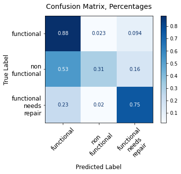


## XGB: SMOTE rebalanced data

### INSTALLER, LGA:  n=125, max_depth=15


```python
df.head(3)
```


<div>
<style scoped>
    .dataframe tbody tr th:only-of-type {
        vertical-align: middle;
    }

    .dataframe tbody tr th {
        vertical-align: top;
    }

    .dataframe thead th {
        text-align: right;
    }
</style>
<table border="1" class="dataframe">
  <thead>
    <tr style="text-align: right;">
      <th></th>
      <th>funder</th>
      <th>installer</th>
      <th>wpt_name</th>
      <th>basin</th>
      <th>subvillage</th>
      <th>region</th>
      <th>lga</th>
      <th>ward</th>
      <th>public_meeting</th>
      <th>permit</th>
      <th>construction_year</th>
      <th>extraction_type_class</th>
      <th>management</th>
      <th>payment</th>
      <th>water_quality</th>
      <th>quantity_group</th>
      <th>source</th>
      <th>waterpoint_type</th>
      <th>status_group</th>
      <th>pop_binned</th>
    </tr>
    <tr>
      <th>id</th>
      <th></th>
      <th></th>
      <th></th>
      <th></th>
      <th></th>
      <th></th>
      <th></th>
      <th></th>
      <th></th>
      <th></th>
      <th></th>
      <th></th>
      <th></th>
      <th></th>
      <th></th>
      <th></th>
      <th></th>
      <th></th>
      <th></th>
      <th></th>
    </tr>
  </thead>
  <tbody>
    <tr>
      <th>69572</th>
      <td>roman</td>
      <td>roman</td>
      <td>none</td>
      <td>Lake Nyasa</td>
      <td>mnyusi_b</td>
      <td>Iringa</td>
      <td>Ludewa</td>
      <td>Mundindi</td>
      <td>True</td>
      <td>False</td>
      <td>1999</td>
      <td>gravity</td>
      <td>vwc</td>
      <td>pay annually</td>
      <td>soft</td>
      <td>enough</td>
      <td>spring</td>
      <td>communal standpipe</td>
      <td>functional</td>
      <td>(100, 150]</td>
    </tr>
    <tr>
      <th>8776</th>
      <td>grumeti</td>
      <td>grumeti</td>
      <td>zahanati</td>
      <td>Lake Victoria</td>
      <td>nyamara</td>
      <td>Mara</td>
      <td>Serengeti</td>
      <td>Natta</td>
      <td>NaN</td>
      <td>True</td>
      <td>2010</td>
      <td>gravity</td>
      <td>wug</td>
      <td>never pay</td>
      <td>soft</td>
      <td>insufficient</td>
      <td>rainwater harvesting</td>
      <td>communal standpipe</td>
      <td>functional</td>
      <td>(200, 300]</td>
    </tr>
    <tr>
      <th>34310</th>
      <td>lottery_club</td>
      <td>world_vision</td>
      <td>kwa_mahundi</td>
      <td>Pangani</td>
      <td>majengo</td>
      <td>Manyara</td>
      <td>Simanjiro</td>
      <td>Ngorika</td>
      <td>True</td>
      <td>True</td>
      <td>2009</td>
      <td>gravity</td>
      <td>vwc</td>
      <td>pay per bucket</td>
      <td>soft</td>
      <td>enough</td>
      <td>dam</td>
      <td>communal standpipe multiple</td>
      <td>functional</td>
      <td>(200, 300]</td>
    </tr>
  </tbody>
</table>
</div>


```python
features = ['installer', 'lga', 'management', 'payment', 'water_quality', 'quantity_group', 'source', 
            'extraction_type_class', 'status_group', 'waterpoint_type', 'permit', 'public_meeting']

features_top_n = ['installer', 'lga']

all_model_features = ['installer_duplicate', 'lga_duplicate', 'management', 'permit', 'public_meeting', 
                      'payment', 'water_quality', 'quantity_group', 'source', 
                      'extraction_type_class', 'status_group', 'waterpoint_type']

```


```python
df_n, X_train_SMOTE, X_test, \
y_train_SMOTE, y_test  = SMOTE_top_n_tts(df, features, features_top_n, 
                                         all_model_features, n=125, p=126, 
                                         test_size=0.25, random_state=123)
```

    Counter({0: 24296, 2: 17013, 1: 3241})
    Counter({0: 24296, 1: 24296, 2: 24296})


```python
clf_xgb, training_accuracy_xgb_SMOTE, \
val_accuracy_xgb_SMOTE, \
imp_table_xgb_SMOTE, \
summ_imp_table_xgb_SMOTE, \
summ_imp_sub_table_xgb_SMOTE = model_xgb_tables(df_n, X_train_SMOTE, X_test, y_train_SMOTE, 
                                                y_test, random_state=123, max_depth=15, 
                                                learning_rate=0.6, min_child_weight=1, 
                                                subsample=0.7, n_estimators=100, n_jobs=-1, 
                                                cache_size=1000, num_feats_incl=100)

```

    Training Accuracy: 84.87%
    Validation accuracy: 74.34%
    
    Individual feature importances, top 10


<div>
<style scoped>
    .dataframe tbody tr th:only-of-type {
        vertical-align: middle;
    }

    .dataframe tbody tr th {
        vertical-align: top;
    }

    .dataframe thead th {
        text-align: right;
    }
</style>
<table border="1" class="dataframe">
  <thead>
    <tr style="text-align: right;">
      <th></th>
      <th>Importance</th>
    </tr>
  </thead>
  <tbody>
    <tr>
      <th>lga_duplicate_Bariadi</th>
      <td>0.033472</td>
    </tr>
    <tr>
      <th>lga_duplicate_Makete</th>
      <td>0.025046</td>
    </tr>
    <tr>
      <th>lga_duplicate_Siha</th>
      <td>0.019400</td>
    </tr>
    <tr>
      <th>lga_duplicate_Kigoma Rural</th>
      <td>0.016053</td>
    </tr>
    <tr>
      <th>lga_duplicate_Rombo</th>
      <td>0.015081</td>
    </tr>
    <tr>
      <th>lga_duplicate_Kongwa</th>
      <td>0.013032</td>
    </tr>
    <tr>
      <th>lga_duplicate_Kyela</th>
      <td>0.012701</td>
    </tr>
    <tr>
      <th>lga_duplicate_Ludewa</th>
      <td>0.011462</td>
    </tr>
    <tr>
      <th>extraction_type_class_other</th>
      <td>0.011321</td>
    </tr>
    <tr>
      <th>lga_duplicate_Njombe</th>
      <td>0.010527</td>
    </tr>
  </tbody>
</table>
</div>


    
    Roll-up summary feature importance table, all features


<div>
<style scoped>
    .dataframe tbody tr th:only-of-type {
        vertical-align: middle;
    }

    .dataframe tbody tr th {
        vertical-align: top;
    }

    .dataframe thead th {
        text-align: right;
    }
</style>
<table border="1" class="dataframe">
  <thead>
    <tr style="text-align: right;">
      <th></th>
      <th>Importance</th>
    </tr>
    <tr>
      <th>var_abbr</th>
      <th></th>
    </tr>
  </thead>
  <tbody>
    <tr>
      <th>lga_dup</th>
      <td>0.596081</td>
    </tr>
    <tr>
      <th>install</th>
      <td>0.263442</td>
    </tr>
    <tr>
      <th>source_</th>
      <td>0.027659</td>
    </tr>
    <tr>
      <th>extract</th>
      <td>0.022771</td>
    </tr>
    <tr>
      <th>managem</th>
      <td>0.021684</td>
    </tr>
    <tr>
      <th>quantit</th>
      <td>0.020372</td>
    </tr>
    <tr>
      <th>waterpo</th>
      <td>0.018717</td>
    </tr>
    <tr>
      <th>payment</th>
      <td>0.014300</td>
    </tr>
    <tr>
      <th>water_q</th>
      <td>0.012181</td>
    </tr>
    <tr>
      <th>public_</th>
      <td>0.001403</td>
    </tr>
    <tr>
      <th>permit_</th>
      <td>0.001389</td>
    </tr>
  </tbody>
</table>
</div>


    
    Roll-up summary feature importances, summing up top 100 most important features ONLY:


<div>
<style scoped>
    .dataframe tbody tr th:only-of-type {
        vertical-align: middle;
    }

    .dataframe tbody tr th {
        vertical-align: top;
    }

    .dataframe thead th {
        text-align: right;
    }
</style>
<table border="1" class="dataframe">
  <thead>
    <tr style="text-align: right;">
      <th></th>
      <th>Importance</th>
    </tr>
    <tr>
      <th>var_abbr</th>
      <th></th>
    </tr>
  </thead>
  <tbody>
    <tr>
      <th>lga_dup</th>
      <td>0.470655</td>
    </tr>
    <tr>
      <th>install</th>
      <td>0.066069</td>
    </tr>
    <tr>
      <th>source_</th>
      <td>0.017798</td>
    </tr>
    <tr>
      <th>quantit</th>
      <td>0.017470</td>
    </tr>
    <tr>
      <th>extract</th>
      <td>0.014927</td>
    </tr>
    <tr>
      <th>waterpo</th>
      <td>0.011120</td>
    </tr>
    <tr>
      <th>payment</th>
      <td>0.003803</td>
    </tr>
    <tr>
      <th>water_q</th>
      <td>0.003391</td>
    </tr>
  </tbody>
</table>
</div>


    


### FUNDER, LGA, n=125; max_depth=15


```python
df.head(3)
```


<div>
<style scoped>
    .dataframe tbody tr th:only-of-type {
        vertical-align: middle;
    }

    .dataframe tbody tr th {
        vertical-align: top;
    }

    .dataframe thead th {
        text-align: right;
    }
</style>
<table border="1" class="dataframe">
  <thead>
    <tr style="text-align: right;">
      <th></th>
      <th>funder</th>
      <th>installer</th>
      <th>wpt_name</th>
      <th>basin</th>
      <th>subvillage</th>
      <th>region</th>
      <th>lga</th>
      <th>ward</th>
      <th>public_meeting</th>
      <th>permit</th>
      <th>construction_year</th>
      <th>extraction_type_class</th>
      <th>management</th>
      <th>payment</th>
      <th>water_quality</th>
      <th>quantity_group</th>
      <th>source</th>
      <th>waterpoint_type</th>
      <th>status_group</th>
      <th>pop_binned</th>
    </tr>
    <tr>
      <th>id</th>
      <th></th>
      <th></th>
      <th></th>
      <th></th>
      <th></th>
      <th></th>
      <th></th>
      <th></th>
      <th></th>
      <th></th>
      <th></th>
      <th></th>
      <th></th>
      <th></th>
      <th></th>
      <th></th>
      <th></th>
      <th></th>
      <th></th>
      <th></th>
    </tr>
  </thead>
  <tbody>
    <tr>
      <th>69572</th>
      <td>roman</td>
      <td>roman</td>
      <td>none</td>
      <td>Lake Nyasa</td>
      <td>mnyusi_b</td>
      <td>Iringa</td>
      <td>Ludewa</td>
      <td>Mundindi</td>
      <td>True</td>
      <td>False</td>
      <td>1999</td>
      <td>gravity</td>
      <td>vwc</td>
      <td>pay annually</td>
      <td>soft</td>
      <td>enough</td>
      <td>spring</td>
      <td>communal standpipe</td>
      <td>functional</td>
      <td>(100, 150]</td>
    </tr>
    <tr>
      <th>8776</th>
      <td>grumeti</td>
      <td>grumeti</td>
      <td>zahanati</td>
      <td>Lake Victoria</td>
      <td>nyamara</td>
      <td>Mara</td>
      <td>Serengeti</td>
      <td>Natta</td>
      <td>NaN</td>
      <td>True</td>
      <td>2010</td>
      <td>gravity</td>
      <td>wug</td>
      <td>never pay</td>
      <td>soft</td>
      <td>insufficient</td>
      <td>rainwater harvesting</td>
      <td>communal standpipe</td>
      <td>functional</td>
      <td>(200, 300]</td>
    </tr>
    <tr>
      <th>34310</th>
      <td>lottery_club</td>
      <td>world_vision</td>
      <td>kwa_mahundi</td>
      <td>Pangani</td>
      <td>majengo</td>
      <td>Manyara</td>
      <td>Simanjiro</td>
      <td>Ngorika</td>
      <td>True</td>
      <td>True</td>
      <td>2009</td>
      <td>gravity</td>
      <td>vwc</td>
      <td>pay per bucket</td>
      <td>soft</td>
      <td>enough</td>
      <td>dam</td>
      <td>communal standpipe multiple</td>
      <td>functional</td>
      <td>(200, 300]</td>
    </tr>
  </tbody>
</table>
</div>


```python
# # Last output (funder, lga, management, permit, public_meeting, max_depth=15):  
# ----------------
# Grid Search found the following optimal parameters: 
# learning_rate: 0.6
# max_depth: 15
# min_child_weight: 1
# n_estimators: 100
# subsample: 0.7

features = ['funder', 'lga', 'management', 'payment', 'water_quality', 'quantity_group', 'source', 
            'extraction_type_class', 'status_group', 'waterpoint_type', 'permit', 'public_meeting']

features_top_n = ['funder', 'lga']

all_model_features = ['funder_duplicate', 'lga_duplicate', 'management', 'permit', 'public_meeting', 
                      'payment', 'water_quality', 'quantity_group', 'source', 
                      'extraction_type_class', 'status_group', 'waterpoint_type']

```


```python
# Running n=125

df_n, X_train_SMOTE, X_test, \
y_train_SMOTE, y_test  = SMOTE_top_n_tts(df, features, features_top_n, 
                                         all_model_features, n=125, p=126, 
                                         test_size=0.25, random_state=123)
```

    Counter({0: 24296, 2: 17013, 1: 3241})
    Counter({0: 24296, 1: 24296, 2: 24296})


```python
clf_xgb, training_accuracy_xgb_SMOTE, \
val_accuracy_xgb_SMOTE, \
imp_table_xgb_SMOTE, \
summ_imp_table_xgb_SMOTE, \
summ_imp_sub_table_xgb_SMOTE = model_xgb_tables(df_n, X_train_SMOTE, X_test, 
                                                y_train_SMOTE, y_test, random_state=123, 
                                                learning_rate=0.6, max_depth=15, 
                                                min_child_weight=1, subsample=0.7, 
                                                n_estimators=100, n_jobs=-1, 
                                                cache_size=1000, num_feats_incl=100)

```

    Training Accuracy: 85.73%
    Validation accuracy: 74.94%
    
    Individual feature importances, top 10


<div>
<style scoped>
    .dataframe tbody tr th:only-of-type {
        vertical-align: middle;
    }

    .dataframe tbody tr th {
        vertical-align: top;
    }

    .dataframe thead th {
        text-align: right;
    }
</style>
<table border="1" class="dataframe">
  <thead>
    <tr style="text-align: right;">
      <th></th>
      <th>Importance</th>
    </tr>
  </thead>
  <tbody>
    <tr>
      <th>lga_duplicate_Bariadi</th>
      <td>0.032915</td>
    </tr>
    <tr>
      <th>lga_duplicate_Kigoma Rural</th>
      <td>0.020907</td>
    </tr>
    <tr>
      <th>lga_duplicate_Makete</th>
      <td>0.015684</td>
    </tr>
    <tr>
      <th>lga_duplicate_Kongwa</th>
      <td>0.014564</td>
    </tr>
    <tr>
      <th>lga_duplicate_Siha</th>
      <td>0.013451</td>
    </tr>
    <tr>
      <th>lga_duplicate_Rombo</th>
      <td>0.013188</td>
    </tr>
    <tr>
      <th>extraction_type_class_other</th>
      <td>0.012909</td>
    </tr>
    <tr>
      <th>lga_duplicate_Kyela</th>
      <td>0.011203</td>
    </tr>
    <tr>
      <th>lga_duplicate_Njombe</th>
      <td>0.010823</td>
    </tr>
    <tr>
      <th>lga_duplicate_Chunya</th>
      <td>0.010807</td>
    </tr>
  </tbody>
</table>
</div>


    
    Roll-up summary feature importance table, all features


<div>
<style scoped>
    .dataframe tbody tr th:only-of-type {
        vertical-align: middle;
    }

    .dataframe tbody tr th {
        vertical-align: top;
    }

    .dataframe thead th {
        text-align: right;
    }
</style>
<table border="1" class="dataframe">
  <thead>
    <tr style="text-align: right;">
      <th></th>
      <th>Importance</th>
    </tr>
    <tr>
      <th>var_abbr</th>
      <th></th>
    </tr>
  </thead>
  <tbody>
    <tr>
      <th>lga_dup</th>
      <td>0.586990</td>
    </tr>
    <tr>
      <th>funder_</th>
      <td>0.262168</td>
    </tr>
    <tr>
      <th>source_</th>
      <td>0.029204</td>
    </tr>
    <tr>
      <th>extract</th>
      <td>0.027144</td>
    </tr>
    <tr>
      <th>managem</th>
      <td>0.022706</td>
    </tr>
    <tr>
      <th>quantit</th>
      <td>0.021565</td>
    </tr>
    <tr>
      <th>waterpo</th>
      <td>0.018533</td>
    </tr>
    <tr>
      <th>payment</th>
      <td>0.015393</td>
    </tr>
    <tr>
      <th>water_q</th>
      <td>0.013359</td>
    </tr>
    <tr>
      <th>permit_</th>
      <td>0.001492</td>
    </tr>
    <tr>
      <th>public_</th>
      <td>0.001447</td>
    </tr>
  </tbody>
</table>
</div>


    
    Roll-up summary feature importances, summing up top 100 most important features ONLY:


<div>
<style scoped>
    .dataframe tbody tr th:only-of-type {
        vertical-align: middle;
    }

    .dataframe tbody tr th {
        vertical-align: top;
    }

    .dataframe thead th {
        text-align: right;
    }
</style>
<table border="1" class="dataframe">
  <thead>
    <tr style="text-align: right;">
      <th></th>
      <th>Importance</th>
    </tr>
    <tr>
      <th>var_abbr</th>
      <th></th>
    </tr>
  </thead>
  <tbody>
    <tr>
      <th>lga_dup</th>
      <td>0.470114</td>
    </tr>
    <tr>
      <th>funder_</th>
      <td>0.048562</td>
    </tr>
    <tr>
      <th>quantit</th>
      <td>0.018555</td>
    </tr>
    <tr>
      <th>extract</th>
      <td>0.017290</td>
    </tr>
    <tr>
      <th>source_</th>
      <td>0.016775</td>
    </tr>
    <tr>
      <th>waterpo</th>
      <td>0.011058</td>
    </tr>
    <tr>
      <th>payment</th>
      <td>0.004278</td>
    </tr>
    <tr>
      <th>water_q</th>
      <td>0.003564</td>
    </tr>
  </tbody>
</table>
</div>


    


```python
imp_table_xgb_SMOTE[:50]
```


<div>
<style scoped>
    .dataframe tbody tr th:only-of-type {
        vertical-align: middle;
    }

    .dataframe tbody tr th {
        vertical-align: top;
    }

    .dataframe thead th {
        text-align: right;
    }
</style>
<table border="1" class="dataframe">
  <thead>
    <tr style="text-align: right;">
      <th></th>
      <th>Importance</th>
    </tr>
  </thead>
  <tbody>
    <tr>
      <th>lga_duplicate_Bariadi</th>
      <td>0.032915</td>
    </tr>
    <tr>
      <th>lga_duplicate_Kigoma Rural</th>
      <td>0.020907</td>
    </tr>
    <tr>
      <th>lga_duplicate_Makete</th>
      <td>0.015684</td>
    </tr>
    <tr>
      <th>lga_duplicate_Kongwa</th>
      <td>0.014564</td>
    </tr>
    <tr>
      <th>lga_duplicate_Siha</th>
      <td>0.013451</td>
    </tr>
    <tr>
      <th>lga_duplicate_Rombo</th>
      <td>0.013188</td>
    </tr>
    <tr>
      <th>extraction_type_class_other</th>
      <td>0.012909</td>
    </tr>
    <tr>
      <th>lga_duplicate_Kyela</th>
      <td>0.011203</td>
    </tr>
    <tr>
      <th>lga_duplicate_Njombe</th>
      <td>0.010823</td>
    </tr>
    <tr>
      <th>lga_duplicate_Chunya</th>
      <td>0.010807</td>
    </tr>
    <tr>
      <th>quantity_group_seasonal</th>
      <td>0.010099</td>
    </tr>
    <tr>
      <th>lga_duplicate_Ludewa</th>
      <td>0.009909</td>
    </tr>
    <tr>
      <th>lga_duplicate_Chamwino</th>
      <td>0.009221</td>
    </tr>
    <tr>
      <th>lga_duplicate_Mkinga</th>
      <td>0.008461</td>
    </tr>
    <tr>
      <th>lga_duplicate_Karatu</th>
      <td>0.008310</td>
    </tr>
    <tr>
      <th>lga_duplicate_Iringa Rural</th>
      <td>0.007892</td>
    </tr>
    <tr>
      <th>lga_duplicate_Kondoa</th>
      <td>0.007869</td>
    </tr>
    <tr>
      <th>lga_duplicate_Hanang</th>
      <td>0.007717</td>
    </tr>
    <tr>
      <th>lga_duplicate_Dodoma Urban</th>
      <td>0.007135</td>
    </tr>
    <tr>
      <th>waterpoint_type_other</th>
      <td>0.007089</td>
    </tr>
    <tr>
      <th>lga_duplicate_Muheza</th>
      <td>0.006855</td>
    </tr>
    <tr>
      <th>source_lake</th>
      <td>0.006801</td>
    </tr>
    <tr>
      <th>lga_duplicate_Bukombe</th>
      <td>0.006763</td>
    </tr>
    <tr>
      <th>lga_duplicate_Muleba</th>
      <td>0.006219</td>
    </tr>
    <tr>
      <th>lga_duplicate_Rungwe</th>
      <td>0.006119</td>
    </tr>
    <tr>
      <th>lga_duplicate_Pangani</th>
      <td>0.006098</td>
    </tr>
    <tr>
      <th>source_rainwater harvesting</th>
      <td>0.005979</td>
    </tr>
    <tr>
      <th>lga_duplicate_Magu</th>
      <td>0.005826</td>
    </tr>
    <tr>
      <th>lga_duplicate_Kisarawe</th>
      <td>0.005823</td>
    </tr>
    <tr>
      <th>lga_duplicate_Sengerema</th>
      <td>0.005591</td>
    </tr>
    <tr>
      <th>lga_duplicate_Kilolo</th>
      <td>0.005565</td>
    </tr>
    <tr>
      <th>lga_duplicate_Songea Rural</th>
      <td>0.005521</td>
    </tr>
    <tr>
      <th>lga_duplicate_Kahama</th>
      <td>0.005426</td>
    </tr>
    <tr>
      <th>funder_duplicate_tardo</th>
      <td>0.005374</td>
    </tr>
    <tr>
      <th>lga_duplicate_Meru</th>
      <td>0.005342</td>
    </tr>
    <tr>
      <th>funder_duplicate_germany_republi</th>
      <td>0.005321</td>
    </tr>
    <tr>
      <th>lga_duplicate_Tunduru</th>
      <td>0.005257</td>
    </tr>
    <tr>
      <th>lga_duplicate_Singida Urban</th>
      <td>0.005180</td>
    </tr>
    <tr>
      <th>lga_duplicate_Lushoto</th>
      <td>0.005179</td>
    </tr>
    <tr>
      <th>funder_duplicate_lga</th>
      <td>0.005171</td>
    </tr>
    <tr>
      <th>funder_duplicate_hifab</th>
      <td>0.005101</td>
    </tr>
    <tr>
      <th>funder_duplicate_missing</th>
      <td>0.004842</td>
    </tr>
    <tr>
      <th>lga_duplicate_Masasi</th>
      <td>0.004829</td>
    </tr>
    <tr>
      <th>lga_duplicate_Korogwe</th>
      <td>0.004822</td>
    </tr>
    <tr>
      <th>lga_duplicate_Mpanda</th>
      <td>0.004796</td>
    </tr>
    <tr>
      <th>lga_duplicate_Geita</th>
      <td>0.004673</td>
    </tr>
    <tr>
      <th>lga_duplicate_Ukerewe</th>
      <td>0.004654</td>
    </tr>
    <tr>
      <th>funder_duplicate_aict</th>
      <td>0.004601</td>
    </tr>
    <tr>
      <th>quantity_group_unknown</th>
      <td>0.004450</td>
    </tr>
    <tr>
      <th>lga_duplicate_Bukoba Rural</th>
      <td>0.004393</td>
    </tr>
  </tbody>
</table>
</div>


```python
summ_imp_table_xgb_SMOTE   
```


<div>
<style scoped>
    .dataframe tbody tr th:only-of-type {
        vertical-align: middle;
    }

    .dataframe tbody tr th {
        vertical-align: top;
    }

    .dataframe thead th {
        text-align: right;
    }
</style>
<table border="1" class="dataframe">
  <thead>
    <tr style="text-align: right;">
      <th></th>
      <th>Importance</th>
    </tr>
    <tr>
      <th>var_abbr</th>
      <th></th>
    </tr>
  </thead>
  <tbody>
    <tr>
      <th>lga_dup</th>
      <td>0.586990</td>
    </tr>
    <tr>
      <th>funder_</th>
      <td>0.262168</td>
    </tr>
    <tr>
      <th>source_</th>
      <td>0.029204</td>
    </tr>
    <tr>
      <th>extract</th>
      <td>0.027144</td>
    </tr>
    <tr>
      <th>managem</th>
      <td>0.022706</td>
    </tr>
    <tr>
      <th>quantit</th>
      <td>0.021565</td>
    </tr>
    <tr>
      <th>waterpo</th>
      <td>0.018533</td>
    </tr>
    <tr>
      <th>payment</th>
      <td>0.015393</td>
    </tr>
    <tr>
      <th>water_q</th>
      <td>0.013359</td>
    </tr>
    <tr>
      <th>permit_</th>
      <td>0.001492</td>
    </tr>
    <tr>
      <th>public_</th>
      <td>0.001447</td>
    </tr>
  </tbody>
</table>
</div>


## Findings:  XGBoost

XGBoost provides highest overall accuracy scores of any of the models used so far.  XGB also provides good--but not great--reduction of false negatives.  

Although the reduction of false negatives isn't as good as for class_weight='balanced' decision tree models, the overall accuracy is higher, and  it's worthwhile to compare features for XGB models with models that provide good performance on reducing false negatives. 

# Modeling:  Support Vector Machines

## FUNDER, LGA (n=100), permit, public_meeting; C=1.0 (default), gamma='scale' (default), class_weight='balanced'


```python
df.head()
```


<div>
<style scoped>
    .dataframe tbody tr th:only-of-type {
        vertical-align: middle;
    }

    .dataframe tbody tr th {
        vertical-align: top;
    }

    .dataframe thead th {
        text-align: right;
    }
</style>
<table border="1" class="dataframe">
  <thead>
    <tr style="text-align: right;">
      <th></th>
      <th>funder</th>
      <th>installer</th>
      <th>wpt_name</th>
      <th>basin</th>
      <th>subvillage</th>
      <th>region</th>
      <th>lga</th>
      <th>ward</th>
      <th>public_meeting</th>
      <th>permit</th>
      <th>construction_year</th>
      <th>extraction_type_class</th>
      <th>management</th>
      <th>payment</th>
      <th>water_quality</th>
      <th>quantity_group</th>
      <th>source</th>
      <th>waterpoint_type</th>
      <th>status_group</th>
      <th>pop_binned</th>
    </tr>
    <tr>
      <th>id</th>
      <th></th>
      <th></th>
      <th></th>
      <th></th>
      <th></th>
      <th></th>
      <th></th>
      <th></th>
      <th></th>
      <th></th>
      <th></th>
      <th></th>
      <th></th>
      <th></th>
      <th></th>
      <th></th>
      <th></th>
      <th></th>
      <th></th>
      <th></th>
    </tr>
  </thead>
  <tbody>
    <tr>
      <th>69572</th>
      <td>roman</td>
      <td>roman</td>
      <td>none</td>
      <td>Lake Nyasa</td>
      <td>mnyusi_b</td>
      <td>Iringa</td>
      <td>Ludewa</td>
      <td>Mundindi</td>
      <td>True</td>
      <td>False</td>
      <td>1999</td>
      <td>gravity</td>
      <td>vwc</td>
      <td>pay annually</td>
      <td>soft</td>
      <td>enough</td>
      <td>spring</td>
      <td>communal standpipe</td>
      <td>functional</td>
      <td>(100, 150]</td>
    </tr>
    <tr>
      <th>8776</th>
      <td>grumeti</td>
      <td>grumeti</td>
      <td>zahanati</td>
      <td>Lake Victoria</td>
      <td>nyamara</td>
      <td>Mara</td>
      <td>Serengeti</td>
      <td>Natta</td>
      <td>NaN</td>
      <td>True</td>
      <td>2010</td>
      <td>gravity</td>
      <td>wug</td>
      <td>never pay</td>
      <td>soft</td>
      <td>insufficient</td>
      <td>rainwater harvesting</td>
      <td>communal standpipe</td>
      <td>functional</td>
      <td>(200, 300]</td>
    </tr>
    <tr>
      <th>34310</th>
      <td>lottery_club</td>
      <td>world_vision</td>
      <td>kwa_mahundi</td>
      <td>Pangani</td>
      <td>majengo</td>
      <td>Manyara</td>
      <td>Simanjiro</td>
      <td>Ngorika</td>
      <td>True</td>
      <td>True</td>
      <td>2009</td>
      <td>gravity</td>
      <td>vwc</td>
      <td>pay per bucket</td>
      <td>soft</td>
      <td>enough</td>
      <td>dam</td>
      <td>communal standpipe multiple</td>
      <td>functional</td>
      <td>(200, 300]</td>
    </tr>
    <tr>
      <th>67743</th>
      <td>unicef</td>
      <td>unicef</td>
      <td>zahanati_ya_nanyumbu</td>
      <td>Ruvuma / Southern Coast</td>
      <td>mahakamani</td>
      <td>Mtwara</td>
      <td>Nanyumbu</td>
      <td>Nanyumbu</td>
      <td>True</td>
      <td>True</td>
      <td>1986</td>
      <td>submersible</td>
      <td>vwc</td>
      <td>never pay</td>
      <td>soft</td>
      <td>dry</td>
      <td>machine dbh</td>
      <td>communal standpipe multiple</td>
      <td>non functional</td>
      <td>(50, 100]</td>
    </tr>
    <tr>
      <th>19728</th>
      <td>action_in_a</td>
      <td>artisan</td>
      <td>shuleni</td>
      <td>Lake Victoria</td>
      <td>kyanyamisa</td>
      <td>Kagera</td>
      <td>Karagwe</td>
      <td>Nyakasimbi</td>
      <td>True</td>
      <td>True</td>
      <td>Missing</td>
      <td>gravity</td>
      <td>other</td>
      <td>never pay</td>
      <td>soft</td>
      <td>seasonal</td>
      <td>rainwater harvesting</td>
      <td>communal standpipe</td>
      <td>functional</td>
      <td>(-1, 0]</td>
    </tr>
  </tbody>
</table>
</div>


```python
features = ['funder', 'lga', 'management', 'payment', 'water_quality', 'quantity_group', 'source', 
            'extraction_type_class', 'status_group', 'waterpoint_type', 'permit', 'public_meeting']

features_top_n = ['funder', 'lga']

all_model_features = ['funder_duplicate', 'lga_duplicate', 'management', 'permit', 'public_meeting', 
                      'payment', 'water_quality', 'quantity_group', 'source', 
                      'extraction_type_class', 'status_group', 'waterpoint_type']

```


```python
# features:  installer & scheme_name (n=100); region

df_svm, X, y = top_n_encode(df, features, features_top_n, all_model_features, n=100, p=101)

X_train, X_test, y_train, y_test = train_test_split(X, y, test_size=0.25, random_state=123)
```


```python
# function just for SVM modeling (takes in X_train, y_train, X_test, y_test from above)

clf_svm, svm_training_accuracy, \
svm_val_accuracy = model_svm(df_svm, X_train, y_train, X_test, y_test, C=1.0, gamma='scale', 
                             random_state=123, cache_size=1000, class_weight='balanced')

```

    Gamma = scale
    C = 1.0
    Training Accuracy: 72.19%
    Validation accuracy: 69.99%
    


## FUNDER, LGA (n=125); C=1.0 (default), gamma=50, class_weight='balanced'


```python
# df = df_train1.copy()    # run this cell if dataframe reset is needed
df.head()
```


<div>
<style scoped>
    .dataframe tbody tr th:only-of-type {
        vertical-align: middle;
    }

    .dataframe tbody tr th {
        vertical-align: top;
    }

    .dataframe thead th {
        text-align: right;
    }
</style>
<table border="1" class="dataframe">
  <thead>
    <tr style="text-align: right;">
      <th></th>
      <th>funder</th>
      <th>installer</th>
      <th>wpt_name</th>
      <th>basin</th>
      <th>subvillage</th>
      <th>region</th>
      <th>lga</th>
      <th>ward</th>
      <th>public_meeting</th>
      <th>permit</th>
      <th>construction_year</th>
      <th>extraction_type_class</th>
      <th>management</th>
      <th>payment</th>
      <th>water_quality</th>
      <th>quantity_group</th>
      <th>source</th>
      <th>waterpoint_type</th>
      <th>status_group</th>
      <th>pop_binned</th>
    </tr>
    <tr>
      <th>id</th>
      <th></th>
      <th></th>
      <th></th>
      <th></th>
      <th></th>
      <th></th>
      <th></th>
      <th></th>
      <th></th>
      <th></th>
      <th></th>
      <th></th>
      <th></th>
      <th></th>
      <th></th>
      <th></th>
      <th></th>
      <th></th>
      <th></th>
      <th></th>
    </tr>
  </thead>
  <tbody>
    <tr>
      <th>69572</th>
      <td>roman</td>
      <td>roman</td>
      <td>none</td>
      <td>Lake Nyasa</td>
      <td>mnyusi_b</td>
      <td>Iringa</td>
      <td>Ludewa</td>
      <td>Mundindi</td>
      <td>True</td>
      <td>False</td>
      <td>1999</td>
      <td>gravity</td>
      <td>vwc</td>
      <td>pay annually</td>
      <td>soft</td>
      <td>enough</td>
      <td>spring</td>
      <td>communal standpipe</td>
      <td>functional</td>
      <td>(100, 150]</td>
    </tr>
    <tr>
      <th>8776</th>
      <td>grumeti</td>
      <td>grumeti</td>
      <td>zahanati</td>
      <td>Lake Victoria</td>
      <td>nyamara</td>
      <td>Mara</td>
      <td>Serengeti</td>
      <td>Natta</td>
      <td>NaN</td>
      <td>True</td>
      <td>2010</td>
      <td>gravity</td>
      <td>wug</td>
      <td>never pay</td>
      <td>soft</td>
      <td>insufficient</td>
      <td>rainwater harvesting</td>
      <td>communal standpipe</td>
      <td>functional</td>
      <td>(200, 300]</td>
    </tr>
    <tr>
      <th>34310</th>
      <td>lottery_club</td>
      <td>world_vision</td>
      <td>kwa_mahundi</td>
      <td>Pangani</td>
      <td>majengo</td>
      <td>Manyara</td>
      <td>Simanjiro</td>
      <td>Ngorika</td>
      <td>True</td>
      <td>True</td>
      <td>2009</td>
      <td>gravity</td>
      <td>vwc</td>
      <td>pay per bucket</td>
      <td>soft</td>
      <td>enough</td>
      <td>dam</td>
      <td>communal standpipe multiple</td>
      <td>functional</td>
      <td>(200, 300]</td>
    </tr>
    <tr>
      <th>67743</th>
      <td>unicef</td>
      <td>unicef</td>
      <td>zahanati_ya_nanyumbu</td>
      <td>Ruvuma / Southern Coast</td>
      <td>mahakamani</td>
      <td>Mtwara</td>
      <td>Nanyumbu</td>
      <td>Nanyumbu</td>
      <td>True</td>
      <td>True</td>
      <td>1986</td>
      <td>submersible</td>
      <td>vwc</td>
      <td>never pay</td>
      <td>soft</td>
      <td>dry</td>
      <td>machine dbh</td>
      <td>communal standpipe multiple</td>
      <td>non functional</td>
      <td>(50, 100]</td>
    </tr>
    <tr>
      <th>19728</th>
      <td>action_in_a</td>
      <td>artisan</td>
      <td>shuleni</td>
      <td>Lake Victoria</td>
      <td>kyanyamisa</td>
      <td>Kagera</td>
      <td>Karagwe</td>
      <td>Nyakasimbi</td>
      <td>True</td>
      <td>True</td>
      <td>Missing</td>
      <td>gravity</td>
      <td>other</td>
      <td>never pay</td>
      <td>soft</td>
      <td>seasonal</td>
      <td>rainwater harvesting</td>
      <td>communal standpipe</td>
      <td>functional</td>
      <td>(-1, 0]</td>
    </tr>
  </tbody>
</table>
</div>


```python
features = ['funder', 'lga', 'management', 'payment', 'water_quality', 'quantity_group', 'source', 
            'extraction_type_class', 'status_group', 'waterpoint_type', 'permit', 'public_meeting']

features_top_n = ['funder', 'lga']

all_model_features = ['funder_duplicate', 'lga_duplicate', 'management', 'permit', 'public_meeting', 
                      'payment', 'water_quality', 'quantity_group', 'source', 
                      'extraction_type_class', 'status_group', 'waterpoint_type']

```


```python
# run for non-resampled data

df_svm, X, y = top_n_encode(df, features, features_top_n, all_model_features, n=125, p=126)

X_train, X_test, y_train, y_test = train_test_split(X, y, test_size=0.25, random_state=123)
```


```python
# function just for SVM modeling (takes in X_train, y_train, X_test, y_test from above)

clf_svm, svm_training_accuracy, \
svm_val_accuracy = model_svm(df_svm, X_train, y_train, X_test, y_test, C=1.0, gamma=50, 
                             random_state=123, cache_size=1000, class_weight='balanced')

# Last output (class_weight='balanced'; installer, scheme_name, region; C=1.0, gamma='scale')
# Gamma = 50
# C = 1.0
# Training Accuracy: 79.91%
# Validation accuracy: 68.58%

# higher gamma value (50) yields slightly higher training score but lower test score.  It also 
# does a better job of minimizing the false negative errors.
```

    Gamma = 50
    C = 1.0
    Training Accuracy: 80.75%
    Validation accuracy: 67.57%
    


## Commentary:  SVM

My initial exploration of SVM models using the default kernel and performing a bit of hyperparameter tuning did not provide significant performance improvement--especially over XGB.

# Findings

## Model Performance: Accuracy and Reduction of False Negatives 
* Imbalanced dataset (original)
  * Training accuracies ranged 77% to 85%
  * Test accuracies ranged from 74% to 80%
  * False negatives were unacceptably high  (up to 77% and 40% for mis-classification of 'functional needs repair' and 'non functional' wells as 'functional', respectively)
* SMOTE resampled data
  * Training accuracies ranged 73% to 80%
  * Test accuracies ranged from 69% to 78%
  * False negatives were noticeably better than for imbalanced dataset, but still higher than for models run with class_weight='balanced' (~30-35% and ~23-30% for mis-classification of 'functional needs repair' and 'non functional' wells as 'functional', respectively)
* class_weight='balanced' (in models where this parameter is available)
  * Training accuracies ranged 65% to 78%
  * Test accuracies ranged from 62% to 74%
  * Best performance of the three options for false negatives (as low as 17% and 17% for mis-classification of 'functional needs repair' and 'non functional' wells as 'functional', respectively)
*   **Conclusion--Class imbalances:**  There is a significant trade-off between overall accuracy and minimizing costly false negatives by addressing class imbalances that contribute to the errors in the smaller classes ('non-functional' and 'functional needs repair'). 
  
## Feature Importances 
* At a macro level, I found that the features that showed up most frequently in the aggregate feature importance list were the following (roughly in order of importance):
     * Quantity ('dry', 'enough', 'insufficient', 'seasonal', or 'unknown')
     * Region or lga (depending on which was used in the model)
     * Waterpoint type (standpipe, borehole, improved spring, cattle trough, other)
     * Installer or funder (depending on which was used in the model)
     * Extraction type (e.g., gravity, hand pump, motor, submersible)
     * Source (e.g., river, spring, shallow well, rainwater harvesting)
     * Payment type (e.g., pay by bucket, pay by month, never pay)
* At a more granular level, the top 30 or so dummy variables tended to include a mix of:
     * Water abundance
     * Waterpoint type
     * Geographic location (e.g., LGA)
     * Extraction type
     * Installer/funder
     * Payment type
* I recommend looking more closely at these values, since they are likely to contain those specific values that have more wells needing replacement or repair

# Possible Future Work

With more time, I would like to explore additional modeling with a subset of parameters:
* As indicated above, most of the models show very similar lists of dummy variables as having the greatest influence on the model algorithms
* While my experience so far is that, regardless which model or subset of variables I use, the accuracy scores remain stubbornly in the 75-80% range, I'd like to find out whether running a smaller subset of dummy variables might improve results
* There are significant holes in this data set (e.g., missing values or values such as ‘other’ for type of well); with more time, I would like to research a few of these values, such as:
  * ‘Other’ in the category ‘extraction_type’, as the majority of wells in this category are non-functional
  * Year constructed—no date recorded for significant percentage of wells; do these wells have something in common, such as:
    * Clustered in certain locations where data was/is not collected?
    * Constructed before a certain date?
    * Constructed by certain installers or funded by certain funders?
    * Of a certain type, e.g., handpump?  

Some features that I was not able to use due to incomplete information are likely to have an impact on the accuracy scores, but would require more research to flesh out
* Significant funding for projects comes from outside Tanzania
  * My initial quick review of some of the top funders and installers suggests that funding / installation management by certain international entities have a substantially higher rate of functional projects, with few projects in need of maintenance or equipment replacement--most notably Germany (perhaps not surprising, given the cultural emphasis on efficiency and high standards for technical expertise and performance
  * There is some geographic / country information on a small subset of funders and/or the installers, but this information is not captured in the dataset provided, except incidentallly (e.g., the rare country reference in the name of the funder or installer)
  * Thus, it would be necessary to research these entities to identify their locations
  * As there are at least 100 that have funded dozens or hundreds of projects, this would be a time-consuming effort.
* Latitude / longitude—Looking at functional status of wells at various geographic locations to identify possible patterns due to geological differences

